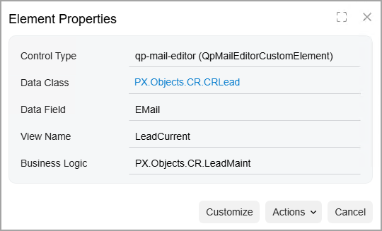
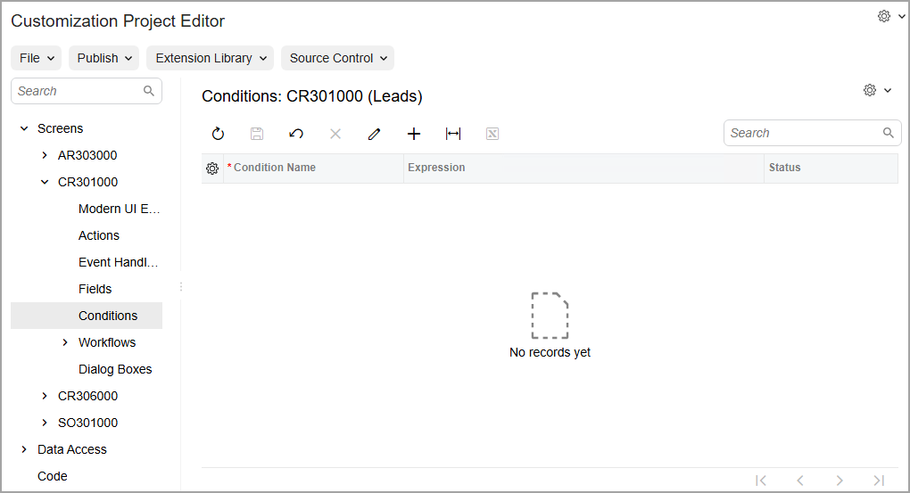
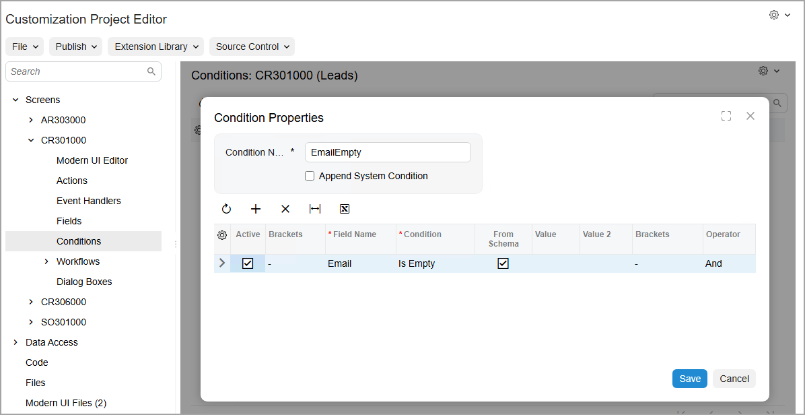
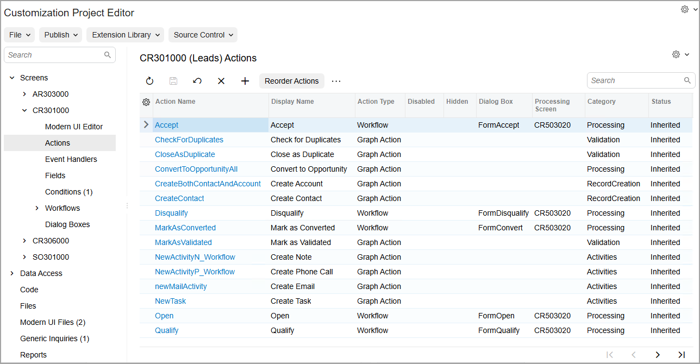
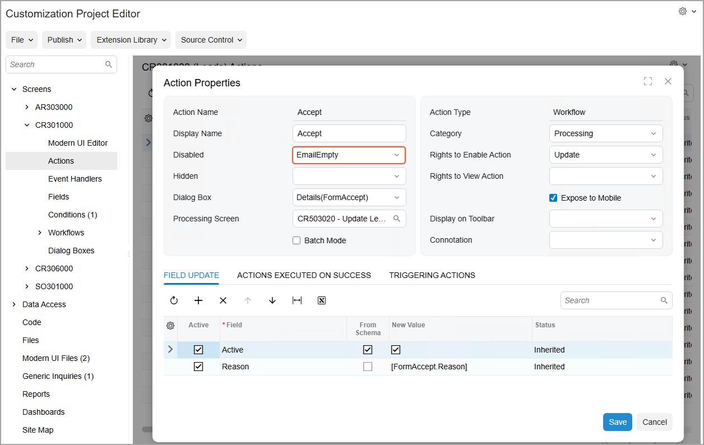

# Conditional Properties: To Disable an Action {#_c67d167d-02cf-4534-9216-6e3ebacfada1 .task}

The following activity will walk you through the process of conditionally disabling an action, which will cause the corresponding button \(and the equivalent command on the More menu\) on the form to be unavailable for clicking it.

## Story { .section}

Suppose that the employees of your company often work with the [Leads](../UserGuide/CR_30_10_00.md) \(CR301000\) form. Further suppose that for a lead to be accepted, you want the email address to be required contact information. That is, if the **Email** box \(which is on the **Contact Info** tab of the form\) is empty, the **Accept** command should not be available on the More menu. You need to configure the condition for the **Accept** command.

## Process Overview { .section}

By invoking the **Element Properties** dialog box on the [Leads](../UserGuide/CR_30_10_00.md) \(CR301000\) form, you will learn the internal name of the element that will be used in the condition. By using the [Screens](../UserGuide/AU_20_10_00.md) page of the Customization Project Editor, you will add the [Leads](../UserGuide/CR_30_10_00.md) form so that it can be customized. You will create a condition on the [Conditions](../UserGuide/AU_20_10_10.md) page. You will specify the created condition for the *Disabled* property of the action underlying the **Accept** command on the [Actions](../UserGuide/AU_20_10_50.md) page; you will then publish the project. Finally, you will test the condition on the [Leads](../UserGuide/CR_30_10_00.md) \(CR301000\) form.

## System Preparation { .section}

Before you begin performing the steps of this activity, do the following:

1.  Prepare an Acumatica ERP instance by performing the [Customization Projects: To Deploy an Instance](CustomizationProjects_GettingStarted_Activity_CreateInstance.md) prerequisite activity.
2.  Create the *Yogifon* customization project by performing the [Customization Projects: To Create a Customization Project](CustomizationProjects_GettingStarted_Activity_CreateProject.md) prerequisite activity.

## Step 1: Learning the Internal Name of the Element { .section}

First, you need to learn the internal name of the element that will be used in the condition; on the [Leads](../UserGuide/CR_30_10_00.md) \(CR301000\) form, this element is the **Email** box. Do the following:

1.  On the Settings menu of the [Leads](../UserGuide/CR_30_10_00.md) form, click **Inspect Element**.
2.  In the **Contact** section of the **General** tab, click the **Email** box.

    The **Element Properties** dialog box opens, as shown in the following screenshot. The internal name of the field is displayed in the **Data Field** box.

    

    As you can see, the box contains *EMail*. Close the dialog box.

## Step 2: Modifying the List of Customized Screens { .section}

To add a new tab on the [Customers](../UserGuide/AR_30_30_00.md) \(AR303000\) form, you first need to add the form to the list of customized screens. Do the following:

1.  On the [Customization Projects](../UserGuide/SM_20_45_05.md) \(SM204505\) form, click *Yogifon* to open the Customization Project Editor for this customization project.
2.  In the navigation pane of the Customization Project Editor, click **Screens**.

    The [Screens](../UserGuide/AU_20_10_00.md) page opens.

3.  On the page toolbar, click **Customize Existing Screen**.

    The **Customize Existing Screen** dialog box opens.

4.  In the **Select Screen** box of the dialog box, click the magnifier button. In the lookup table, type `CR301000` in the Search box, and double-click the *Leads* form.
5.  Click **OK** to close the dialog box.

    The [Leads](../UserGuide/CR_30_10_00.md) form is added to the list of forms on the [Screens](../UserGuide/AU_20_10_00.md) page, and the Screen Editor: CR301000 \(Leads\) page opens.

## Step 3: Defining the Condition { .section}

Now that you have learned the name of the element that you plan to use in the condition and added the screen to the customization project, you can define the condition. In the Customization Project Editor, do the following:

1.  In the navigation pane, click **Screens** &gt; **CR301000** &gt; **Conditions**.

    The [Conditions](../UserGuide/AU_20_10_10.md) page opens, as shown in the following screenshot.

    **Tip:** In the name that appears on the page, *Conditions: CR301000 \(Leads\)*, *Conditions* is followed by the form ID and then the form name in parentheses.

    

2.  On the page toolbar, click **Add New Record**.
3.  In the **Condition Properties** dialog box, which opens, enter the name of the condition: `EmailEmpty`.
4.  On the table toolbar, click **Add Row**.
5.  In the new row, specify the following settings:

    -   **Field Name**: *Email*
    -   **Conditions**: *Is Empty*
    The resulting condition is shown in the following screenshot.

    

6.  Click **Save** to save your changes and close the dialog box.

## Step 4: Specifying the Condition for the Disabled Property { .section}

Now you need to specify the condition that you have defined as the value for the **Disabled** property of the **Accept** command. Do the following:

1.  In the navigation pane, click **Screens** &gt; **CR301000** &gt; **Actions**.

    The [Actions](../UserGuide/AU_20_10_50.md) page opens, as shown in the following screenshot. Notice that the page contains multiple actions.

    **Tip:** In the name that appears on the page, *CR301000 \(Leads\) Actions*, *Actions* is preceded by the form ID and then the form name in parentheses.

    

2.  Click the *Accept* link in the **Action Name** column in the table.

    The **Action Properties** dialog box opens for the *Accept* action.

3.  In the dialog box, select *EmailEmpty* in the **Disabled** box \(see the following screenshot\).

    This setting means that if the *EmailEmpty* condition is met on the [Leads](../UserGuide/CR_30_10_00.md) form \(that is, if the **Email** box is empty\), the **Accept** command will be disabled on the More menu.

    

4.  Click **Save** to save your changes and close the dialog box.
5.  To apply the changes to the instance, on the main menu of the Customization Project Editor, click **Publish** &gt; **Publish Current Project**.
6.  Wait until the *Website updated* row appears in the **Compilation** pane, and click **Close Compilation Pane**.

## Step 5: Testing the Configured Condition { .section}

Now you can test the condition. On the [Leads](../UserGuide/CR_30_10_00.md) \(CR301000\) form in Acumatica ERP, do the following:

1.  Open the record with the *Smith, Jenny* lead ID.

    **Important:** If the record is already open, refresh the page.

2.  In the **Contact** section of the **General** tab, clear the **Email** box.
3.  On the More menu, make sure that the **Accept** command under **Processing** is visible but unavailable. This is because no email address is specified for the lead.
4.  In the **Email** box, enter `jsmith@trucksrus.con` as the lead's email address.
5.  On the More menu, make sure that the **Accept** command under **Processing** is now available.

**Parent topic:**[Defining Conditional Properties](../CustomizationPlatform/CustomizationProjects_DisplayingElementsConditions_Mapref.md)

