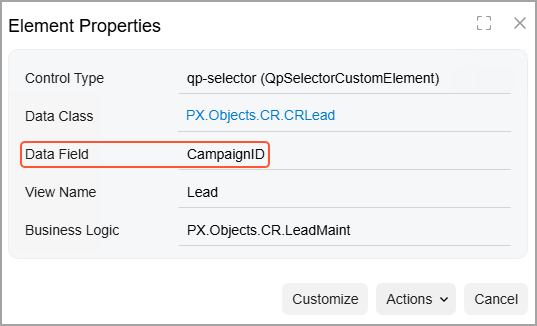

# Conditional Properties: To Require an Element {#_dc202219-82d3-4946-b23d-ead502351280 .task}

The following activity will walk you through the process of conditionally making a box required on a form.

## Story { .section}

Suppose that employees of your company often work with the [Leads](../UserGuide/CR_30_10_00.md) \(CR301000\) form. Further suppose that if a lead comes from a campaign, you want the user to specify the identifier of the marketing campaign from which the lead was generated on the [Leads](../UserGuide/CR_30_10_00.md) \(CR301000\) form. That is, you need to require the user to select an identifier in the **Source Campaign** box if *Campaign* is selected as the **Source**.

## Process Overview { .section}

By invoking the **Element Properties** dialog box on the [Leads](../UserGuide/CR_30_10_00.md) \(CR301000\) form, you will learn the internal name of the element that will be used in the condition \(that is, of the **Source Campaign** box\). By using the [Screens](../UserGuide/AU_20_10_00.md) page of the Customization Project Editor, you will add the [Leads](../UserGuide/CR_30_10_00.md) form so that it can be customized. By using the [Conditions](../UserGuide/AU_20_10_10.md) page, you will create a condition that uses the value of the **Source Campaign** box. On the [Fields](../UserGuide/AU_20_10_60.md) page, you will specify the created condition for the *Required* property for the **Source Campaign** box; you will then publish the project. Finally, you will test the condition on the [Leads](../UserGuide/CR_30_10_00.md) \(CR301000\) form.

## System Preparation { .section}

Before you begin performing the steps of this activity, do the following:

1.  Prepare an Acumatica ERP instance by performing the [Customization Projects: To Deploy an Instance](CustomizationProjects_GettingStarted_Activity_CreateInstance.md) prerequisite activity.
2.  Create the *Yogifon* customization project by performing the [Customization Projects: To Create a Customization Project](CustomizationProjects_GettingStarted_Activity_CreateProject.md) prerequisite activity.

## Step 1: Learning the Internal Name of the Element { .section}

First, you need to learn the internal name of the element that will be used in the condition; on the [Leads](../UserGuide/CR_30_10_00.md) \(CR301000\) form, this is the **Source Campaign** box. Do the following:

1.  On the form title bar of the [Leads](../UserGuide/CR_30_10_00.md) form, click **Settings** &gt; **Inspect Element**.
2.  In the Summary area, click the **Source Campaign** box.

    The **Element Properties** dialog box opens, as shown in the following screenshot. The internal name of the field is displayed in the **Data Field** box.

    

    As you can see, the box contains `CampaignID`. Close the dialog box.

## Step 2: Modifying the List of Customized Screens { .section}

To add a condition for a box on the [Leads](../UserGuide/CR_30_10_00.md) \(CR301000\) form, you need to add the form to the list of customized screens. In the Customization Project Editor, do the following:

1.  In the navigation pane, click **Screens** to open the [Screens](../UserGuide/AU_20_10_00.md) page.
2.  On the page toolbar, click **Customize Existing Screen**.

    The **Customize Existing Screen** dialog box opens.

3.  In the **Select Screen** box of the dialog box, click the magnifier button. In the lookup table, type `CR301000` in the Search box, and double-click the *Leads* form.
4.  Click **OK** to close the dialog box.

    Notice that the [Leads](../UserGuide/CR_30_10_00.md) \(CR301000\) form is added to the list of customized screens on the page.

## Step 3: Defining the Condition { .section}

To define the condition, do the following in the Customization Project Editor:

1.  In the navigation pane, click **Screens** &gt; **CR301000** &gt; **Conditions**. The [Conditions](../UserGuide/AU_20_10_10.md) page opens.

    **Tip:** In the name that appears on the page, *Conditions: CR301000 \(Leads\)*, *Conditions* is followed by the form ID and then the form name in parentheses.

2.  On the page toolbar, click **Add New Record**.
3.  In the **Condition Properties** dialog box, which opens, enter the name of the condition: `CampaignCondition`.
4.  On the table toolbar, click **Add Row**.
5.  In the new row, specify the following settings:
    -   **Field Name**: *Source*
    -   **Conditions**: *Equals*
    -   **From Schema**: Selected
    -   **Value**: *Campaign*
6.  Click **Save** to save your changes and close the dialog box.

## Step 4: Specifying the Condition for the Required Property { .section}

To specify the condition you have defined as the value for the **Required** property of the `Source Campaign` field, do the following:

1.  In the navigation pane, click **Screens** &gt; **CR301000** &gt; **Fields**. The [Fields](../UserGuide/AU_20_10_60.md) page opens.

    **Tip:** In the name that appears on the page, *CR301000 \(Leads\) Fields*, *Fields* is preceded by the form ID and then the form name in parentheses.

2.  On the page toolbar, click **Add New Record**.
3.  In the **Add Field** dialog box, which opens, specify the following settings:
    -   **Container**: *Lead \(Lead Summary\)*
    -   **DAC**: *PX.Objects.CR.CRLead* \(specified automatically\)
    -   **Field Name**: *Source Campaign*
    -   **Display Name**: `Source Campaign`
4.  In the table, select the unlabeled check box in the only row, and click **Add &amp; Close** to save your changes.

    The dialog box is closed, and the added field appears in the table on the [Fields](../UserGuide/AU_20_10_60.md) page.

5.  In the **Required** column of the *CampaignID* row, select *CampaignCondition*.
6.  On the page toolbar, click **Save**.
7.  To apply the changes to the instance, on the main menu of the Customization Project Editor, click **Publish** &gt; **Publish Current Project**.
8.  Wait until the *Website updated* row appears in the **Compilation** pane, and click **Close Compilation Pane**.

## Step 5: Testing the Condition { .section}

To test the condition, do the following on the [Leads](../UserGuide/CR_30_10_00.md) \(CR301000\) form of Acumatica ERP:

1.  Create a lead.
2.  In the **Contact** section of the **General** tab, specify the following settings:
    -   **First Name**: `Sam`
    -   **Last Name**: `Collins`
    -   **Account Name**: `Muffin Secret`
3.  In the **Address** section, specify the following settings:
    -   **City**: `New York`
    -   **Country**: *US*
4.  In the **Lead Class** box in the Summary area, select *Lead*.
5.  In the table on the **Attributes** tab, enter `Food, Beverages & Tobacco` in the **Industry** row.
6.  In the Summary area, specify the following settings:
    -   **Source**: *Campaign*
    -   **Source Campaign**: Empty
7.  Try to save your changes.

    An error should be displayed.

8.  In the **Source Campaign** box, select *Partner*.
9.  Save your changes.

    Make sure that the system does not display the error and that the record is saved.

**Parent topic:**[Defining Conditional Properties](../CustomizationPlatform/CustomizationProjects_DisplayingElementsConditions_Mapref.md)

