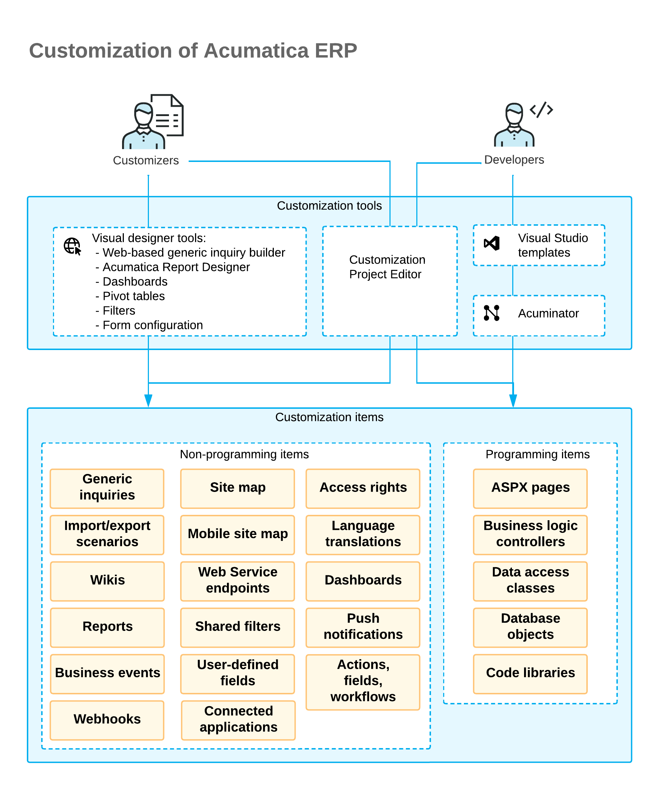

# Customization Projects: General Information {#_23c00bb2-dc1a-418a-bbd3-79673c7fe32c .concept}

By using the tools and capabilities of the Acumatica Customization Platform, you can change the user interface and business logic of Acumatica ERP, as well as extend the functionality of the system.

## Learning Objectives { .section}

In this chapter, you will learn about the customization projects in Acumatica ERP and the tools used to manage them.

## Applicable Scenarios { .section}

You may find the information in this chapter useful when you are responsible for the customization of Acumatica ERP in your company, and you need a general idea of how the customization process works.

## Tools for Customization { .section}

You can customize Acumatica ERP so that it optimally supports your company's business processes. The following diagram shows the tools that your customizers and developers can use to customize Acumatica ERP to meet your company's needs. It also illustrates the customization items \(described below\) that would result from these efforts.

As a customizer, you can use the following tools to modify Acumatica ERP:

-   Customization Project Editor
-   UI Configuration mode
-   Generic inquiry builder
-   Acumatica Report Designer
-   Dashboards
-   Pivot tables
-   Filters

As a developer, you would typically use the following tools to modify Acumatica ERP:

-   Customization Project Editor
-   Visual Studio
-   Acuminator

## Customization Projects and Customization Items { .section}

To manage your customization efforts, you create and use customization projects. A *customization project* is a set of changes to the user interface, configuration data, and functionality of Acumatica ERP. You create a customization project in a single instance. You can apply the customization project you have created to a different instance of Acumatica ERP by exporting the customization project from the original instance and importing it to a new instance.

While customizing Acumatica ERP, you use the [Customization Project Editor](../UserGuide/SM_20_45_10.md) to create *customization items*, which are components of various types \(shown in the diagram above\) that make up a customization project. You also use UI Configuration mode to modify the layout of forms—that is, to add certain elements to a form or remove them, or to rearrange the elements. Customization items fall into the following two categories: programming items and non-programming items. This guide describes working with non-programming items and is designed primarily for customizers.

The Customization Project Editor includes a page to support each type of item in a customization project, and you open these pages by using the navigation pane of the editor.

**Attention:** A customization project contains only the items that have been explicitly saved to it in the Customization Project Editor.

To apply the items of a customization project to Acumatica ERP, you have to *publish* the project. Before the project is published, the changes exist only in the project and have not yet been applied to the instance.

This guide covers the customization of Acumatica ERP by using the Customization Project Editor and UI Configuration mode to create and manage customization items. The lessons of this guide involve only light code editing \(copying and pasting small snippets\) and do not require deep programming skills.

For details on creating other kinds of customization items, see [Customizing Elements of the User Interface](CG_GL_UI.md).

## Types of Objects { .section}

During the customization process, you modify various system objects and add new objects. Customization changes fall into the following general categories:

-   Changes and additions to the metadata of the following types of objects, with the changes affecting a specific tenant:
    -   Access rights
    -   Actions, fields, and workflows
    -   Analytical reports
    -   Business events
    -   Connected applications
    -   Dashboards
    -   Generic inquiries
    -   Import and export scenarios
    -   Mobile application
    -   Push notifications
    -   Reports
    -   Shared filters
    -   Site map nodes
    -   System locales
    -   User-defined fields
    -   Webhooks
    -   Web service endpoints
    -   Wiki articles
-   Website changes and additions to the following types of objects, with the changes affecting all tenants:
    -   Code
    -   Data access classes
    -   Database scripts
    -   Files
    -   Screens \(forms\)

When you save any of these objects to a customization project, a customization item of the particular type is created. You can see all customization items of the current customization project in the navigation pane of the Customization Project Editor, sorted by their type. For example, you can customize Acumatica ERP by adding or modifying a generic inquiry. You can include this generic inquiry in a customization project as a customization item of the *GenericInquiryScreen* type.

You can add new customization items or modify existing ones. When you publish the customization project on another instance, all objects saved as customization items are also applied to the instance. In this case, you do not need to configure them manually on the instance where you published the project.

For details on types of customization items, see [Types of Items in a Customization Project](CG_Platform_Project_ItemTypes.md).

## Application of Changes to the Instance { .section}

When you make changes to form elements by using the Customization Project Editor, the changes are available only in the editor and have not yet been applied to the instance. To apply these changes to the instance, you need to publish the customization project. You can publish any number of projects by using the [Customization Projects](../UserGuide/SM_20_45_05.md) \(SM204505\) form of Acumatica ERP. Also, while you are working on a project in the Customization Project Editor, you can publish it.

When you start the publication of the project from within the Customization Project Editor by clicking **Publish** &gt; **Publish Current Project**, it proceeds as follows:

-   The **Compilation** pane appears at the bottom of the Customization Project Editor window.
-   The project is validated. That is, the system checks the syntax and semantics, and makes sure that the changes included in the customization project are compatible with the original application code.
-   The project is published. The system displays the *Website updated* line and the **Close Compilation Pane** button in the **Compilation** pane to indicate that the publishing has finished successfully.

If you use the UI Configuration mode to change the layout of a form, you click **Apply to All** in the UI Configuration pane to apply those changes.

## Terminology for Internal and External Elements { .section}

The terms that are used to describe elements in the code \(that is, the elements’ *internal names*\) sometimes differ from the terms used to describe these elements on Acumatica ERP forms \(the elements’ *external names*\). The following table lists these elements. In this guide, you will see the internal names and external names of the elements, depending on whether their internal development or external appearance is being discussed.

|External Name|Internal Name|
|-------------|-------------|
|Form|Screen|
|Box

 Check box

|Field|
|Command

 Button

|Action|

**Parent topic:**[Getting Started with Customization Projects](../CustomizationPlatform/CustomizationProjects_GettingStarted_Mapref.md)

