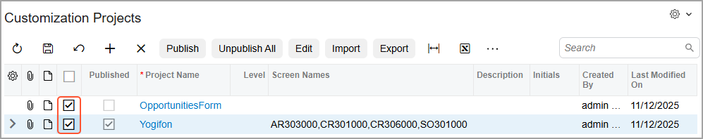
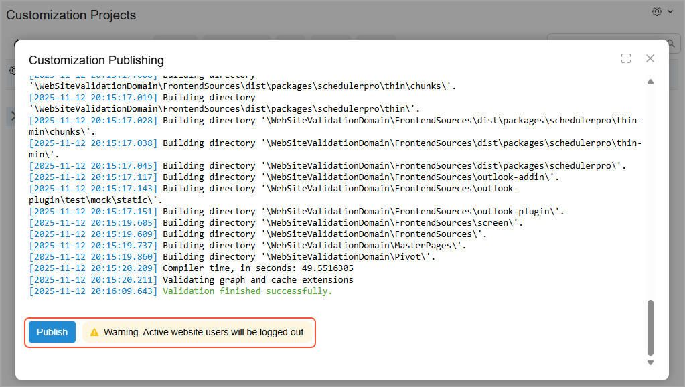
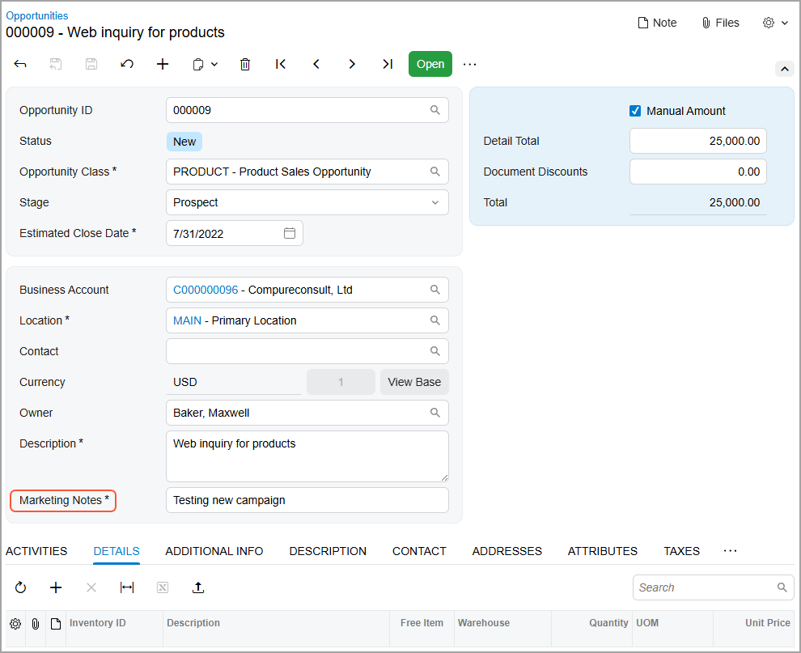

# Project Publication: To Publish Two Customization Projects {#_a2986150-5243-43d7-8349-d1f34d1c1648 .task}

The following activity will walk you through the process of publishing two customization projects.

## Story { .section}

Suppose that you have two customization projects. The *Yogifon* project contains the modifications of various elements on the [Customers](../UserGuide/AR_30_30_00.md) \(AR303000\), [Cases](../UserGuide/CR_30_60_00.md) \(CR306000\), [Leads](../UserGuide/CR_30_10_00.md) \(CR301000\), [Sales Orders](../UserGuide/SO_30_10_00.md) \(SO301000\), and [Customer Locations](../UserGuide/AR_30_30_20.md) \(AR303020\) forms. The *OpportunitiesForm* project adjusts the size of the **Description** box on the [Opportunities](../UserGuide/CR_30_40_00.md) \(CR304000\) form so that this box has the same length as other boxes in the Summary area. You need to publish these customization projects simultaneously to apply the changes from both projects.

## Process Overview { .section}

By using the [Customization Projects](../UserGuide/SM_20_45_05.md) \(SM204505\) form of the *Yogifon\_Staging* instance, you will publish the *Yogifon* and the *OpportunitiesForm* projects.

## System Preparation { .section}

Before you begin performing the steps of this activity, do the following:

1.  Prepare anAcumatica ERP instance called *Yogifon\_Staging* by using the process described in [Customization Projects: To Deploy an Instance](CustomizationProjects_GettingStarted_Activity_CreateInstance.md).
2.  In the *Yogifon\_Staging* instance, enable the following features on the [Enable/Disable Features](../UserGuide/CS_10_00_00.md) \(CS100000\) form:
    -   **Business Account Locations**
    -   **Multicurrency Accounting**
    -   **Payment Application by Line**
3.  Download the following files of the deployment packages:
    -   [`Yogifon.zip`](https://training.acumatica.com/University/W140/Yogifon.zip)
    -   [`OpportunitiesForm.zip`](https://training.acumatica.com/University/W140/Yogifon.zip)

## Step 1: Importing the Customization Projects { .section}

To import the deployment packages to the staging environment, do the following:

1.  In the *Yogifon\_Staging* instance, open the [Customization Projects](../UserGuide/SM_20_45_05.md) \(SM204505\) form.
2.  On the More menu \(under **Import**\), click **Import**.
3.  In the **Open Package** dialog box, which opens, select the `Yogifon.zip` file, which you have downloaded.
4.  Click **Upload**.

    The system uploads the project and adds it to the list on the [Customization Projects](../UserGuide/SM_20_45_05.md) form.

5.  On the More menu \(under **Import**\), click **Import** again.
6.  In the **Open Package** dialog box, which opens, select the `OpportunitiesForm.zip` file, which you have downloaded.
7.  Click **Upload**.

    The system uploads the project and adds it to the list on the [Customization Projects](../UserGuide/SM_20_45_05.md) form.

## Step 2 : Publishing the Yogifon Project and the OpportunitiesForm Project { .section}

To publish multiple customization projects, do the following on the [Customization Projects](../UserGuide/SM_20_45_05.md) \(SM204505\) form:

1.  In the table, select the check boxes \(in the unlabeled column\) for the *Yogifon* and *OpportunitiesForm* projects, as shown in the following screenshot.

    

    **Tip:** You can open this form directly in Acumatica ERP; you can also open it while you are working in the Customization Project Editor by clicking **Publish** &gt; **Multiple Projects**.

2.  On the form toolbar, click **Save**.
3.  On the More menu \(under **Publish**\), click **Publish**.

    The **Compilation** pane appears, and the validation of the projects is performed.

4.  After the validation has completed, click **Publish** \(see the following screenshot\).

    

    When the *Website updated* line and **Close Compilation Pane** button appear in the **Compilation** pane, the publication has completed.

5.  Close the **Compilation** pane.

## Step 3: Testing the Changes from the OpportunitiesForm Customization Project { .section}

To test the changes to the **Marketing Notes** box, do the following:

1.  On the [Opportunities](../UserGuide/CR_30_40_00.md) \(CR304000\) form in Acumatica ERP, open the opportunity with the *000009* ID.

    Notice that the value in the **Opportunity Class** box is *Product*.

2.  In the Summary area, make sure that the **Marketing Notes** box appears, and that it is required \(see below\).

    

## Step 4: Testing the Changes in the Yogifon Customization Project { .section}

To test the changes in the published *Yogifon* customization project, perform the following steps:

1.  Open the [Generic Inquiry](../UserGuide/SM_20_80_00.md) \(SM208000\) form. In the **Inquiry Title** box, select *SO-OpenByCustomer*.
2.  On the form toolbar, click **View Inquiry**.

    Make sure that the inquiry opens in a new browser tab, and that it contains the **Order Type** column.

3.  On the [Customers](../UserGuide/AR_30_30_00.md) \(AR303000\) form, do the following:
    1.  Open the customer with the *C000000003* ID.
    2.  Find the **Address Type** box on the **General** tab, and make sure that it has the *Business*, *Home*, and *Other* options.
    3.  Make sure that the **Financial** tab contains the **Currency** section.
    4.  On the More menu \(under **Inquiries**\), click **Open SO by Customer**, and make sure that the Open Sales Orders by Customer generic inquiry opens in a new browser tab.
4.  On the [Cases](../UserGuide/CR_30_60_00.md) \(CR306000\) form, do the following:
    1.  Open the case with the *000002* ID.
    2.  Verify that the form contains the **Problem Summary** tab, and that this tab contains the **Problem Type** and **Comments** boxes.
    3.  Click the magnifier button of the **Case ID** box in the Summary area, and make sure that the lookup table contains the **Reported On** column.
5.  On the [Leads](../UserGuide/CR_30_10_00.md) \(CR301000\) form, clear the **Email** for the record with the *Smith, Jenny* lead ID, and make sure that the **Accept** command on the More menu is visible but unavailable.
6.  On the [Sales Orders](../UserGuide/SO_30_10_00.md) \(SO301000\) form, do the following:
    1.  On the Company and Branch Selection menu in the top pane of the screen, select the *MyStore* branch.
    2.  In the info area, in the upper-right corner of the top pane of the Acumatica ERP screen, make sure that the business date in your system is set to *10/31/2024*. If a different date is displayed, click the Business Date menu button, and select *10/31/2024* from the calendar.
    3.  Open the sales order with the *000002* ID.
    4.  Verify that the form toolbar contains the **Sales Orders by Customer** button, and that the More menu contains the **Sales Orders by Customer** command.
    5.  Click this button or menu command, and make sure that the report opens in a new browser tab.
7.  On the [Customer Locations](../UserGuide/AR_30_30_20.md) \(AR303020\) form, make sure that the **Network Type** box is displayed on the **User-Defined Fields** tab.

**Parent topic:**[Publishing Customization Projects](../CustomizationPlatform/CustomizationProjects_PublishingProjects_Mapref.md)

