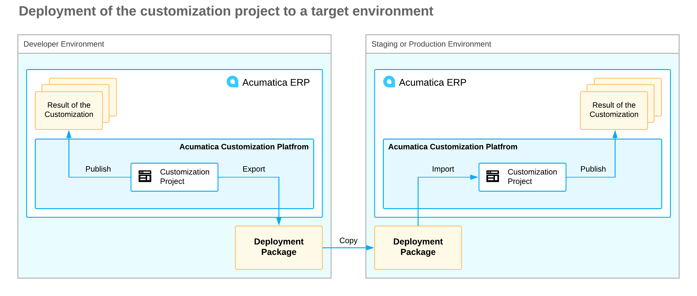
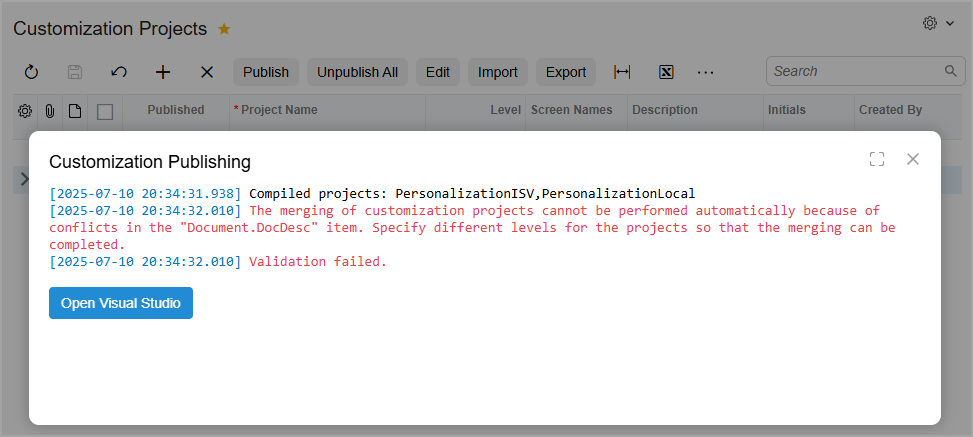
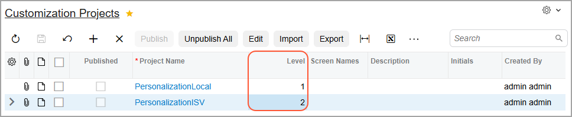
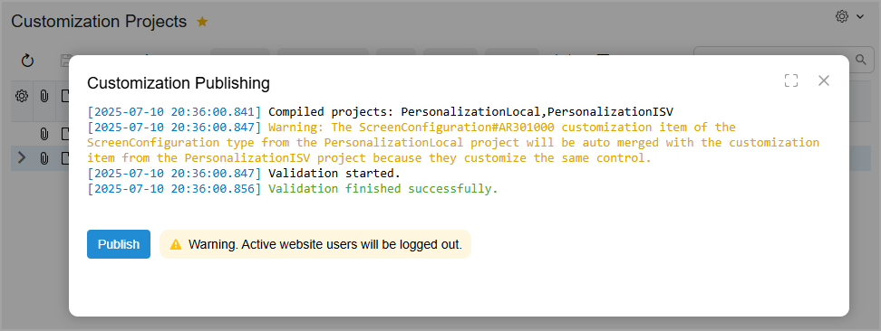
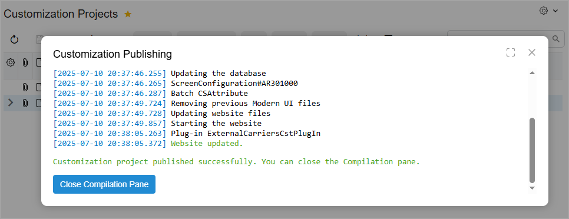
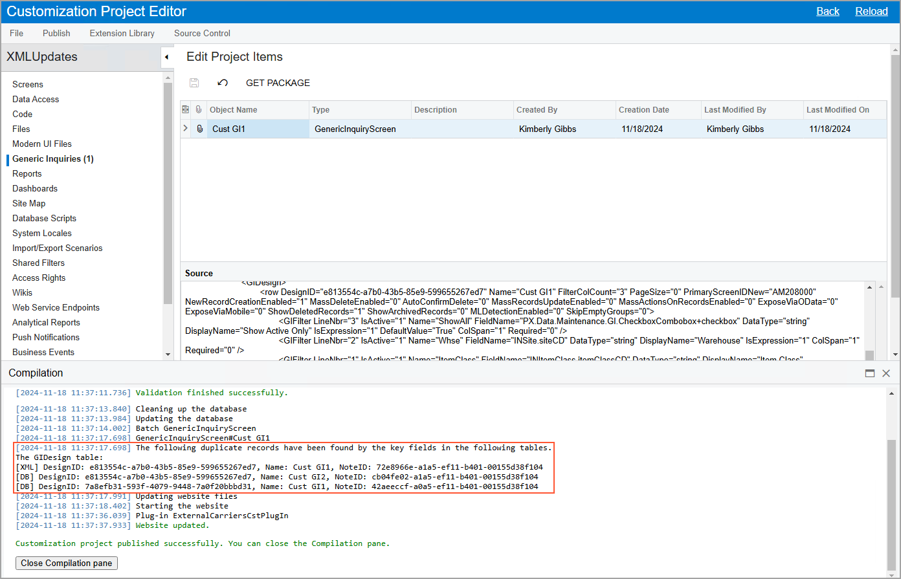

# Project Publication: General Information {#_75b5787a-a8cb-46a3-8ba6-037455d8a42a .concept}

When you have made all the needed changes to an Acumatica ERP instance, you can deploy your customization project to another instance.

You can implement planned changes in different customization projects, with related changes grouped in the same project. You can publish multiple customization projects in one instance of Acumatica ERP.

## Learning Objectives { .section}

In this chapter, you will learn how to do the following:

-   Create a deployment package for the customization project
-   Export the package to a target system
-   Publish the customization project in the target system
-   Publish multiple customization projects simultaneously

## Applicable Scenarios { .section}

You deploy a customization project to another instance in the following cases:

-   You need to copy the changes caused by the customization project from the testing Acumatica ERP instance to the production Acumatica ERP instance.
-   You need to deploy another Acumatica ERP instance, and you want to make the same changes to it as you have to an existing instance that has a customization project published.

You publish multiple customization projects when you have been working on separate customization projects in your company, and you need to apply the changes from these projects to a single Acumatica ERP instance.

## Deployment of a Customization Project to Another Environment { .section}

As you customize the system, you usually need to use three different environments:

-   A *development environment*: Your local environment, in which you create customization items, publish the customization project being developed, and perform initial tests related to the customization items
-   A *staging \(or pre-production\) environment*: A copy of the production environment in which you will perform final testing of the completed customization project before applying it to the production environment
-   A *production environment*: The target environment of the system that must be customized

You develop customization projects in the development environment. After you have added all customization items to the customization project and done preliminary testing, you prepare a deployment package to distribute the customization project to the staging or production environment, as shown in the following diagram.

A deployment package of a customization project is a redistributable ZIP file that includes the full content of the project. The deployment package consists of the `project.xml` file and any custom files that you have added to the project, such as external assemblies. The ZIP file has the same name as the exported customization project does.

## Publication of Multiple Projects to the Same Instance { .section}

When you publish more than one customization project, the Acumatica Customization Platform merges the contents of all projects into a single customization project. If different projects include customization items for the same object, the platform tries to merge the changes by using the following approach:

-   If the changes can be merged, the platform merges them.
-   If the changes cannot be merged—for example, if the same report has been added to different customization projects—the platform stops the process and displays an error message.

**Attention:** If a customization project contains DLL files that are not .NET Framework DLL files, these DLL files are skipped during the publication process.

The process of publishing multiple projects to the same instance is similar to the process of publishing a single project. You start the publication on the [Customization Projects](../UserGuide/SM_20_45_05.md) \(SM204505\) form by selecting the customization projects you need to publish and clicking **Publish** on the More menu. You can also open this form while you are working in the Customization Project Editor by clicking **Publish** &gt; **Multiple Projects** on the main menu.

The system opens the **Compilation** pane, which displays the progress of publishing. First, the system performs the validation of the projects. After the validation is complete, you need to click **Publish** in this pane. Note that at this stage, all current users will be signed out.

After the publication is complete, you can view the content of the merged customization project by clicking the **View Published** on the More menu of the [Customization Projects](../UserGuide/SM_20_45_05.md) form. \(See [To View a Published Customization](CG_GL_Projects_ViewingPublished.md) for details.\)

## Changes to the Application and Database { .section}

During the publication, the platform applies the changes to the application and database objects and updates the files in the website folder as follows:

-   The custom layout is applied to the forms of Acumatica ERP.
-   The `.cs` files with the DAC extension code for the existing data access classes are generated and placed in the file system.
-   The `.cs` files with the BLC extension code for the existing business logic are generated and placed in the file system.
-   The `.cs` files with the custom code \(Code items\) are generated and placed in the file system.
-   The custom files of the project are added to the website folder.
-   The custom tables are created in the database, and custom SQL scripts are executed.
-   The custom generic inquiries, reports, site map nodes, system locales, integration scenarios, shared reusable filters, access rights, wikis, web service endpoints, and analytical reports are added to the database.

We recommend that you back up the database before you publish customization projects, because canceling publication does not revert the changes made to the database. See [Unpublishing Customization Projects](CustomizationProjects_UnpublishingProjects_Mapref.md) for details.

After the publication is complete, the application domain always restarts if the project includes assemblies, which are placed in the `/Bin` folder of the website. If you have no assemblies in the project, you can enable run-time compilation, and the publication will not cause a restart.

If a published customization project contains classes derived from the CustomizationPlugin class, the platform launches the implemented custom processes after website files were updated and after the website was restarted. \(See [Custom Processes During Publication of a Customization](CG_Platform_Framework_PlugIn.md) for details.\)

After you have published the customization project, the files with the customization code are updated in the file system, and you can work with them in MS Visual Studio. The `.cs` files with code are placed in the `App_RuntimeCode` folder of the website.

## Validation of Customization Code { .section}

While the Acumatica Customization Platform processes the publication of a customization project, the platform validates the customization code included in the project. This validation of the code provides not only checking for syntax and semantics but also checking of the compatibility of the code included in the customization project with the original application code.

If there are any compatibility errors, the platform displays the warning and error messages in the **Compilation** window and stops the publication process. See [Validation of Customization Projects: Compatibility Validation](../DeveloperGuide/CodeCustomization_Validation_BeforeUpgrade.md) for detailed information.

## Merging of Form \(UI\) Configurations {#section_usx_htm_phc .section}

In Acumatica ERP, you can perform individual or system-wide form configuration. You can also incorporate a form’s modifications in a customization project as a screen configuration.

If you have multiple projects, you might have modifications of the same form in different projects. Consider this example:

1.  You have created a system-wide configuration of a form in Acumatica ERP.
2.  You’ve added the form’s changes to a customization project as a screen configuration on the [UI Configurations](../UserGuide/AU_23_00_10.md) page of the Customization Project Editor.
3.  Your ISV has provided another customization project with changes to the same form.
4.  After reviewing the ISV project’s changes, you’ve decided that it would be beneficial to apply changes from both projects to the form.

In the Modern UI, you simply publish both projects—or any number of projects. The system merges the changes if they’re compatible, such as when each project adds a different user-defined field to the same fieldset.

Conflicting changes can't be merged, however—for example, when a tab or a table column is hidden in one project and visible in another. In this case, the system displays an error \(shown below\) and prompts you to assign different priority levels to the projects.

To do this, you assign the highest level to the project with the most important changes on the [Customization Projects](../UserGuide/SM_20_45_05.md) \(SM204505\) form, as shown below, and start the publication again. A level is a whole number; the higher this number, the more important the customization project is. If you don't specify a level, the project keeps the default value of *0*.

The system applies to the form the changes from the project with a higher level as well as the changes with no conflicts. It then displays a message about the merging of changes \(see below\).

The publication then completes \(shown below\).

When changes are overridden based on the level of a customization project, you can manually reintroduce them. To do this, add the updated UI configuration to the higher-level project and publish this project.

If you later unpublish the project, the system-wide form configuration stays in place. You can reverse these modifications only in UI Configuration mode \(by clicking **Reset to Default** on the UI Configuration pane\).

## Duplicate Record Checking {#section_mmz_wwd_f2c .section}

The system checks for duplicate records during the publication of customization projects. Suppose that an item in a customization project has the same key \(the primary key, the unique index, or the unique key\) as a record that exists in the system. When you publish this project, the system displays a warning \(see below\) and overwrites the existing record with the item from the project.

For details on XML format, see [Implementing the XML Import and Export Functionality in a Custom Form](CG_GL_BL_ExampleXMLImportExportCustomForm.md).

**Parent topic:**[Publishing Customization Projects](../CustomizationPlatform/CustomizationProjects_PublishingProjects_Mapref.md)

