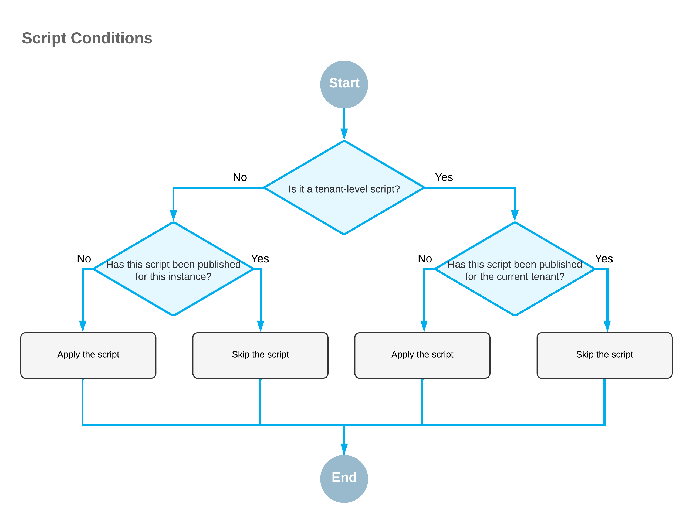
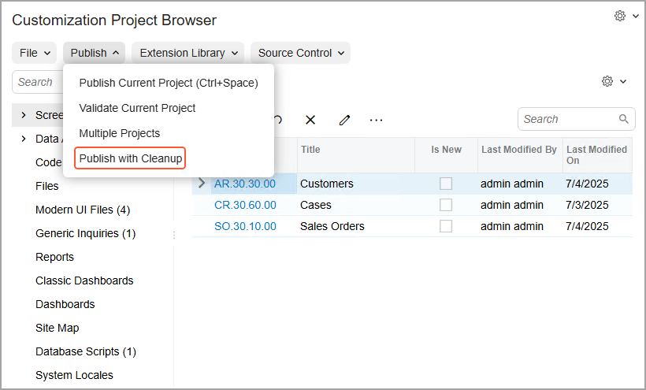

# Publication with Cleanup: General Information {#_260f3c6e-7f82-4e4a-bc05-f12bccf56dda .concept}

If a customization project contains customization items \(such as *GenericInquiryScreen* customization items\) that make the system run scripts in the database, then during the publication of the project, the platform executes the scripts. To avoid the execution of these scripts each time the project is published, the platform saves information about each script that has been executed at least once and has not yet been changed in the database, and omits the repeated execution of such scripts.

You can force the platform to clean up all information about previously executed scripts of a customization project and execute the scripts once more during the publication of the project. That is, you can publish the customization project with the cleanup operation.

**Important:** You should use publishing with cleanup if you have made changes outside of the Customization Project Editor to the tables that are affected by your custom database scripts. For example, you would use publishing with cleanup if you have modified database tables by using the SQL Server Management Studio, or modified or removed a generic inquiry on the [Generic Inquiry](../UserGuide/SM_20_80_00.md) \(SM208000\) form.

## Learning Objectives { .section}

In this chapter, you will learn how to use the cleanup operation when publishing customization projects.

## Applicable Scenarios { .section}

You publish a customization project with cleanup if you have modified database tables outside of the Customization Project Editor, made some changes to the customization project, and need to publish this project again.

## Publishing with Cleanup and Database Scripts { .section}

Database scripts fall into two categories:

-   *Database-level scripts*, which modify the database schema and are applied to the whole instance.
-   *Tenant-level scripts*, which modify data in database tables. These scripts modify the data of only the tenant for which the scripts are published.

During the first \(non-cleanup\) publication of a customization project that contains items that make the system run scripts in the database, a hash for each script is saved to the database. For a tenant-level script, the system also saves the tenant ID for which this script has been published. When the customization project is published again, the system compares the hash of each database script \(and the tenant ID, if applicable\) in the current project to the hash \(and tenant ID, if applicable\) of each database script in the database. If the hashes \(and tenant IDs\) are equal, the script is not applied. The conditions for which different scripts are applied are shown in the following diagram.

The system behavior with these scripts has the following outcomes:

-   Even minor changes in a database script customization item may lead to the script being applied again.
-   The same tenant-level script is not applied to the same tenant twice.
-   When a customization project is published for another tenant, all tenant-level scripts are applied.
-   A database-level script is never applied again for the same instance.

Publishing with cleanup applies all database scripts again, regardless of whether these scripts have been applied before.

For example, suppose that you have added to a customization project a database script that creates a new table in the database. Further suppose that you have published this customization project, and the table has been added to the database. Then you have removed this table from the database manually. To apply the script in the customization project and create the table again, you need to publish the project with the cleanup operation.

## Publishing of a Project with Cleanup { .section}

To publish a customization project with the cleanup operation, you perform the following general steps:

1.  You open the customization project in the Customization Project Editor.
2.  On the main menu, you click **Publish** &gt; **Publish with Cleanup** \(see the following screenshot\).

    

    The system cleans all information about previously executed scripts of the customization project and initiates the process of publishing the customization project \(executing the scripts during the publication\).

**Parent topic:**[Publishing with the Cleanup Operation](../CustomizationPlatform/CustomizationProjects_PublishingWithCleanup_Mapref.md)

