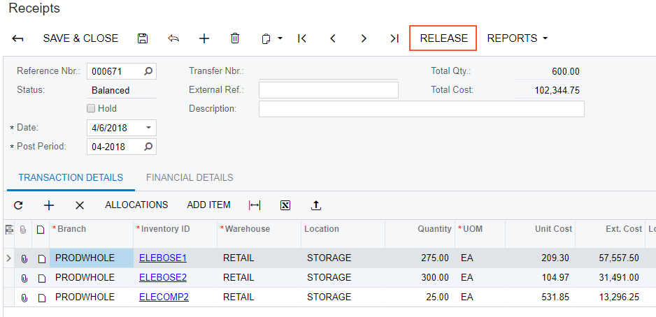
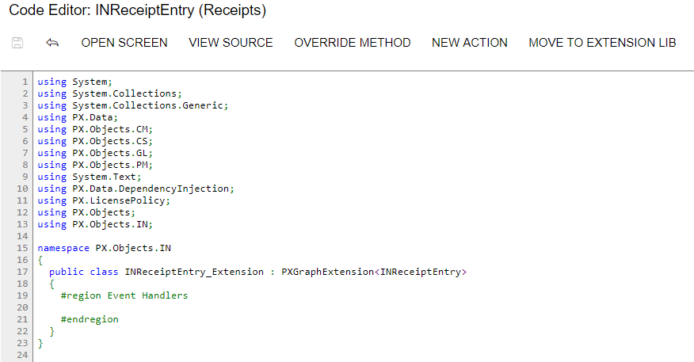

# Modifying a BLC Action {#_978b1ce1-49da-4194-bd11-bb72eaad9c5e .concept}

To modify the behavior of an action that is defined within a business logic controller \(BLC, also referred to as *graph*\), you should override an action delegate.

Suppose that you need to rename the **Release** button to **Extended Release** on the Receipts \(IN301000\) form, which is shown in the following screenshot.



To do this, you have to find the business logic controller for the form and modify the display name of the action that corresponds to the **Release** button as follows:

1.  Find the business logic controller for the form, on the **Customization** menu, select **Inspect Element** and click the button caption on the form. The system should retrieve the following information of the button, which appears in the **Element Properties** dialog box:

    -   **Control Type**: *DS Callback Command*. The type of the UI control.
    -   **Business Logic**: *INReceiptEntry*. The business logic controller that contains the code of the action that is represented by the **Release** button.
    Thus, to rename the button, you have to change the `DisplayName` parameter of the `PXUIField` attribute for the `Release` action in the BLC extension for the *INReceiptEntry* class.

2.  Modify the attributes of the action, by doing the following:

    1.  Select **Actions** &gt; **Customize Business Logic** in the Element Properties dialog box
    2.  In the **Select Customization Project** dialog, specify the project to which you want to add the customization item for the business logic controller of the form and click **OK**.

        The Code Editor opens for customization of the business logic code of the form \(see the screenshot below\). The system generates the BLC extension class in which you can develop the customization code. \(See [Graph Extensions](CG_Platform_TO_Code_CS_GraphExtensions.md) for details.\)

        

    3.  Modify the `DisplayName` parameter of the `PXUIField` attribute for the `Release` action by redefining the action in the BLC extension class, to which the attributes are attached. Insert the code listed below into the `INReceiptEntry_Extension` class, as shown in the screenshot below. In the `DisplayName` parameter, you specify the new name for the button, *"Extended Release"*.

        ```
        
        #region Customized Actions
          public PXAction<INRegister> release;
          [PXUIField(DisplayName = "Extended Release",
                     MapEnableRights = PXCacheRights.Update,
                     MapViewRights = PXCacheRights.Update)]
          [PXProcessButton]
          protected IEnumerable Release(PXAdapter adapter)
          {
            return Base.release.Press(adapter);
          }
        #endregion
        
        ```

    The redefined action delegate must have exactly the same signature—that is, the return value, the name of the method, and any method parameters—as the base action delegate has. You always have to redefine the action delegate to alter either its delegate or the attributes attached to the action. To use the action declared within the base BLC or a lower-level extension from the action delegate, you should redefine the generic `PXAction<TNode>` data member within the BLC extension, as shown in the code above. You do not need to redefine the data member when it is not meant to be used from the action delegate. For details, see [Graph Extensions](CG_Platform_TO_Code_CS_GraphExtensions.md). When you redefine an action delegate, you have to repeat the attributes attached to the action. Every action delegate must have PXButtonAttribute \(or the derived attribute\) and PXUIFieldAttribute attached.

3.  Click **Save** in Code Editor to save the changes.

The system adds the customization to the business logic code to the **Code** list of project items. See [Code](CG_GL_Items_Code.md) for details.

To view the result of the customization, publish the customization project and open the Receipts form. Verify that the button caption has changed to **Extended Release**. Click this button for a document with the *Balanced* status and verify that the release procedure works exactly as it worked before publication of the current customization project.

**Parent topic:**[Examples of Functional Customization](../CustomizationPlatform/ACECustHow.md)

