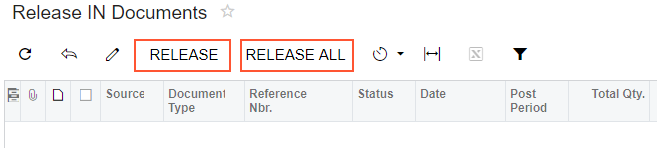
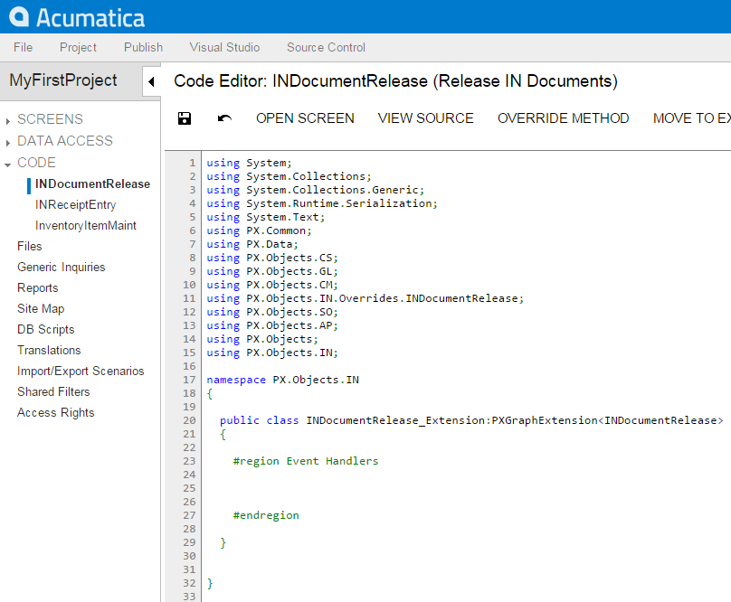

# Altering the BLC of a Processing Form {#_61657507-0dec-408a-989a-b7ce3df31c82 .concept}

For most processing forms of Acumatica ERP, the processing method, the button captions that are displayed on the toolbar of the form are set up during the BLC initialization \(*business logic controller*, also referred to as *graph*\)—that is, in the constructor of the BLC that provides the logic for the processing form, or in the `RowSelected` event handler of the main view data access class \(DAC\). To modify the logic that is executed during the BLC initialization, you have to create a BLC extension class and implement the needed logic in the Initialize\(\) method overridden in the extension class; do not use the constructor for that.

For example, to disable the **Release All** button and modify the functionality of the **Release** button of the Release IN Documents \(IN501000\) form, you create an extension on the INDocumentRelease BLC and override the `Initialize()` method as follows:

1.  Open the Release IN Documents form to see its original view \(see the screenshot below\). Notice that the **Release** and **Release All** buttons are both available for clicking.

    

2.  Select the business logic controller for customization, on the **Customization** menu, by clicking **Inspect Element** and selecting any element on the form, for example, the **Release** button. The system should retrieve the following information that appears in the **Element Properties** dialog box:
    -   **Business Logic**: *INDocumentRelease*. The business logic controller that provides the logic for the *Release IN Documents* form.
3.  Select **Actions** &gt; **Customize Business Logic** in the Element Inspector. In the **Select Customization Project** dialog box, specify the project to which you want to add the customization item for the business logic controller of the form and click **OK**.

    The Code Editor opens for customization of the business logic code of the form \(see the screenshot below\). The system generates the BLC extension class in which you can develop the customization code. \(See [Graph Extensions](CG_Platform_TO_Code_CS_GraphExtensions.md) for details.\)

    

4.  Override the Initialize\(\) method. In the method, disable the **Release All** button on the toolbar of the form, set the processing method, and set the method for asking the confirmation from the user before running the process.

    **Note:** Do not define constructors of BLC extension classes; always use the Initialize\(\) method to implement the needed initialization logic.

    To the BLC extension class for `INDocumentRelease`, add the code that is listed below.

    ```
    #region Extended initialization
    public override void Initialize()
    {
        // Disable the Process All button
        Base.INDocumentList.SetProcessAllEnabled(false);
        //If set by the SetParametersDelegate, the method is executed before the processing is run
        //and provides conditional processing depending on the confirmation from the user
        //If the method returns true, the system executes the processing method 
        //that is set by SetProcessDelegate
        Base.INDocumentList.SetParametersDelegate(delegate(List<INRegister> documents)
        {
            return Base.INDocumentList.Ask("IN Document Release",
                                           "Are you sure?",
                                           MessageButtons.YesNo) == WebDialogResult.Yes;
         });
         Base.INDocumentList.SetProcessDelegate(delegate(INRegister doc)
         {
             INDocumentRelease.ReleaseDoc(new List<INRegister>() { doc }, true);
         });
    }
    #endregion
    ```

    For another example of extending the BLC initialization, see [Extending BLC Initialization](HowACEInitializeBLC.md).

5.  Click **Save** in Code Editor to save the changes.

The system adds the customization to the business logic code to the **Code** list of project items. See [Code](CG_GL_Items_Code.md) for details.

To view the result of the customization, publish the customization project and open the Release IN Documents form. Notice that the **Release All** button has become unavailable. Select a few check boxes for documents to be released and click **Release**. The dialog box appears with the question that you have added in the BLC code. Click **Yes** to release the documents or **No** to cancel the operation and exit the dialog box.

**Parent topic:**[Examples of Functional Customization](../CustomizationPlatform/ACECustHow.md)

