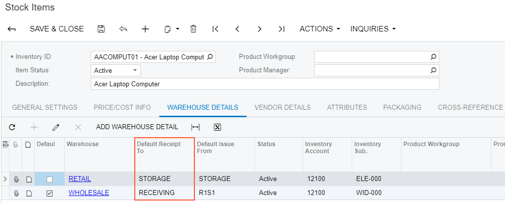
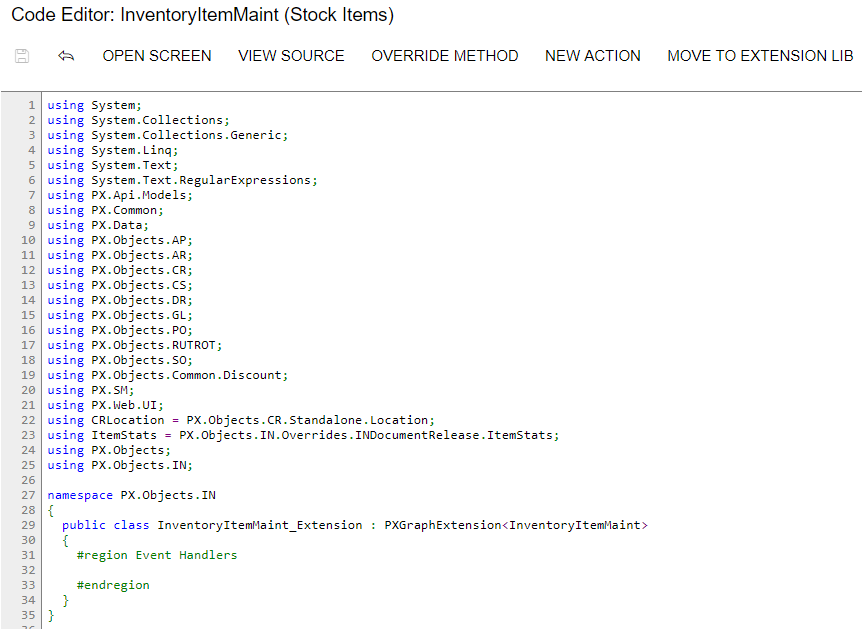

# Declaring or Altering a BLC Data View Delegate {#_06e2c0cd-cc6b-45c8-aa6f-2ca135ee9ca2 .concept}

You can modify the data view delegate—that is, the method that is invoked when the records are retrieved through the data view.

**Note:** For this example, you have to enable the *Warehouses* feature in the system to view the **Warehouses** tab on the Stock Items \(IN202500\) form.

For the Stock Items form, suppose that you have to make the system display the default warehouse in the **Default Receipt To** column for those records for which this column is empty. Your customization task specifies that the default warehouse for such records is the **Default Receipt To** warehouse of the default record selected on the **Warehouses** tab.

Open the Stock Items form and select the **Warehouses** tab to view the original tab, which is shown in the screenshot below.



To resolve this task, you have to modify the logic that retrieves the records to the **Warehouses** tab—that is, the modify the delegate of the data view that provides data for the tab. The data view that provides data for the tab is `itemsiterecords` that is defined in the business logic controller of the form. The business logic controller of the form is the InventoryItemMaint class. Do the following:

1.  Select the business logic controller for customization, on the **Customization** menu, select **Inspect Element** and click the **Warehouses** tab. The system should retrieve the following information that appears in the **Element Properties** dialog box:
    -   **Business Logic**: *InventoryItemMaint*. The business logic controller that provides the logic for the *Stock Items* form.
2.  Select **Actions** &gt; **Customize Business Logic** in the **Element Properties** dialog box.
3.  In the **Select Customization Project** dialog box, specify the project to which you want to add the customization item for the business logic controller of the form and click **OK**.

    The Code Editor opens for customization of the business logic code of the form \(see the screenshot below\). The system generates the BLC extension class in which you can develop the customization code. \(See [Graph Extensions](CG_Platform_TO_Code_CS_GraphExtensions.md) for details.\)

    

    To resolve the customization task, you have to redefine the `itemsiterecords` data view and implement the needed logic in the `itemSiteRecords()` data view delegate.

4.  Add the code that is listed below to the BLC extension class for InventoryItemMaint

    ```
    #region Customized Data Views
      public PXSelectJoin<INItemSite,
        InnerJoin<INSite,
          On<INSite.siteID, Equal<INItemSite.siteID>>,
        LeftJoin<INSiteStatusSummary,
          On<INSiteStatusSummary.inventoryID, Equal<INItemSite.inventoryID>,
            And<INSiteStatusSummary.siteID, Equal<INItemSite.siteID>>>>>>
        itemsiterecords;
    
      protected IEnumerable itemSiteRecords()
      {
        int? dfltReceiptLocationID = null;
        foreach (var res in Base.itemsiterecords.Select())
        {
          INItemSite site = (INItemSite)res;
          if (site.DfltReceiptLocationID != null && site.IsDefault == true)
            dfltReceiptLocationID = site.DfltReceiptLocationID;
          else if (site.DfltReceiptLocationID == null && dfltReceiptLocationID != null)
            site.DfltReceiptLocationID = dfltReceiptLocationID;
          yield return res;
        }
      }
    #endregion
    ```

    When you declare or alter a data view delegate within a BLC extension, the new delegate is attached to the corresponding data view. To query a data view declared within the base BLC or lower-level extension from the data view delegate, you should redeclare the data view within the BLC extension. You do not need to redeclare a generic `PXSelect<Table>` data member when it will not be used from the data view delegate. For details, see [Graph Extensions](CG_Platform_TO_Code_CS_GraphExtensions.md).

    The redeclared data view delegate must have exactly the same signature—the return value, the name of the method, and any method parameters— as the base data view delegate.

5.  Click **Save** in Code Editor to save the changes.

The system adds the customization to the business logic code to the **Code** list of project items. See [Code](CG_GL_Items_Code.md) for details.

To view the result of the customization, publish the customization project and open the Stock Items form. Verify that the default warehouse is displayed for all records as needed according to the customization task. The default warehouse is taken from the **Default Receipt To** warehouse of the record selected as *Default* in the table.

**Parent topic:**[Examples of Functional Customization](../CustomizationPlatform/ACECustHow.md)

