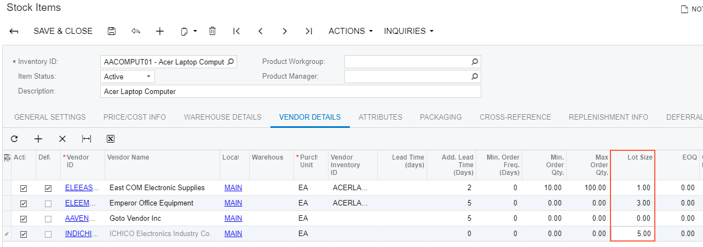

# Modifying a BLC Data View {#_7e9c3596-6a89-4580-b509-fe1b77556e5e .concept}

A *data view* is a PXSelect BQL expression declared in a business logic controller \(BLC, also referred to as *graph*\) for accessing and manipulating data. A data view may contain a delegate that is used to extend data access. To modify the data view, you have to alter the appropriate PXSelect BQL expression.

Suppose that you need to filter the rows on the **Vendors** tab of the Stock Items \(IN202500\) form. Open the original Stock Items form and create an item that has multiple vendor records on the **Vendors** tab, one or more of which has a **Lot Size** column value of *0.00*, as the screenshot below illustrates.

Your task is to modify the selection of records for the **Vendors** tab so that only the records that have a non-zero **Lot Size** value are retrieved to the tab. To resolve this customization task, you have to redeclare the data view that provides the data displayed on the tab.



The data for the **Vendors** tab is provided by the VendorItems data view that is defined in the InventoryItemMaint class—that is, the business logic controller for the Stock Items form. To resolve the customization task, you have to redefine the VendorItems data view in the BLC extension for the business logic controller of the form as follows:

1.  Select the business logic controller for customization, on the **Customization** menu, select **Inspect Element** and click the **Vendors** tab. The system should retrieve the following information that appears in the **Element Properties** dialog box:
    -   **Business Logic**: *InventoryItemMaint*. The business logic controller that provides the logic for the *Stock Items* form.
2.  Select **Actions** &gt; **Customize Business Logic** in the **Element Properties** dialog box.
3.  In the **Select Customization Project** dialog box, specify the project to which you want to add the customization item for the business logic controller of the form and click **OK**.

    The Code Editor opens for customization of the business logic code of the form \(see the screenshot below\). The system generates the BLC extension class in which you can develop the customization code. \(See [Graph Extensions](CG_Platform_TO_Code_CS_GraphExtensions.md) for details.\)

    

4.  In the BLC extension class for InventoryItemMaint, redefine the `VendorItems` data view, as listed below.

    ```
    public POVendorInventorySelect<POVendorInventory, 
        LeftJoin<InventoryItem, 
            On<InventoryItem.inventoryID, Equal<POVendorInventory.inventoryID>>, 
        LeftJoin<Vendor, 
            On<Vendor.bAccountID, Equal<POVendorInventory.vendorID>>, 
        LeftJoin<Location, 
            On<Location.bAccountID, Equal<POVendorInventory.vendorID>, 
                And<Location.locationID, Equal<POVendorInventory.vendorLocationID>>>>>>, 
        Where<POVendorInventory.inventoryID, Equal<Current<InventoryItem.inventoryID>>,
            And<POVendorInventory.lotSize, Greater<decimal0>>>, InventoryItem> VendorItems;
    ```

    To modify a data view, you have to redefine the data view in the BLC extension class. The data view redefined within a BLC extension completely replaces the base data view within the *Views* collection of a BLC instance, including all attributes attached to the data view declared within the base BLC. You can either attach the same set of attributes to the data view or completely redeclare the attributes. For details, see [Graph Extensions](CG_Platform_TO_Code_CS_GraphExtensions.md). The data view must have exactly the same identifier, `VendorItems`, which is referred in the UI control.

5.  Click **Save** in Code Editor to save the changes.

The system adds the customization to the business logic code to the **Code** list of project items. See [Code](CG_GL_Items_Code.md) for details.

To view the result of the customization, publish the customization project and open the Stock Items form. Verify that the records are filtered on the **Vendors** tab as required according to the customization task \(only the records with non-zero **Lot Size** are retrieved\).

**Parent topic:**[Examples of Functional Customization](../CustomizationPlatform/ACECustHow.md)

