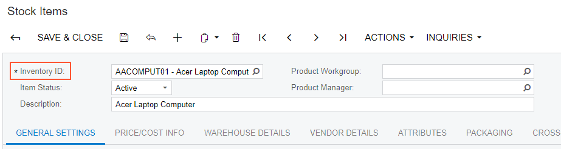

# Extending BLC Initialization {#_01fb63f2-6f2d-45ae-bf4d-d0660ea9a880 .concept}

During the initialization of a business logic controller \(BLC, also referred to as *graph*\), you can retrieve additional preferences, change field settings, or configure the processing form. You can extend the BLC initialization by implementing the needed logic in a BLC extension. To extend the initialization process, you have to override the Initialize\(\) method of the PXGraphExtension&lt;T&gt; class and do not use the constructor of the BLC extension class for that. During the BLC initialization, the system calls the Initialize\(\) methods of all extension levels, from the lowest to the highest. See [Graph Extensions](CG_Platform_TO_Code_CS_GraphExtensions.md) for details.

In this example, you will create an extension of the InventoryItemMaintExtension BLC, which overrides the Initialize\(\) method to change the display name of the InventoryItem data access class \(DAC\) field from *Inventory ID* to *Inventory Item ID* during the initialization of the base \(original\) BLC instance.

If you open the Stock Items \(IN202500\) form, you can see its original view with the **Inventory ID** control \(see the following screenshot\) that corresponds to the InventoryItem DAC field.



To complete the example, do the following:

1.  Select the business logic controller for customization, on the **Customization** menu, select **Inspect Element** and click the **Inventory ID** label. The system should retrieve the following information that appears in the **Element Properties** dialog box:
    -   **Business Logic**: *InventoryItemMaint*. The business logic controller that provides the logic for the *Stock Items* form.
2.  Select **Actions** &gt; **Customize Business Logic** in the **Element Properties** dialog box.
3.  In the **Select Customization Project** dialog box, specify the project to which you want to add the customization item for the business logic controller of the form and click **OK**.

    The Code Editor opens for customization of the business logic code of the form \(see the screenshot below\). The system generates the BLC extension class in which you can develop the customization code. \(See [Graph Extensions](CG_Platform_TO_Code_CS_GraphExtensions.md) for details.\)

    

4.  Override the Initialize\(\) method; in the method, set the display name of the InventoryItem data access class \(DAC\) field to *Inventory Item ID*. \(For demonstrative purposes, the code also retrieves the INSetup data record and shows how you can implement the logic depending on values of the record.\)

    **Note:** Do not define constructors of BLC extension classes; always use the Initialize\(\) method to implement the needed initialization logic.

    Add the code that is listed below to the BLC extension class for InventoryItemMaint.

    ```
    #region Extended initialization
    public override void Initialize()
    {
        PXUIFieldAttribute.SetDisplayName<InventoryItem.inventoryCD>(
            Base.Item.Cache,
            "Inventory Item ID"); 
        //retrieval of the setup record that stores inventory preferences       
        INSetup setup = Base.insetup.Current;
        if (setup.UpdateGL != true)
        {
            // Do some actions here
        }
    }
    #endregion
    ```

    In this method, you change the display name of the InventoryCD field of the InventoryItem DAC. You do this by calling the SetDisplayName\(\) static method of PXUIFieldAttribute. Also, you obtain the INSetup DAC instance by using the Current property of the INSetup data view. In your customization tasks, you may need to perform some actions that depend on field values of this setup DAC instance.

    You do not need to explicitly invoke the Initialize\(\) method on the previous extension levels; these methods are called automatically. Invoking `base.Initialize()` makes no sense, because the base variable points to the base class, which is PXGraphExtension \(not the base graph\). The PXGraphExtension class defines Initialize\(\) as an empty method.

5.  Click **Save** in Code Editor to save the changes.

The system adds the customization to the business logic code to the **Code** list of project items. See [Code](CG_GL_Items_Code.md) for details.

To view the result of the customization, publish the customization project and open the Stock Items form. Verify that the label has changed to **Inventory Item ID**.

**Parent topic:**[Examples of Functional Customization](../CustomizationPlatform/ACECustHow.md)

