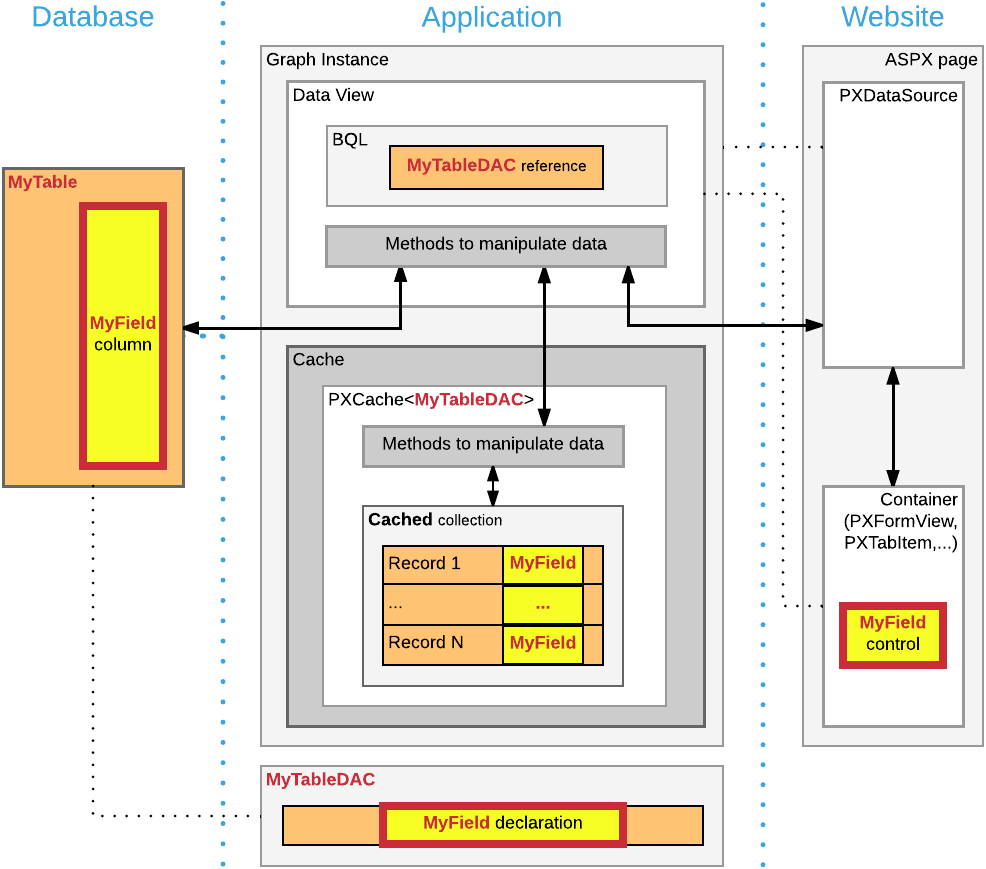
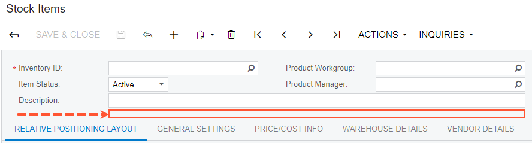
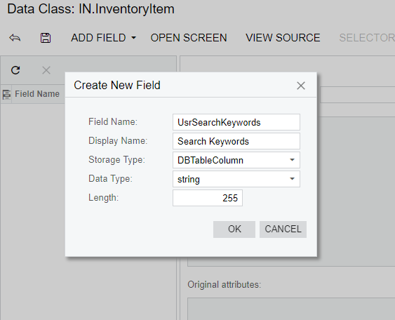
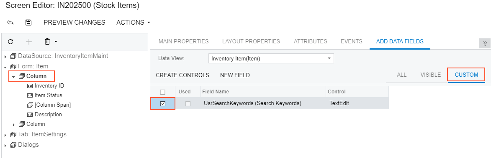
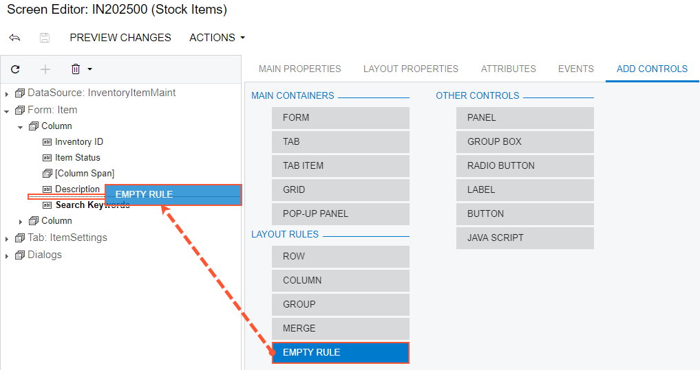
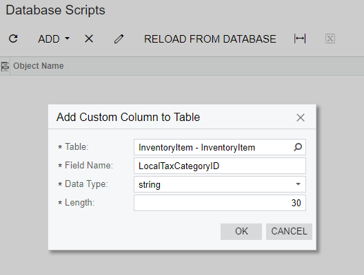
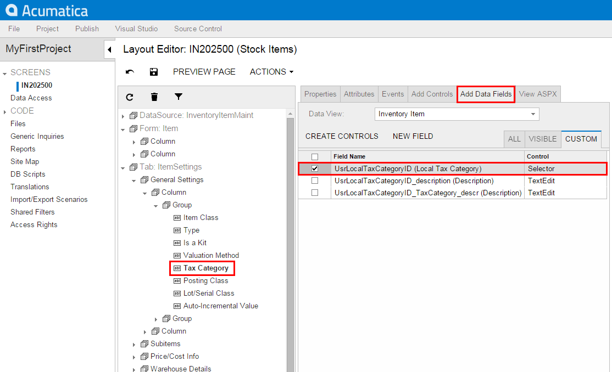

# Adding Data Fields {#_a5df3248-1ede-4e64-8c1d-5c80f59b3466 .concept}

You can add to a form a UI control based on a new data field. To do this, you can use the following ways:

-   Use the Data Class Editor to create the data field and use the Screen Editor to add the control onto the required area of a form.
-   Define the data field in code, add the Table customization item for adding the column to the database table if the field is bound, and use the Screen Editor to add the control onto the required area of a form.

These approaches are described in greater detail below.

-   [Adding a Data Field From the Data Class Editor](#section_dkm_553_jq)
-   [Adding a Data Field From Code](#section_hxs_553_jq)

## Adding a Data Field From the Data Class Editor {#section_dkm_553_jq .section}

Suppose that you have to add an input UI text box for a bound data field to the [Stock Items](../UserGuide/IN_20_25_00.md) \(IN202500\) form. To do this, you have to \(see the diagram below\):

-   Add a data field to the code of the appropriate DAC \(the functional customization step\)
-   Add a column to the database table \(a customization change to the database structure that is a part of functional customization\)

    **Tip:** You have to add a database column only for bound data fields. Bound data field means the field values are saved in the database. If you define an unbound field, skip this step.

-   Add a control for the field onto the form area \(the UI customization step\)

    


Suppose you have to add the new **Search Keywords** text box to the Stock Items form to the location shown on the screenshot.



To add this text box, do the following:

1.  Add the field to the appropriate DAC as follows:
    1.  Open the data access class that provides fields for the form area on the Stock Items form in the Data Class Editor. To do this, open the Stock Items form, select **Customization** &gt; **Inspect Element** on the form title bar, and click the form area of the Stock Items form.

        The following information of the control and the data access class should appear in the **Element Properties** dialog box:

        -   **Control Type**: *Form View*
        -   **Data Class**: *InventoryItem*
        -   **Business Logic**: *InventoryItemMaint*
        `InventoryItem` is the data access class that provides the data fields for UI controls on the form. Therefore, you have to add the new data field to the extension of this class.

    2.  In the **Element Properties** dialog box, select **Actions** &gt; **Customize Data Fields** to open the Data Class Editor for the `InventoryItem` class.

        **Tip:** If you haven't selected the current project yet, you will be asked to select the customization project to which the customization of the data access class will be added. You can select the current project to automatically add all customizations that you initiate from the Element Inspector by using the **Customization** &gt; **Select Project** menu to the project. For more information, see [Table 1](../UserGuide/AU_CustomizationMenu.md#_6adfabb5-9264-4273-938a-db4a41510b1c).

    3.  In the Data Class Editor, select **Add Field** &gt; **Create New Field** on the toolbar.
    4.  In the **Create New Field** dialog box, specify the following parameters for the new field:

        -   **Field Name**: `SearchKeywords`
        -   **DisplayName**: `Search Keywords`
        -   **Storage Type**: *DBTableColumn*
        -   **Data Type**: *string*
        -   **Length**: `255`
        As soon as you move the focus out of the **Field Name** box, the system adds the *Usr* prefix to the field name \(see the screenshot below\), which provides the distinction between the base fields and new custom fields that you add to the class. Keep the prefix in the field name and click **OK** to add the data field to the class.

        **Tip:** If you select the *DBTableColumn* storage type, the system automatically adds schema for the new database column to the customization project. For more information on parameters that you specify for new fields, see [Create New Field Dialog Box](../UserGuide/AU_DataClassEditor.md#_cdaebe06-9e8d-43fc-8dda-6850986501b6).

        

        To the customization project, the system adds the new field as the extension to the `InventoryItem` data access class, and adds the Table item for adding the corresponding column to the database table.

    5.  Click **Save** on the toolbar of the Data Class Editor to save the changes to the project. After you save the added field, you can see the added project item in the **Database Scripts** page of the Customization Project Editor.
2.  Publish the customization project. You need to do it at this point to be able to add the UI control for the new field because when the project is published the system compiles the customization code and updates the database schema with the new column. For more information, see [Publishing Customization Projects](CG_GL_Projects_Publishing.md).
3.  Add the control to the form. Do it as follows:

    1.  Add the Stock Items form to the customization project. To do this, you can use the Element Inspector or select **Screens** on the navigation pane of the Customization Project Editor, and add the Stock Items form to the list by clicking **Customize Existing Screen** on the toolbar.
    2.  Open the form in the Screen Editor. In the Control Tree, expand the **Form: Item** container and select and expand the first column within the container to set up the position to which the new control will be added.
    3.  Select the **Add Data Fields** tab of the Screen Editor.
    4.  Leave the **Data View** box empty. \(The box specifies the data access class by which the fields are filtered in the table below.\)
    5.  Select the **Custom** filter on the tab and select the check box for the *UsrSearchKeywords* field in the table, as the following screenshot shows.

        

    6.  Click **Create Controls** on the toolbar of the tab. The control for the **Search Keywords** field will be added to the tree.
    Now you have to adjust the position and size of the control on the form. Drag and drop the **Search Keywords** control at the end of the column after the **Description** control and click **Save** to save the changes to the project.

4.  Adjust the size of the control. To do that you have to place an instance of the `PXLayoutRule` component right above the control and configure it as follows:
    1.  Select the **Add Controls** tab of the Screen Editor and drag and drop an **Empty Rule** component to the position above the **Search Keywords** control in the tree, as the screenshot below shows.

        

    2.  Select the *\[Layout Rule\]* node that appears in the Control Tree and switch to the **Layout Properties** tab of the Screen Editor.
    3.  On the **Layout Properties** tab, set the **ColumnSpan** property to `2`, which specifies the span of the control on two columns of the layout on the form. Click **Save** to save the changes to the project. After you save these changes, the *\[Layout Rule\]* node is renamed to *\[Column Span\]* according to the property the rule is changing.

        **Tip:** The controls are organized in two columns on the form. For more information about positioning controls, see [Layout Rule \(PXLayoutRule\)](CG_GL_UI_LayoutRules.md).


The customization to the layout of the form is ready.

**Tip:** While working with the Screen Editor, you can click **Preview Changes** to view how the changes will affect the layout of the form.

Publish the project again to view the changes applied to the [Stock Items](../UserGuide/IN_20_25_00.md) \(IN202500\) form. After you publish the project, verify that the customized Stock Items form looks as needed according to the customization task. The customization items for form layout, data access class, and database schema have been added to the project. The new **Search Keywords** text box will appear on the Stock Items form on every system where you publish the customization project.

The DAC extension code that has been generated for the new field is given below. The system has generated a DAC extension class for `InventoryItem` and added the data field definition to the class. For more information about extension classes, see [DAC Extensions](CG_Platform_Framework_CS_DACExt.md).

```
public class PX_Objects_IN_InventoryItem_Extension_AddColumn: 
  PXCacheExtension<PX.Objects.IN.InventoryItem>
{
  #region UsrSearchKeywords
  public abstract class usrSearchKeywords : IBqlField{}	
  [PXDBString(255)]
  [PXUIField(DisplayName="Search Keywords")]
  public virtual string UsrSearchKeywords
  {
      get; set;
  }
  #endregion
}
```

You can open the customization code in MS Visual Studio and work with the code there. For more information, see [Integrating the Project Editor with Microsoft Visual Studio](CG_Platform_Studio.md).

## Adding a Data Field From Code {#section_hxs_553_jq .section}

If you work with the customization code in MS Visual Studio, you can define a new data field in DAC extension code and then create the control on the form.

Suppose that you have to add an input UI text box for a bound data field to the [Stock Items](../UserGuide/IN_20_25_00.md) \(IN202500\) form. To do this, you have to:

-   Add a data field to the code of the appropriate DAC \(the functional customization step\)
-   Add a column to the database table \(a customization change to the database structure that is a part of functional customization\)

    **Tip:** You have to add a database column only for bound data fields. Bound data field means the field values are saved in the database. If you define an unbound field, skip this step.

-   Add an input UI text box onto the form area of the form \(the UI customization step\)

Suppose you have to add the new **Local Tax Category** selector to the Stock Items form, as the screenshot below shows.


If you want to work with the DAC extension code in the integrated MS Visual Studio solution without use of the Data Class Editor, you can develop the code in a *.cs* file added to the customization project as a custom Code item or in a *.cs* file in a separate add-on project in the solution. We recommend that you use either the Data Class Editor or develop the entire customization code in an add-on project in MS Visual Studio, but do not mix up the approaches. For more information, see [Integrating the Project Editor with Microsoft Visual Studio](CG_Platform_Studio.md).

To add the UI control for the bound data field created from code, perform the following actions:

1.  In MS Visual Studio, define the custom `usrLocalTaxCategoryID` data field in the DAC extension class, as listed below.

    ```
    using PX.Data;
    using PX.Objects.IN;
    using PX.Objects.TX;
    
    namespace PX.Objects.IN
    {
      public class InventoryItemExtension: PXCacheExtension<InventoryItem>
      {
          #region UsrLocalTaxCategoryID
          public abstract class usrLocalTaxCategoryID : PX.Data.IBqlField
          {
          }
          [PXDBString(10, IsUnicode = true)]
          [PXUIField(DisplayName = "Local Tax Category")]
          [PXSelector(typeof(TaxCategory.taxCategoryID),
                      DescriptionField = typeof(TaxCategory.descr))]
          public string UsrLocalTaxCategoryID { get; set; }
          #endregion
      }
    }
    ```

    **Tip:** In this example, the *.cs* file with the DAC extension code is added to the customization project as a custom Code item. When you develop extensions in custom Code items, define the extension classes in the namespace of the original class. For more information about adding custom Code items to the project, see [Code](../UserGuide/AU_20_40_00.md).

2.  Update the customization project with the new customization code. To do this, open the customization project that corresponds to the MS Visual Studio solution in the Customization Project Editor, select the **Files** list of project items and click **Detect Modified Files**.

    **Tip:** If you build an assembly with the DAC extension code, update the assembly file in the customization project. For more information, see [To Update a File Item in a Project](CG_GL_Items_Files_Updating.md).

    In the **Modified Files Detected** dialog box, select the conflicting file of the custom Code item and click **Update Customization Project** to update the code in the project.

3.  Add the database schema for the custom field to the project as follows:
    1.  On the **Database Scripts** page of the Customization Project Editor, on the More menu \(under **Actions**\), click **Add Custom Column to Table**. In the **Add Custom Column to Table** dialog box which opens, fill in the following values and click **OK**:

        -   **Table Name**: *InventoryItem*
        -   **Field Name**: `LocalTaxCategoryID` \(without the *Usr* prefix\)
        -   **Field Type**: *string*
        -   **Length**: `10`
        

        **Tip:** We recommend that you add the database schema for the a custom column, as shown above, and do not alter the original schema of the table by a custom SQL script.

    2.  Publish the customization project to make the system add the column to the database and compile the customization code. To do this, select **Publish** &gt; **Publish Current Project** on the menu of Customization Project Editor.
4.  Add the UI control for the custom field to the Stock Items form. To do this, open the form in the Screen Editor.

    **Tip:** You can add an existing form to the customization project by using the Element Inspector or directly from Project Editor. See [Screens](../UserGuide/AU_20_10_00.md) for details.

    1.  Select the **Tax Category** control in the Control Tree to add the new control below it.
    2.  On the **Add Data Fields** tab, select the check box for the **Local Tax Category** selector in the table and click **Create Controls** to add the control to the tree \(see the screenshot below\).

        

    3.  Click **Save** on the toolbar to save the layout changes.
    4.  Preview the customized form by clicking **Preview Changes** on the toolbar or publish the customization project to view the changes applied to the [Stock Items](../UserGuide/IN_20_25_00.md) form.
5.  Verify that the customized Stock Items form looks as needed according to the customization task \(see above\). The customization items for the form layout, custom code \(or external assembly file\), and database schema have been added to the customization project. The new **Local Tax Category** text box will appear on the Stock Items form on every system where you publish the customization project.

**Parent topic:**[Examples of Functional Customization](../CustomizationPlatform/ACECustHow.md)

