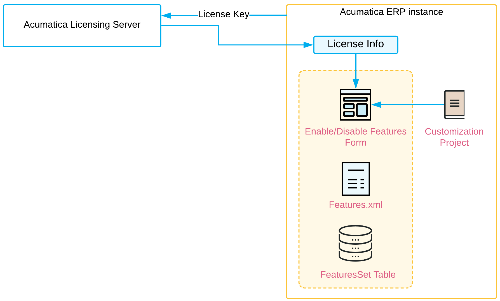

# Custom Feature Switches {#_f8988de5-6944-46bb-9cf7-3d387bbf5dae .concept}

You can develop a custom feature and integrate it in Acumatica ERP by using a customization project. After you develop this custom feature, you might want to add a switch for this feature—that is, a check box that the administrator can select to enable the feature—on the [Enable/Disable Features](../UserGuide/CS_10_00_00.md) \(CS100000\) form. With this feature switch added, the administrator can enable the feature to make the custom forms associated with the feature available or disable the feature to make the custom forms unavailable.

## Adding a Custom Feature: Process Overview { .section}

After you have developed a custom feature and integrated it in Acumatica ERP, your feature is reviewed by the ISV team, and information about the feature is added to the Acumatica Licensing Server. After that, you can customize the [Enable/Disable Features](../UserGuide/CS_10_00_00.md) \(CS100000\) form, the FeaturesSet table, and the`Features.xml` file to add information about your feature to the project. The process of exchanging information with the Acumatica Licensing Server is shown in the diagram below.

After you have completed all these steps, when your customer purchases your custom feature, you should notify the ISV team about it \(for example, by using your ISV solution's page on the partner portal\).

**Parent topic:**[To Add a Custom Feature Switch](../CustomizationPlatform/CG_AddFeatureSwitch.md)

