# Dragging, Moving, and Deleting UI Controls and Grid Columns {#_dcf5b243-c0ce-4691-8f15-89a708671da5 .concept}

This topic describes in detail how to change the placement of UI controls by dragging them and how to use the facilities of the Screen Editor to delete or move UI controls and grid columns.

## Dragging and Dropping UI Controls {#section_ych_jsd_wl .section}

Before you start to manually move UI controls by dragging them in the Control Tree of the Screen Editor, note the following simple rules:

-   You can move a UI control anywhere within its container control.
-   To move a UI control within a container, you have to drag the element to the required place.
-   Any UI control moved within a form is automatically aligned according to the nearest **PXLayoutRule** component placed above it. \(See [Layout Rule \(PXLayoutRule\)](CG_GL_UI_LayoutRules.md) for details.\)

On the [Stock Items](../UserGuide/IN_20_25_00.md) \(IN202500\) form, suppose that you want to move up the **Is a Kit** check box, to make it the first control in the first column of the **General** tab area, as the screenshot below illustrates.

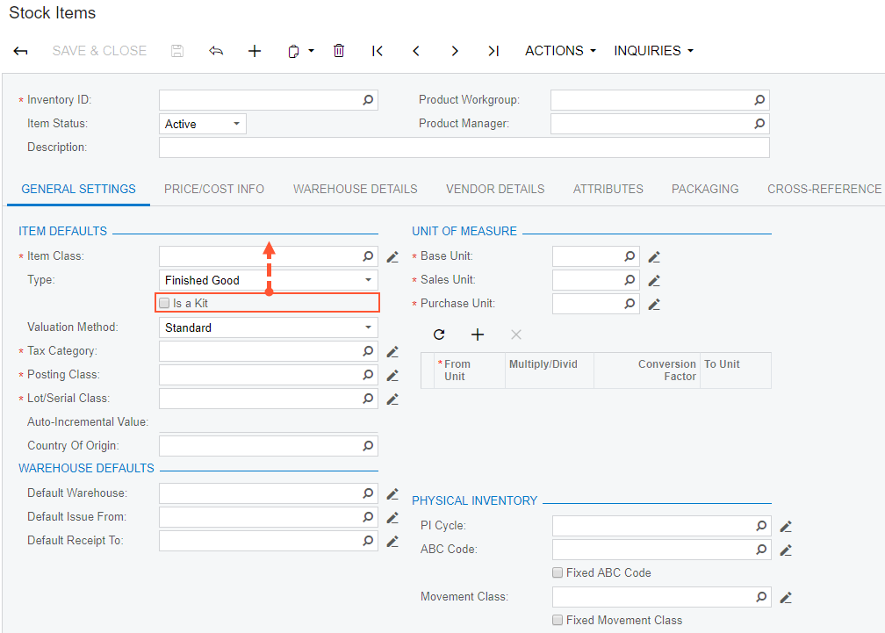

To move the check box:

1.  Click the **Customization** menu on the form and choose the **Inspect Element** command.
2.  Click the **Is a Kit** check box.
3.  Click the **Customize** button on the **Element Properties** dialog box.

    The customization item is added to the current project if you have selected one by using the **Customization** &gt; **Select Project** command, or you will be asked to select the customization project to add the item to it.

4.  In the Control Tree of the Screen Editor, drag the **Is a Kit** check box to the position above the **Item Class** control.
5.  Save the changes to the customization project, and publish the customization project.

    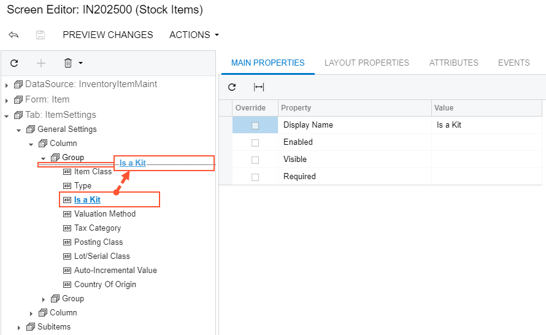

The check box appears at the new position \(see the following screenshot\).

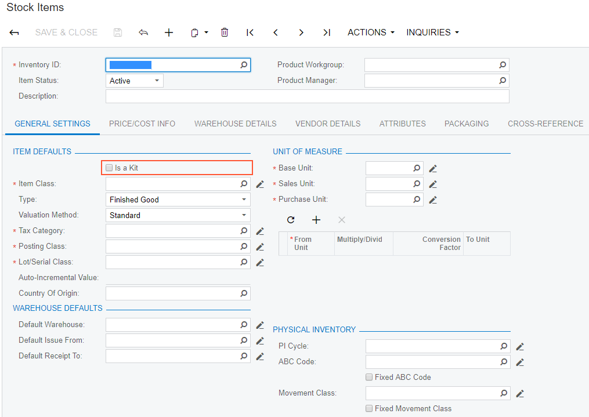

## Moving and Deleting UI Controls and Grid Columns {#section_rm1_tqd_wl .section}

You use the Screen Editor to implement advanced customization of a form—for instance, if you need to shift a column within a grid, to delete a UI control or table column from a form area, or to change the position of a UI control on a form while having the capability to change its original container.

**Note:** After changing containers, you should perform functional changes concerning the code of appropriate main data access classes \(DACs\) or data views of business logic controllers \(BLCs, also referred to as *graphs*\). For details, see [Customizing DAC Attributes](CustAttr.md).

Suppose that you have to customize the **General** and **Warehouses** tabs of the Stock Items \(IN202500\) form as follows:

1.  Delete the **Auto-Incremental Value** input control. \(See the first screenshot below.\)
2.  Move down the **Tax Category** control so that it is placed under the **Lot/Serial Class** control, as the first screenshot also illustrates.

    **Note:** The **Lot/Serial Class** field is visible if the **Lot and Serial Tracking** feature is enabled on the Enable/Disable Features \(CS100000\) form.

3.  Move to the left the **Status** column of the details table so that it is placed at the right of the **Default** column, as shown in the second screenshot below

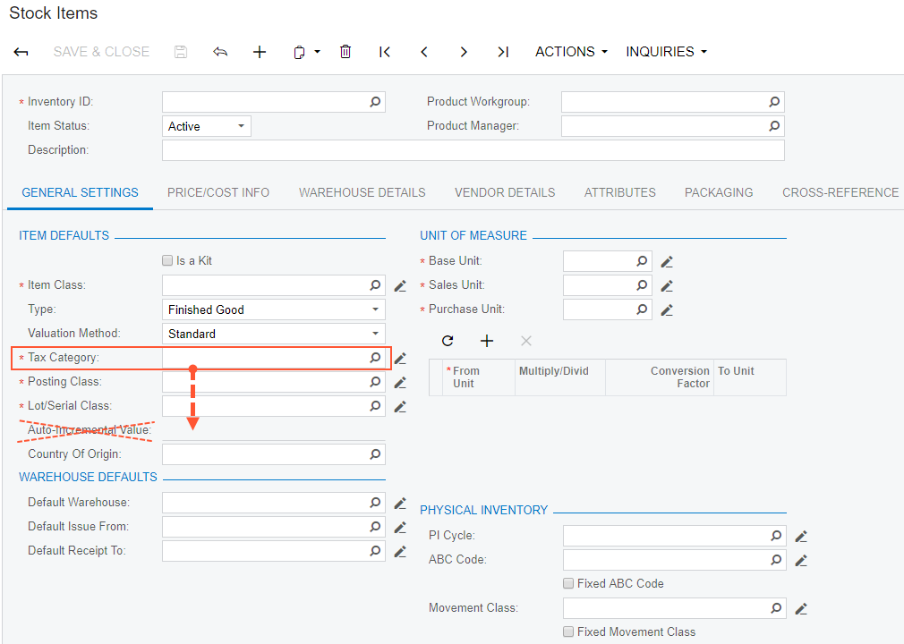

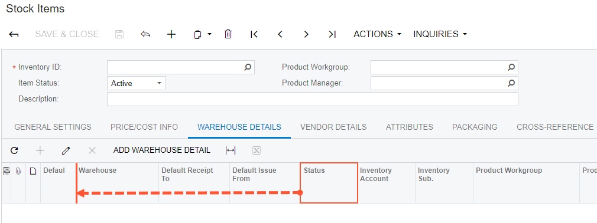

To open the Screen Editor, open the Stock Items \(IN202500\) form, click the **Customization** menu, choose the **Inspect Element** command, select the **Auto-Incremental Value** control on the form, and click the **Customize** button on the **Element Properties** dialog box.

The Control Tree of the editor displays content of the **General** tab item, to which the **Auto-Incremental Value** control belongs. This control is currently selected and highlighted in bold.

**Note:** To view all controls and containers of the customized form on the tree, click the filter button of the tree toolbar.

To delete the selected control, select **Remove** &gt; **Remove** of the tree toolbar.

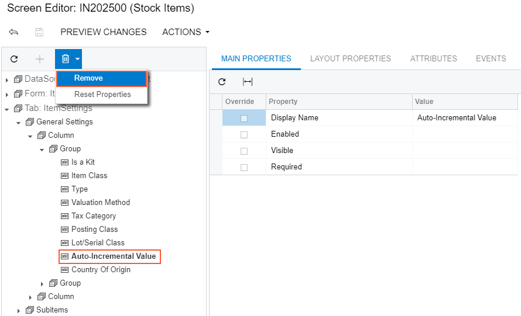

Now you should move down the **Tax Category** UI control, to place it under the **Lot/Serial Class** control. Select the **Tax Category** UI control on the tree, drag it and drop to the required position, as the screenshot below illustrates.

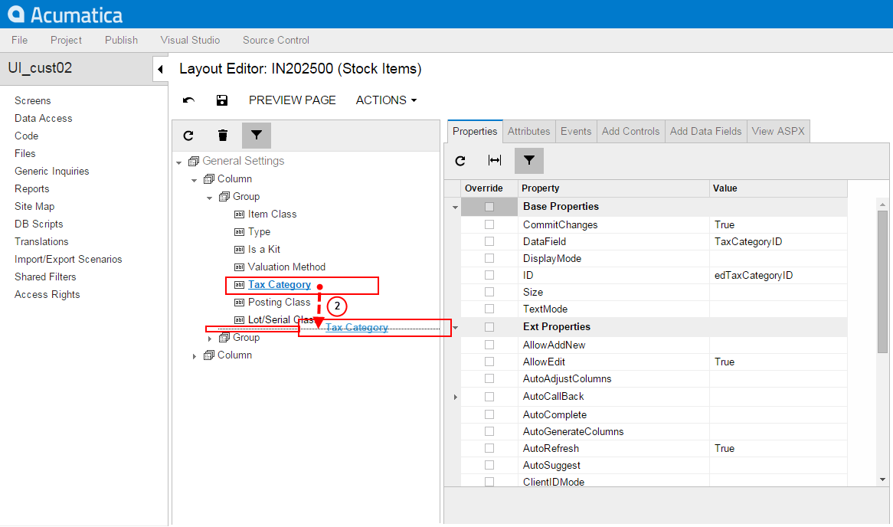

Thus, to change the placement of a UI control, you select it on the Control Tree of the Screen Editor, drag it and drop to place this control appropriately in relation to other UI controls.

Click **Save** on the toolbar of the Screen Editor to save changes to the current customization project.

To begin moving the **Status** column, you can:

-   Open the Stock Items \(IN202500\) form and use the Element Inspector for the **Status** column on the form
-   Open the Screen Editor for the form and find the column in the Control Tree

Drag and drop the **Status** control to the required position in the tree, as the screenshot below illustrates.

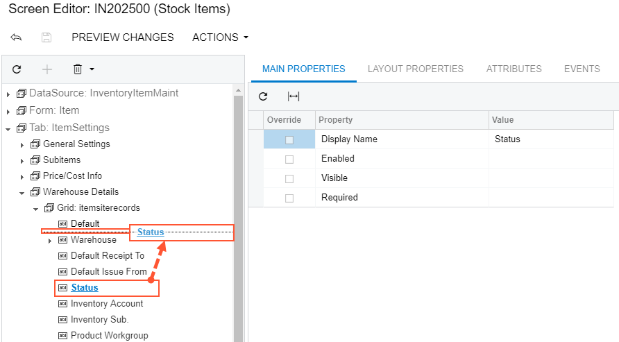

Thus, to change the placement of a grid column, you find the column in the Control Tree of the Screen Editor and drag it to the desired position.

Click **Save** on the toolbar of the Screen Editor to save changes to the current customization project.

After you publish the project, you will see the modified **General** tab on the Stock Items \(IN202500\) form, as the following screenshot illustrates.

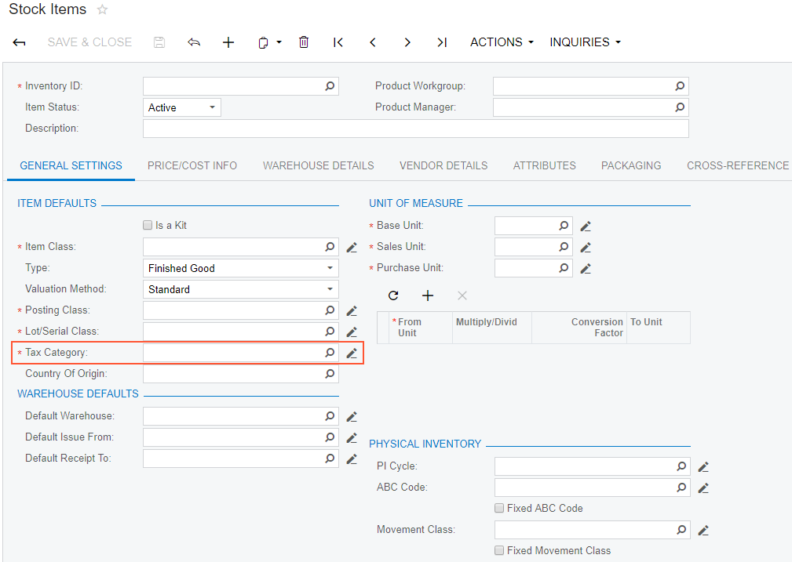

If you open the **Warehouses** tab of this form, you will see that the column of the details table has been moved to the left, as shown in the screenshot below.

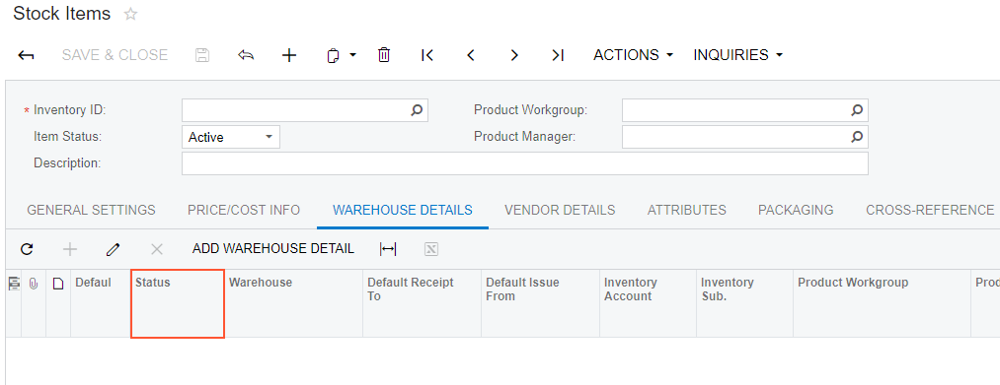

If you need to analyze the added content \(changeset\) of the customization project, open the project in the Project Editor, choose the **Edit Project Items** command on the **File** menu item and select the **Object Name** field of the customized object \(see the screenshot below\).

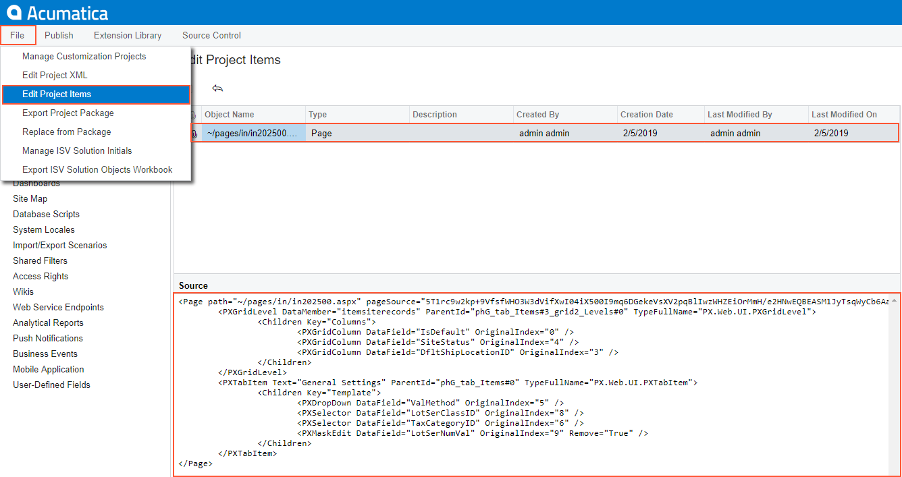

**Parent topic:**[Examples of User Interface Customization](../CustomizationPlatform/UICustHow.md)

