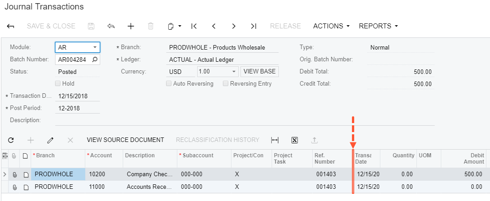
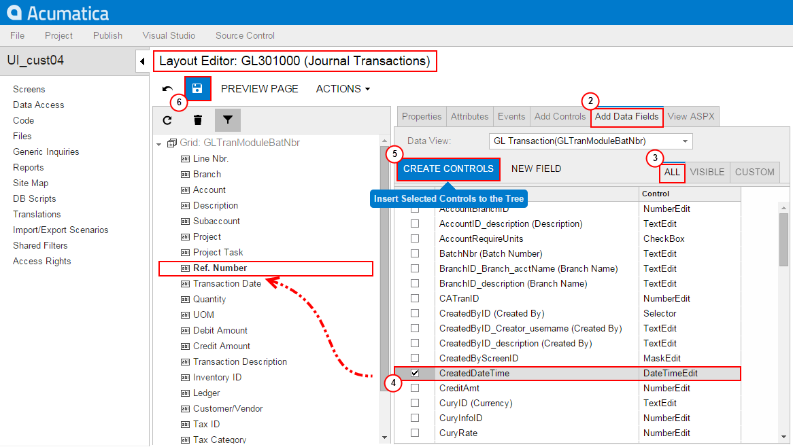
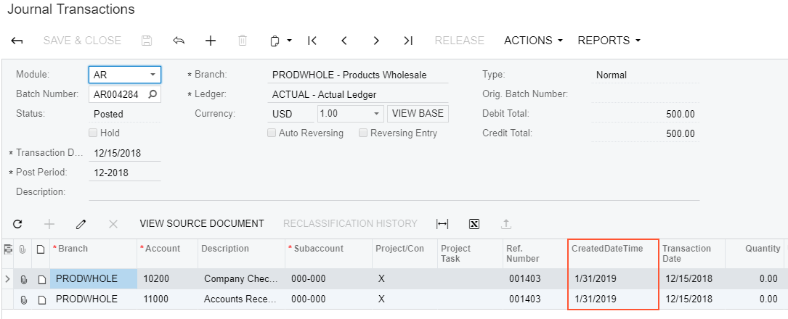
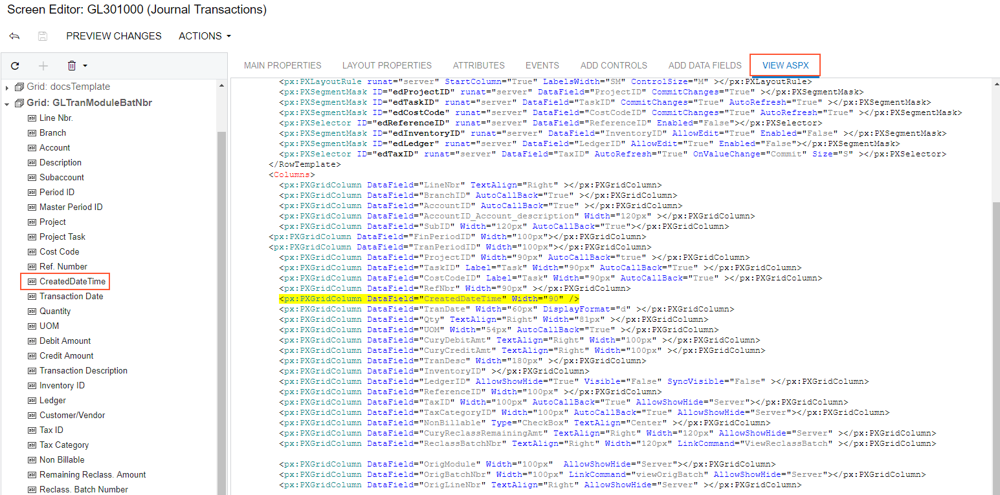
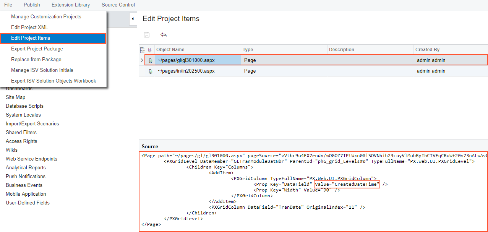

# Adding Columns to a Grid {#_cd3af693-0fa1-4371-ab7c-b8bf3bc258ad .concept}

Suppose that you need to add a column to the details table \(grid\) of the Journal Transactions \(GL301000\) form shown in the screenshot below.

For instance, suppose that you need to add the column for the *CreateDateTime* data field to the position after the **Ref. Number** column.

To do this, perform the following actions:

1.  On the Journal Transactions \(GL301000\) form, click the **Customization** &gt; **Inspect Element**, select the **Ref. Number** column header, and click **Customize** on the **Element Properties** dialog box.
2.  In the Screen Editor, open the **Add Data Fields** tab.
3.  Apply the **All** filter to the list of the fields.
4.  Select the *CreateDateTime* field in the list, as shown in the screenshot below.
5.  Click **Create Controls** in the tab toolbar.

    **Note:** New columns are added to the grid in the position after the item selected in the Control Tree of the Screen Editor. If you need to change the placement of a UI control, select the control on the tree, drag and drop it to the needed place.

    

6.  Click **Save** on the toolbar of the Screen Editor to save changes to the current customization project.

Thus, to add new columns to a grid, you have to open the grid node on the Control Tree of the Screen, select the **Add Data Fields** tab in the editor, select needed fields in the list on the tab, click **Create Controls**, and then drag and drop new columns to desired positions inside the grid. You can add a column for any field that belongs to any data access class \(DAC\) of any data view of the business logic controller bound to the form. To select a DAC to view its fields in the list, use the **Data View** drop-down list on the **Add Data Fields** tab.

To view the changes on the form, click **Preview Changes** on the toolbar or publish the project and review the changes on the Journal Transactions \(GL301000\) form after the customization has been applied.

To view the fragment of the .aspx code that represents the customization result, open the form in the Screen Editor and select the **View ASPX** tab. The customized fragment is highlighted in yellow, as the screenshot below illustrates.

To analyze the changes to the layout of the form introduced by the new column, in the Customization Project Editor, click **File** &gt; **Edit Project Items** and select the **Object Name** field of the customized object \(see the screenshot below\). You can see the new Page item that contains the .aspx code changeset.

**Parent topic:**[Examples of User Interface Customization](../CustomizationPlatform/UICustHow.md)

