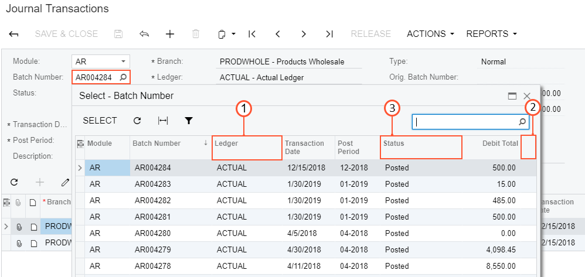
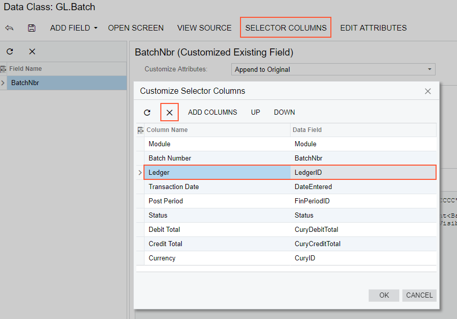
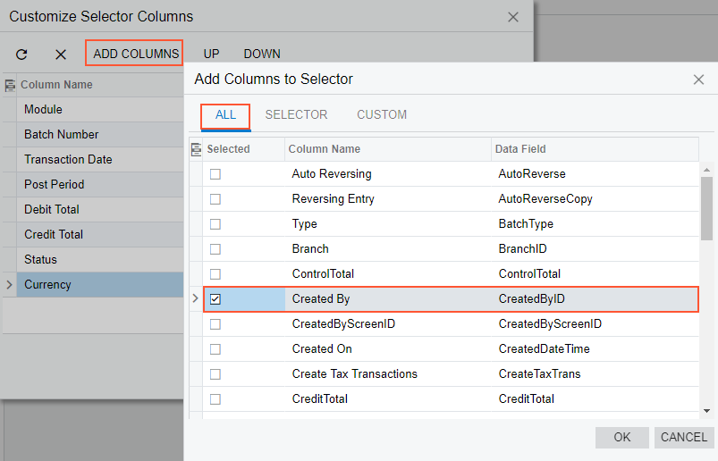
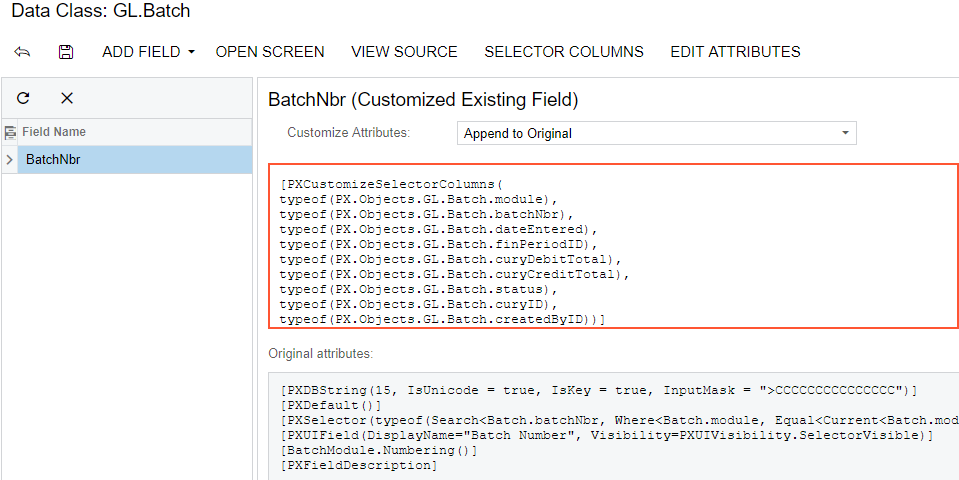
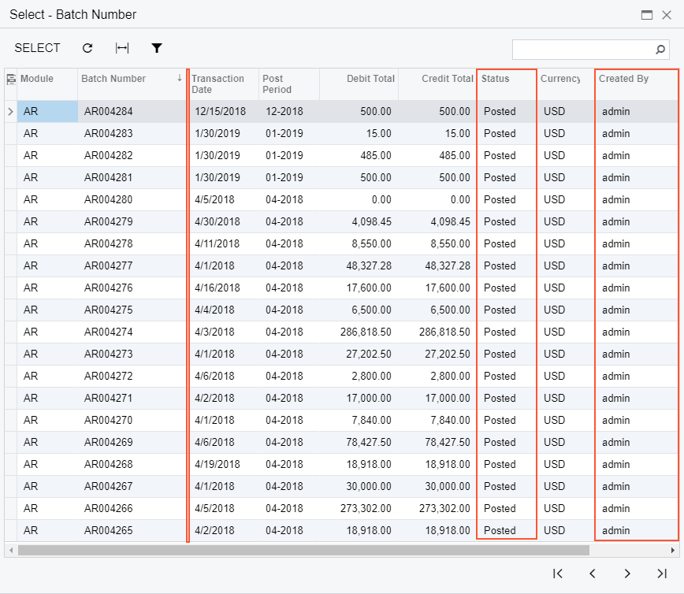
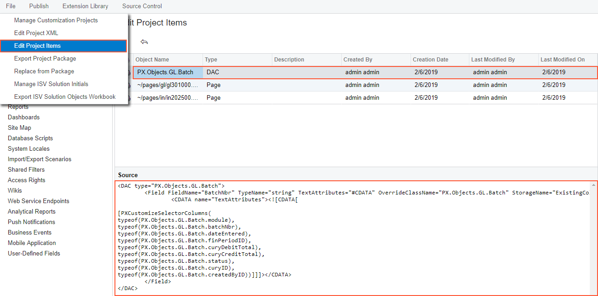

# Modifying Columns in a Selector {#_520c9c0d-5bd5-4d38-a4bb-97df4b0e47c4 .concept}

If you add columns to a selector, you give the user the capability to see more information about each item in the lookup window, so the user can select the appropriate data record.

The screenshot below illustrates the original view of the **Batch Number** lookup window \(also referred to as *selector*\). The **Batch Number** is a control on the form of the Journal Transactions \(GL301000\) form. The lookup window of this control includes eight columns, as shown in the screenshot below.

Suppose the UI customization task for the **Batch Number** selector includes the following steps \(see the screenshot above\):

1.  Deleting an existing column, such as the **Ledger** column.
2.  Adding a column for the **Created By** field to the place after the **Currency** column.
3.  Changing the order of the selector columns, so the **Status** column moves to the position between the **Credit Total** and **Currency** columns.

To do this, perform the following actions:

1.  On the Journal Transactions \(GL301000\) form, click the **Customization** &gt; **Inspect Element**, select the **Batch Number** control, click **Actions** on the **Element Properties** dialog box and select the **Customize Data Fields** command.

    The Data Class Editor appears with only the **BatchNbr** field in the list of the customized fields of the class. The field is already selected in the field; therefore the work area of the editor holds information about the field.

    **Note:** The selected field type is selector, so the **Edit Selector Columns** button is enabled on the More menu.

2.  Click **Edit Selector Columns** to open the **Customize Selector Columns** dialog box, as shown in the screenshot below.
3.  In the table of the **Customize Selector Columns** dialog box, select the row with the **Ledger** column.
4.  Click **Delete Row** to delete the selected **Ledger** column from the selector.

    

5.  Click **Add Columns** on the toolbar of the **Customize Selector Columns** dialog box to open the **Add Columns to Selector** dialog box.
6.  In the **Add Columns to Selector** dialog box, select the **All** tab to view all fields of the customized data access class \(DAC\) in the table.
7.  In the table, select the row with the **Created By** column name.
8.  Click **OK** to add the selected field to the table of the **Customize Selector Columns** dialog box.

    

    **Note:** New columns are added to the position after the last existing column of the selector.

    The **Created By** column is created in the table of the **Customize Selector Columns** dialog box at the rightmost position. Therefore, you do not need to move this column inside the selector. But you still have to move the **Status** column to position between the **Credit Total** and **Currency** columns.

9.  Select the row with the **Status** column.
10. Click **Down** twice to move the selected row to the required position, as shown in the screenshot below.
11. Click **OK** on the **Customize Selector Columns** dialog box to apply the changes to the selector.
12. Click **Save** on the toolbar of the Data Class Editor to save the changes to the current customization project.

After you click **OK** in the **Customize Selector Columns** dialog box, the system applies the modifications to the selector table. As a result, the PXCustomizeSelectorColumns attribute is added to the selector field and you can view the attribute in the **Customize Attributes** text area of the Data Class Editor \(see the screenshot below\). This attribute defines the new set and order of the columns in the selector.

After publishing the project, open the Journal Transactions \(GL301000\) form, click the Magnifier icon of the **Batch Number** control, and view the lookup window. Notice the absence of the deleted column, the position of the moved **Status** column, and the presence of the **Created By** column, as shown in the screenshot below.

If you need to analyze the added content \(changeset\) of the customization project, open the project in the Project Editor, choose the **Edit Project Items** command on the **File** menu item, and select the **Object Name** field of the customized object \(see the screenshot below\). The *DAC* object represents the changes to the data access class code.

**Parent topic:**[Examples of User Interface Customization](../CustomizationPlatform/UICustHow.md)

