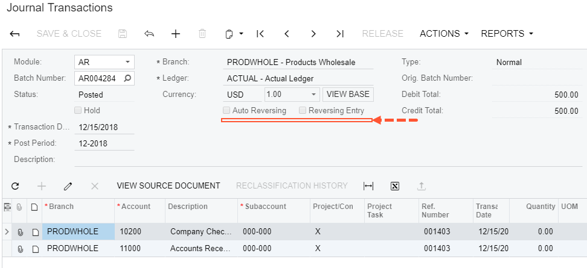
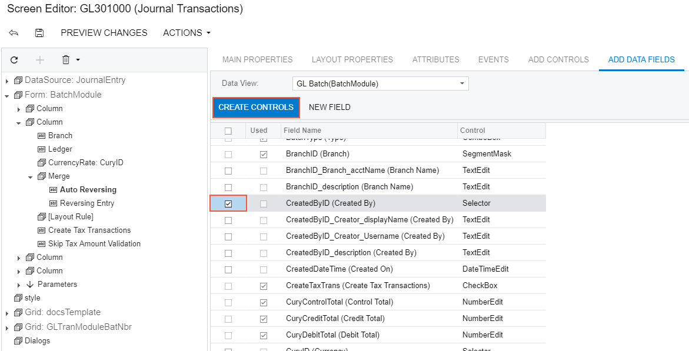
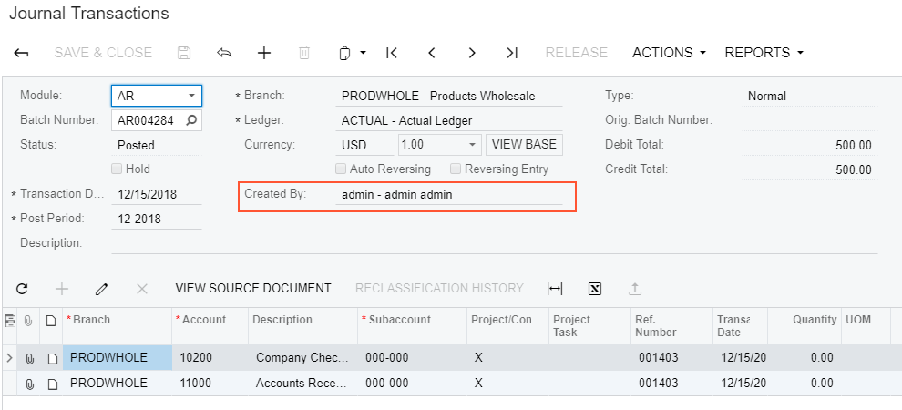
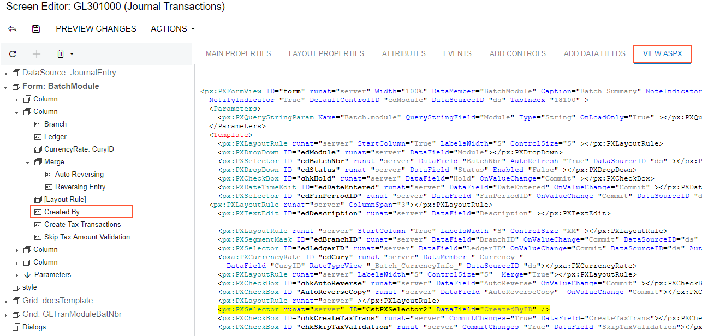
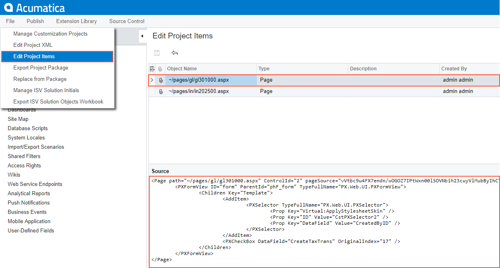

# Adding Input Controls {#_22e770a5-6e9d-4603-a10b-d16e89a1e0f3 .concept}

If you need to add a control onto a form, you use the Screen Editor.

The screenshot below illustrates the original Journal Transactions \(GL301000\) form. Suppose that you want to add a text field \(for instance, the **CreatedByID** selector of the *GL Batch* DAC\) below the **Auto Reversing** check box.

To open the Screen Editor, open the Journal Transactions \(GL301000\) form, click the **Customization** menu, choose the **Inspect Element** command, select the **Auto Reversing** control, and click the **Customize** button on the **Element Properties** dialog box.

The editor is opened with the **Auto Reversing** control selected and highlighted in bold in the tree of controls.

To create a control below the selected item in the tree:

1.  Click on the **Add Data Field** tab.
2.  Select the **CreatedByID** field in the list on the tab.
3.  Click the **Create Controls** button on the tab toolbar.

Adjust the placement of a UI control so that it is after the *\[Layout Rule\]* node by dragging it to the needed place.

Click **Save** on the toolbar of the Screen Editor to save changes to the current customization project.

After publishing the customization project, you will see the added field on the *Journal Transactions* form, as the screenshot below illustrates.

To view the fragment of the .aspx code that represents the customization result, open the form in the Screen Editor and select the **View ASPX** tab. The customized fragment is highlighted in yellow, as the screenshot below illustrates.

To view the changes to the layout of the form introduced by the new control, open the project in the Project Editor, choose the **Edit Project Items** command on the **File** menu item and select the **Object Name** field of the customized object \(see the screenshot below\). You can see the new Page item that contains the .aspx code changeset.

**Tip:** As a rule, if you add a new data field, you need to perform some additional actions related to the functional customization. For an example of the creation of a new data field, see [Adding Data Fields](HowACE_AddField.md).

**Parent topic:**[Examples of User Interface Customization](../CustomizationPlatform/UICustHow.md)

