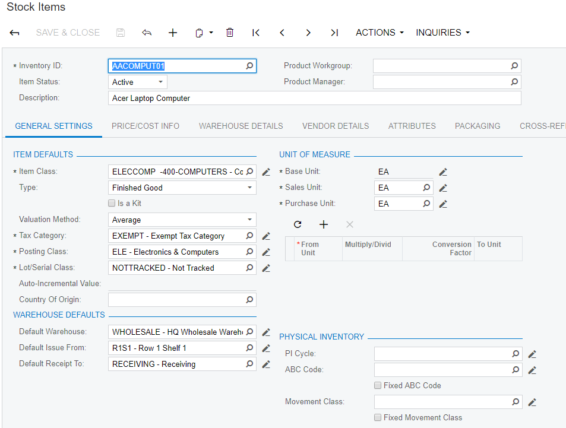
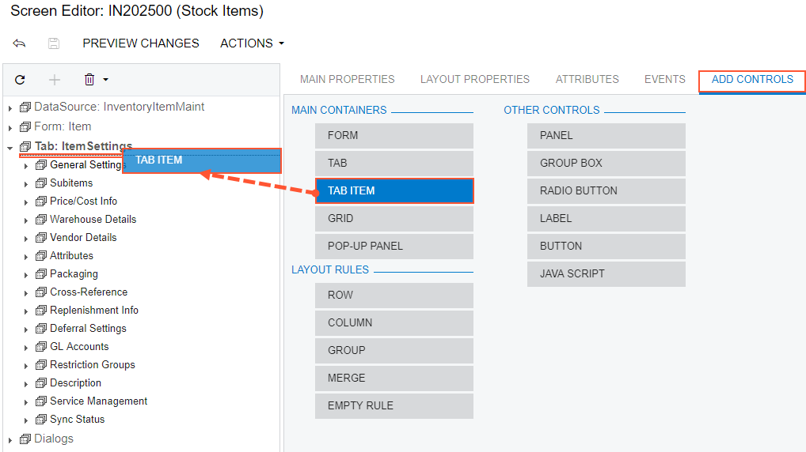
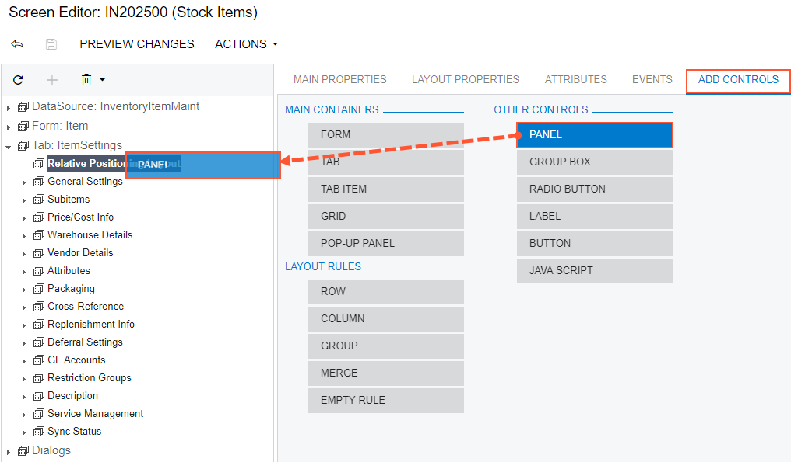
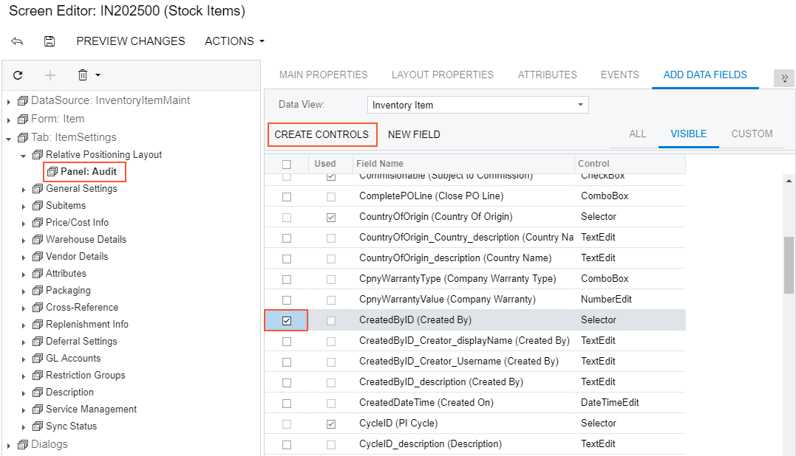
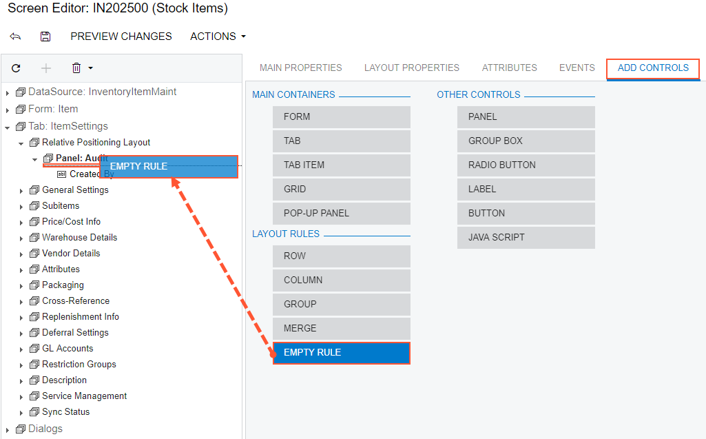
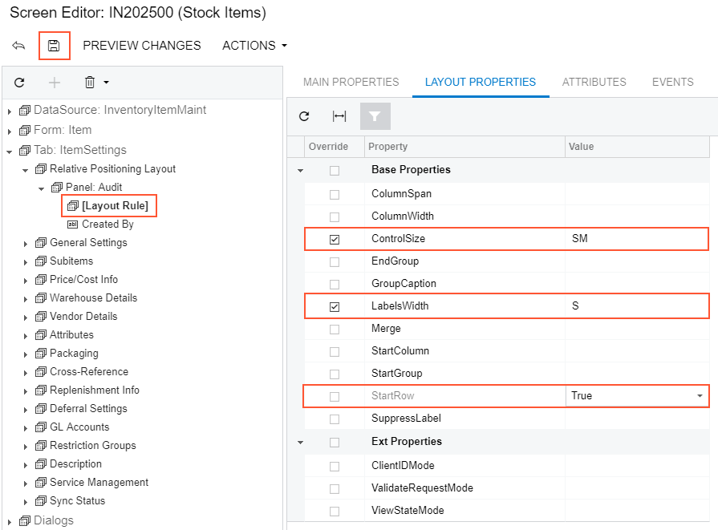
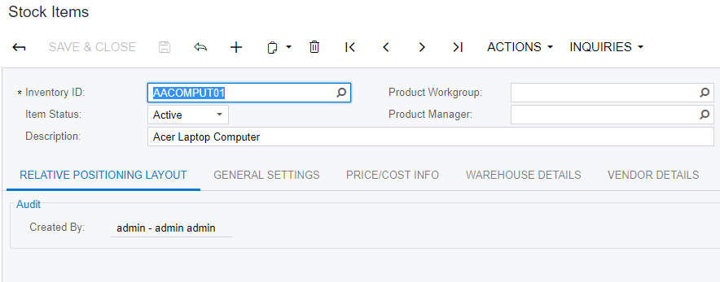
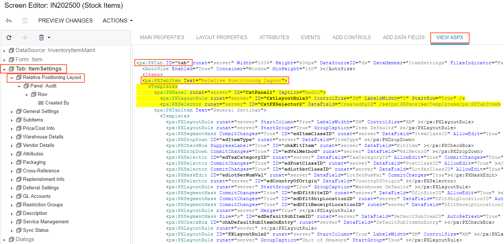
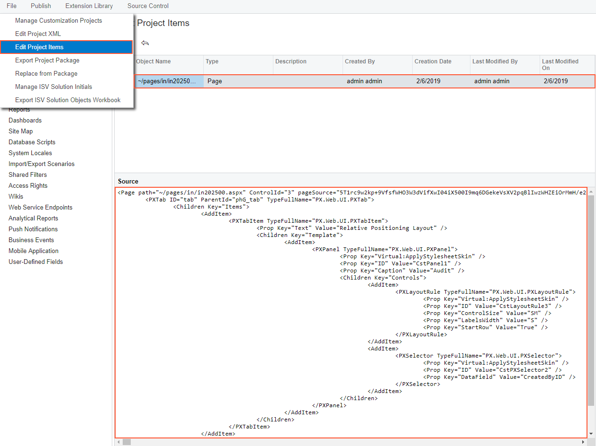

# Adding Advanced Controls {#_7d176281-bf77-4164-bb74-c307a7033f4e .concept}

Suppose that you need to customize the Stock Items \(IN202500\) form and you have divided the customization task into the following steps:

-   [Adding a new tab item](#section_xt1_l4m_kq) onto the form.
-   [Adding a panel onto the tab item](#section_d21_htm_kq).
-   [Adding an UI control onto the new panel](#section_vpr_mtm_kq).

    **Note:** This step is needed to make the added tab and its content visible at run time; otherwise, empty container controls aren't displayed.

The original Stock Items \(IN202500\) form is shown on the screenshot below.

## Adding a New Tab Item {#section_xt1_l4m_kq .section}

Suppose that you need to add the **Relative Positioning Layout** tab item to the Stock Items \(IN202500\) form and set its position as the leftmost one.

To do this, perform the following actions:

1.  On the Stock Items \(IN202500\) form, click the **Customization** &gt; **Inspect Element**, select the tab control, and click **Customize** on the **Element Properties** dialog box.
2.  In the Screen Editor that appears, click the *Tab: ItemSettings* node in the Control Tree to view all items of the tab.
3.  Open the **Add Controls** tab of the Screen Editor.
4.  Drag and drop the **Tab Item** \(*PXTabItem*\) container above the *General Settings* node in the tree, as shown in the screenshot below.

    

5.  Select the *TabItem* node that has been added.
6.  Select the **Layout Properties** tab of the Screen Editor.
7.  Select the **Text** property and enter `Relative Positioning Layout` to specify the name of the new tab.
8.  Click **Save** on the toolbar of the Screen Editor to save changes to the current customization project.

Thus, to add a new tab item to a tab, you have to expand the tab node in the Control Tree of the Screen Editor, select the **Add Controls** tab in the editor, drag and drop the **Tab Item** container to place this control appropriately in relation to other items in the tab.

A container is visible on the form if the container contains a visible field control. So at the moment you cannot view the **Relative Positioning Layout** tab item on the Stock Items \(IN202500\) form even after the customization project is published or on the form preview that can be opened by clicking **Preview Changes** in the Screen Editor.

## Adding a Panel onto the PXTabItem Container Control {#section_d21_htm_kq .section}

Now you have to add a panel \(a *PXPanel* control\) onto the created *PXTabItem* control \(that is, onto the new tab item\), which is empty at the moment.

Complete the following steps:

1.  Open the **Add Controls** tab of the Screen Editor.
2.  On the opened tab item, find and drag the **Panel** \(*PXPanel*\) control.
3.  Drop it into the *Relative Positioning Layout* tab item in the tree of controls, as shown in the screenshot below.

    

4.  Select the *Panel: CstPanel1* node that has been added.
5.  Select the **Layout Properties** tab of the Screen Editor.
6.  Select the **Caption** property and enter `Audit` to specify the name of the new panel.
7.  Click **Save** on the toolbar of the Screen Editor to save changes to the current customization project.

Thus, to add a new control to a container, you have to open the Screen Editor, find the container in the Control Tree, select the **Add Controls** tab in the editor, find the required type of the control, and drag and drop the needed control onto the container. Then you can specify the properties of the created control.

## Adding a UI Control onto the *PXPanel* Control {#section_vpr_mtm_kq .section}

The panel is still not visible on the tab because it doesn't contain any visible controls. Add a control to the panel, as described below:

1.  Select the *Panel: Audit* node in the tree of controls.
2.  Open the **Add Data Fields** tab of the Screen Editor.
3.  Select the **CreatedByID** field in the list that at the moment displays the visible fields of the Inventory Item data access class.
4.  Click **Create Controls** on the tab toolbar \(see the screenshot below\).

    

5.  Click the *Panel: Audit* node to expand and view the created control in the tree of controls.
6.  Open the **Add Controls** tab of the Screen Editor.
7.  Drag the **Empty Rule** \(*PXLayoutRule*\) control and drop it above the *Created By* control in the tree, as shown in the screenshot below.

    

8.  In the Control Tree, select the *Layout Rule* node that has been added.
9.  Select the **Layout Properties** tab of the Screen Editor.
10. Type `SM` as the **ControlSize** property value and `S` as the **LabelWidth** property value.
11. Set the **StartRow** property to *True*, as shown in the screenshot below.

    

12. Click **Save** on the toolbar of the Screen Editor to save changes to the customization project.

    After you save your changes, the Layout Rule transforms into a Control Tree node inside the *Panel:Audit* node according to specified properties. In this case, you see the *Created By* node is now inside the *Row* node which has the Layout Rule's properties.

Thus, to apply a layout rule to controls, you have to place the layout rule above the controls. Then you can specify the properties of the created layout rule.

To view the changes, click **Preview Changes** on the toolbar or publish the project and review the changes on the Stock Items \(IN202500\) form after the customization has been applied.

The control is displayed on the panel on the **Relative Positioning Layout** tab \(see the screenshot below\) that has been added in [Adding a New Tab Item](#section_xt1_l4m_kq).

To view the fragment of the .aspx code that represents the customization result, open the form in the Screen Editor and select the **View ASPX** tab. The customized fragment is highlighted in yellow, as the screenshot below illustrates.

If you need to analyze the added content \(changeset\) of the customization project, in the Customization Project Editor, choose the **Edit Project Items** command on the **File** menu item and select the **Object Name** field of the customized object \(see the screenshot below\). The Page item represents the changes to the .aspx code.

**Parent topic:**[Examples of User Interface Customization](../CustomizationPlatform/UICustHow.md)

