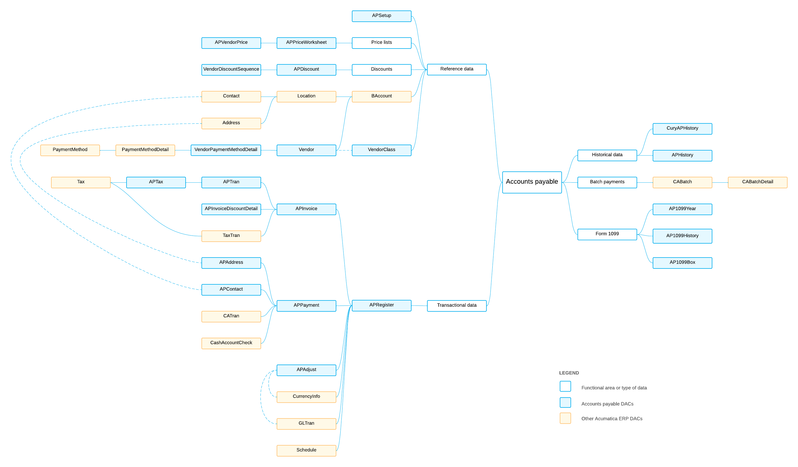

# AP DACs: General Information {#_04766af1-2f6b-4e32-acc5-8cd316b014a3 .concept}

The system uses the accounts payable data access classes \(DACs\) to enter, monitor, maintain, and process the payments, invoices, and memos that the organization sends to its vendors.

## Learning Objectives { .section}

In this chapter, you will learn about the DACs that are related to the following data:

-   Reference data that is used in most of the DACs of accounts payable, such as information about vendors, locations, and addresses
-   Transactional data
-   Historical data

## Applicable Scenarios { .section}

You review AP DACs in the following cases:

-   You need to create a generic inquiry that uses accounts payable data.
-   You need to design a report that uses accounts payable data.
-   You need to customize the accounts payable functionality by adjusting it in the [Customization Project Editor](../UserGuide/SM_20_45_10.md).
-   You need to customize the accounts payable functionality by writing customization code.

## Basic Relationships Between AP DACs { .section}

The following diagram illustrates the main relationships between accounts payable DACs. For detailed descriptions of the DACs and DAC fields, look for the needed DAC in the [DAC Schema Browser](https://help.acumatica.com/dacBrowser). \(For details about the DAC Schema Browser, see [Data from Multiple Data Sources: DAC Schema Browser](../UserGuide/GI_Discovering_DACs_DAC_Schema_Browser_Concept.md).\)

**Parent topic:**[Reviewing Accounts Payable DACs](../DeveloperGuide/DACOverview_AP_Mapref.md)

