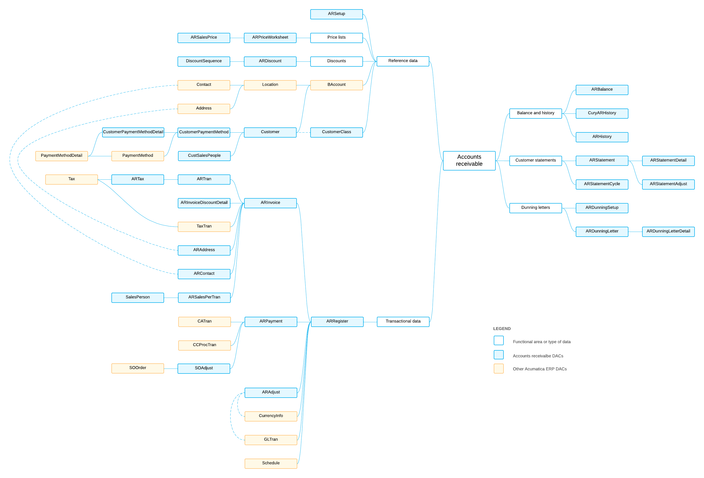

# AR DACs: General Information {#_f47e9f5b-a64e-49a8-823f-31d0ee787069 .concept}

The system uses the accounts receivable data access classes \(DACs\) to enter, monitor, maintain, and process the payments, invoices, and memos that the organization sends to its customers.

## Learning Objectives { .section}

In this chapter, you will learn about the DACs that are related to the following data:

-   Reference data that is used in most of the DACs of accounts receivable, such as information about customers, locations, or addresses
-   Transactional data
-   Balance and historical data
-   Data that is related to customer statements

## Applicable Scenarios { .section}

You review the AR DACs in the following cases:

-   You need to create a generic inquiry that uses accounts receivable data.
-   You need to design a report that uses accounts receivable data.
-   You need to customize the accounts receivable functionality by adjusting it in the [Customization Project Editor](../UserGuide/SM_20_45_10.md).
-   You need to customize the accounts receivable functionality by writing customization code.

## Basic Relationships Between the AR DACs { .section}

The following diagram illustrates the main relationships between the accounts receivable DACs. For detailed descriptions of the DACs and DAC fields, look for the needed DAC in the [DAC Schema Browser](https://help.acumatica.com/dacBrowser). \(For details about the DAC Schema Browser, see [Data from Multiple Data Sources: DAC Schema Browser](../UserGuide/GI_Discovering_DACs_DAC_Schema_Browser_Concept.md).\)

**Parent topic:**[Reviewing Accounts Receivable DACs](../DeveloperGuide/DACOverview_AR_Mapref.md)

