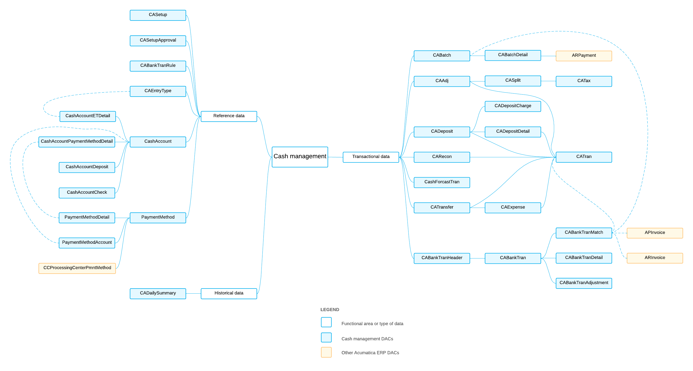

# CA DACs: General Information {#_0e66969a-34a3-46ef-ad6d-bb23ac22b807 .concept}

The system uses the cash management data access classes \(DACs\), most of which have the *CA* prefix, to manage day-to-day cash operations, including funds transfers and daily deposits.

## Learning Objectives { .section}

In this chapter, you will learn about the DACs that are related to the following data:

-   Reference data that is used in most of the DACs of cash management
-   Transactional data
-   Historical data

## Applicable Scenarios { .section}

You review cash management DACs in the following cases:

-   You need to create a generic inquiry that uses cash management data.
-   You need to design a report that uses cash management data.
-   You need to customize the cash management functionality by adjusting it in the [Customization Project Editor](../UserGuide/SM_20_45_10.md).
-   You need to customize the cash management functionality by writing customization code.

## Basic Relationships Between CA DACs { .section}

The following diagram illustrates the main relationships between the cash management DACs. For detailed descriptions of the DACs and DAC fields, look for the needed DAC in the [DAC Schema Browser](https://help.acumatica.com/dacBrowser). \(For details about the DAC Schema Browser, see [Data from Multiple Data Sources: DAC Schema Browser](../UserGuide/GI_Discovering_DACs_DAC_Schema_Browser_Concept.md).\)

**Parent topic:**[Reviewing Cash Management DACs](../DeveloperGuide/DACOverview_CA_Mapref.md)

