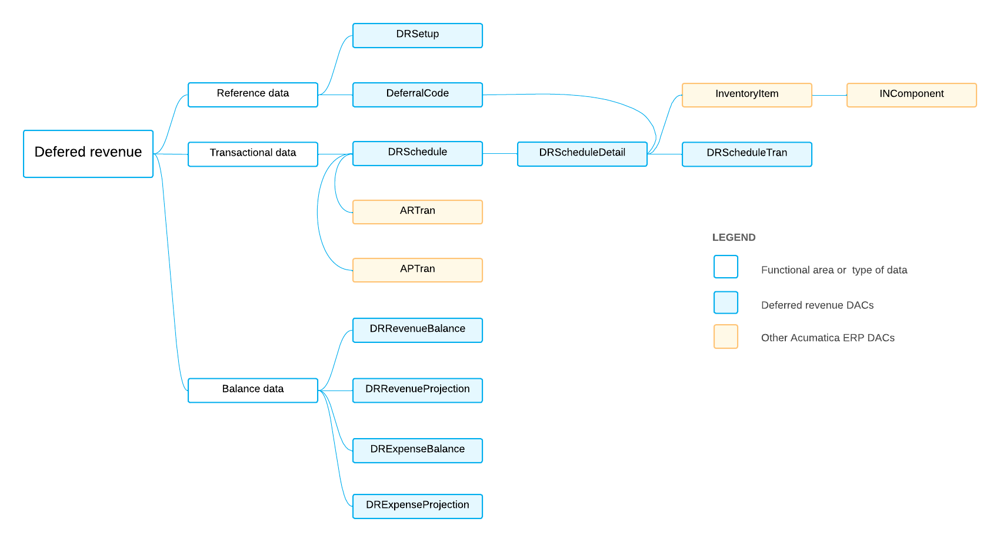

# DR DACs: General Information {#_6a77142f-671e-4de0-b93d-8b8467421619 .concept}

Deferred revenue is money that the company receives in advance for products and services that will be delivered or performed later. This means that the revenue amount cannot be recognized in the current financial period because it has not yet been earned. Instead, in the financial period of the delivery, the deferred amount is recognized as revenue.

You may also need to use deferred expenses, which are costs that have already been incurred, even though the products have not been used or consumed or the services have not been delivered. For example, suppose that your company pays upfront for a five-year insurance policy. It would not be correct to recognize the whole expense in a single period. Instead, you spread the expenses over five years, recognizing part of the amount each month.

The system uses the deferred revenue data access classes \(DACs\), most of which have the *DR* prefix, to give users the ability to view and edit deferral schedules that have been generated for accounts payable and accounts receivable documents. The portions of deferred amount are recognized according to these schedules.

## Learning Objectives { .section}

In this chapter, you will learn about the DACs that are related to the following information:

-   Reference data that is used in most of the DACs of deferred revenue
-   Transactional data
-   Balance data

## Applicable Scenarios { .section}

You review deferred revenue DACs in the following cases:

-   You need to create a generic inquiry that uses deferred revenue data.
-   You need to design a report that uses deferred revenue data.
-   You need to customize the deferred revenue functionality by adjusting it in the [Customization Project Editor](../UserGuide/SM_20_45_10.md).
-   You need to customize the deferred revenue functionality by writing customization code.

## Key Differences Between Deferred Revenue and Deferred Expenses { .section}

The table below highlights the key differences in the recognition of deferred revenue and deferred expenses.

|Characteristic|Deferred Revenue|Deferred Expenses|
|--------------|----------------|-----------------|
|The functionality with which deferred revenue or expense functionality interacts during schedule creation and recognition|Accounts receivable|Accounts payable|
|The entity that is linked to a non-custom deferral schedule \(which is a record stored in the [DRSchedule DAC\)](https://help.acumatica.com/dacBrowser/PX.Objects.DR/DRSchedule)|An invoice line \(which is stored in the [ARTran](https://help.acumatica.com/dacBrowser/PX.Objects.AR/ARTran) DAC\)|A bill line \(which is stored in the [APTran](https://help.acumatica.com/dacBrowser/PX.Objects.AP/APTran) DAC\)|
|Deferral account type|Liability|Asset|
|Credit line deferral transactions|A transaction that debits an AR account and a transaction that credits a deferral account|A transaction that credits an AP account and a transaction that debits a deferral account|
|Recognition deferral transactions|A transaction that debits a deferral account and a transaction that credits a revenue account|A transaction that credits a deferral account and a transaction that debits an expense account|
|Deferred amount balance and projection tables|[DRRevenueBalance](https://help.acumatica.com/dacBrowser/PX.Objects.DR/DRRevenueBalance) and [DRRevenueProjection](https://help.acumatica.com/dacBrowser/PX.Objects.DR/DRRevenueProjection)|[DRExpenseBalance](https://help.acumatica.com/dacBrowser/PX.Objects.DR/DRExpenseBalance) and [DRExpenseProjection](https://help.acumatica.com/dacBrowser/PX.Objects.DR/DRExpenseProjection)|
|Entities for which balances and projections are stored|Customers|Vendors|
|Ability to use flexible and *On Payment* recognition methods|Yes|No|

## Deferred Revenue Entities and Processes { .section}

In Acumatica ERP, revenue recognition schedules are associated with individual invoice lines \(which are stored as records in the [ARTran](https://help.acumatica.com/dacBrowser/PX.Objects.AR/ARTran) DAC\). The association is performed automatically upon release if the user specifies a deferral code \(that is, a record in the [DRDeferredCode](https://help.acumatica.com/dacBrowser/PX.Objects.DR/DRDeferredCode) DAC\) in the line.

For example, suppose that a user has created and released an AR invoice \(a record in the [ARInvoice](https://help.acumatica.com/dacBrowser/PX.Objects.AR/ARInvoice) DAC\) with three document lines \(ARTran records\), which are the following:

-   Line 1 corresponds to a product delivered in the current financial period. The document line does not have a deferral code specified.
-   Line 2 corresponds to a six-month insurance contract. It contains a deferral code that specifies six recognition occurrences.
-   Line 3 corresponds to a five-year long-term contract that begins in three months. It contains another deferral code with 60 recognition occurrences and a recognition offset of three periods.

The Accounting Standards Codification \(ASC\) is a set of accounting principles documented by the Financial Accounting Standards Board. According to ASC 605, the revenue recognition schedules for the AR invoice in this example will be created as follows:

-   Line 1 will not have a revenue recognition schedule created. During release of the AR invoice, the system will directly post the line amount onto the sales income account.
-   For lines 2 and 3, the system will post the line amount to the deferred revenue account specified in DRDeferredCode.Account and create two different recognition schedules according to the rules determined by the deferral codes of the respective lines.

For the differences for ASC 606, see the [Revenue Recognition by IFRS 15/ASC 606](#_81cbaf56-91d9-47b0-a291-c0855d892d4c) section below.

## Revenue Recognition by IFRS 15/ASC 606 {#_81cbaf56-91d9-47b0-a291-c0855d892d4c .section}

International Financial Reporting Standard \(IFRS\) 15 Revenue from Contracts with Customers was introduced by the International Accounting Standards Board to provide a comprehensive revenue recognition model for all contracts with customers. A user can switch on revenue recognition by IFRS 15/ASC 606 if the user enables the *Revenue Recognition by IFRS 15/ASC 606* feature on the [Enable/Disable Features](../UserGuide/CS_10_00_00.md) \(CS100000\) form.

ASC 606 mode affects only deferred revenue \(which originates from AR and SO documents\) and does not change deferred expenses \(which originate from AP documents\).

Revenue recognition schedules are associated with all invoice lines \([ARTran](https://help.acumatica.com/dacBrowser/PX.Objects.AR/ARTran) records\) with deferral code \([DRDeferredCode](https://help.acumatica.com/dacBrowser/PX.Objects.DR/DRDeferredCode) records\) in the lines.

For example, suppose that a user has created and released a sales invoice \(an [ARInvoice](https://help.acumatica.com/dacBrowser/PX.Objects.AR/ARInvoice) record\) with three document lines \(ARTran records\), which are the following:

-   Line 1 corresponds to a product delivered in the current financial period. The document line does not have a deferral code specified.
-   Line 2 corresponds to a six-month insurance contract. It contains a deferral code that specifies six recognition occurrences.
-   Line 3 corresponds to a five-year long-term contract beginning in three months. It contains another deferral code with 60 recognition occurrences and a recognition offset of three periods.

As a result, the revenue recognition schedules for the AR invoice in this example will be created as follows:

-   Line 1 will not have a revenue recognition schedule created. During release of the AR invoice, the system will directly post the line amount onto the sales income account.
-   For lines 2 and 3, the system will post the line amounts to deferred revenue accounts specified in DRDeferredCode.Account and create one recognition schedule with two revenue components from line 2 and line 3.

## Basic Relationships Between Deferred Revenue DACs { .section}

The following diagram illustrates the main relationships between deferred revenue DACs. For detailed descriptions of the DACs and DAC fields, look for the needed DAC in the [DAC Schema Browser](https://help.acumatica.com/dacBrowser). \(For details about the DAC Schema Browser, see [Data from Multiple Data Sources: DAC Schema Browser](../UserGuide/GI_Discovering_DACs_DAC_Schema_Browser_Concept.md).\)

**Parent topic:**[Reviewing Deferred Revenue DACs](../DeveloperGuide/DACOverview_DR_Mapref.md)

