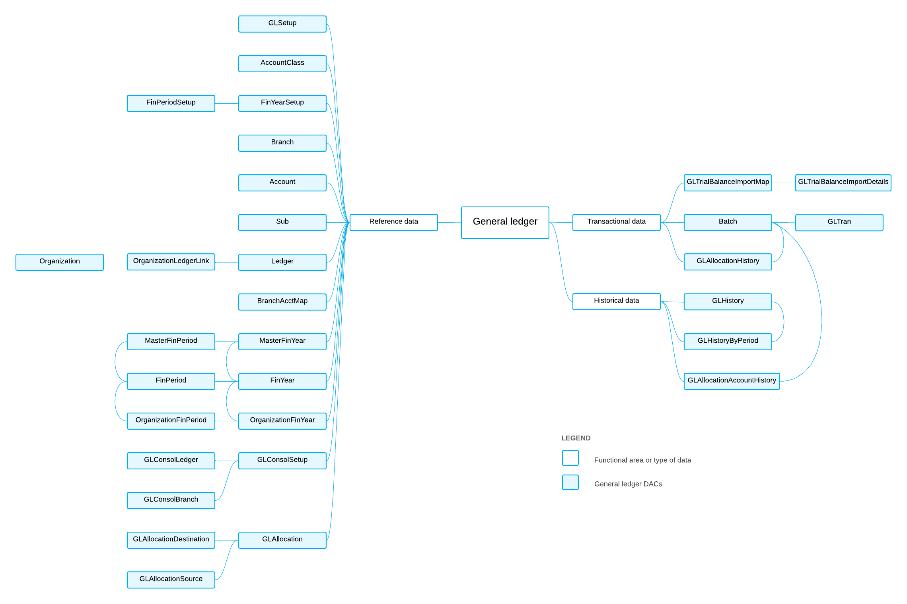

# GL DACs: General Information {#_f2c09460-e99b-4202-88a2-1e1be78d4e87 .concept}

The system uses the general ledger data access classes \(DACs\) to collect all financial information to be analyzed, summarized, and reported upon.

## Learning Objectives { .section}

In this chapter, you will learn about the DACs that are related to the following data:

-   Reference data that is used in most of the DACs of general ledger
-   Transactional data
-   Historical data

## Applicable Scenarios { .section}

You review GL DACs in the following cases:

-   You need to create a generic inquiry that uses general ledger data.
-   You need to design a report that uses general ledger data.
-   You need to customize the general ledger functionality by adjusting it in the [Customization Project Editor](../UserGuide/SM_20_45_10.md).
-   You need to customize the general ledger functionality by writing customization code.

## Basic Relationships Between GL DACs { .section}

The following diagram shows the basic general ledger DACs and the relationships between them. For detailed descriptions of the DACs and DAC fields, look for the needed DAC in the [DAC Schema Browser](https://help.acumatica.com/dacBrowser). \(For details about the DAC Schema Browser, see [Data from Multiple Data Sources: DAC Schema Browser](../UserGuide/GI_Discovering_DACs_DAC_Schema_Browser_Concept.md).\)

**Parent topic:**[Reviewing General Ledger DACs](../DeveloperGuide/DACOverview_GL_Mapref.md)

