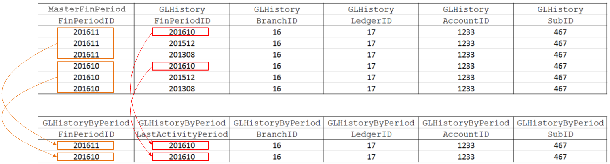

# GL DACs: Historical Data {#_e3fffc16-20d3-4912-9781-33b58f433ae8 .concept}

Historical data access classes \(DACs\) keep historical information on GL transactions and turnover by period.

## GLHistory { .section}

A [GLHistory](https://help.acumatica.com/dacBrowser/PX.Objects.GL/GLHistory) record is a historical entity that accumulates [GLTran](https://help.acumatica.com/dacBrowser/PX.Objects.GL/GLTran) amounts by financial period for a particular account and subaccount for reporting purposes. The GLHistory records are calculated from GLTran records during the posting of a batch.

GLHistory contains fields with the following prefixes:

-   `Fin`: The fields with this prefix contain the amounts that correspond to the amounts of the GLTran records that can be found by the link from GLHistory.FinPeriodID to GLTran.FinPeriodID.
-   `Tran`: The fields with this prefix contain the amounts that correspond to the amounts of GLTran records that can be found by the link from GLHistory.FinPeriodID to GLTran.TranPeriodID.

-   `Cury`: The fields with this prefix contain amounts in the currency of the record.

## GLHistoryByPeriod { .section}

[GLHistoryByPeriod](https://help.acumatica.com/dacBrowser/PX.Objects.GL/GLHistoryByPeriod) is a projection based on a join of the [GLHistory](https://help.acumatica.com/dacBrowser/PX.Objects.GL/GLHistory) and [MasterFinPeriod](https://help.acumatica.com/dacBrowser/PX.Objects.GL.FinPeriods/MasterFinPeriod) DACs. GLHistoryByPeriod obtains the last period to which each GL entry has been posted \(that is, the last period for which a GLHistory record exists\) that is earlier than or the same as the specified period for each account–subaccount pair.

The GLHistoryByPeriod projection joins GLHistory records that have FinPeriodID that is earlier than or the same as the particular period to each MasterFinPeriod record. The result of join contains a set of all previous existing periods \(including the current period\) with posted data for each period. Then the projection groups the obtained set by the MasterFinPeriod.FinPeriodID field and extracts the maximum GLHistory.FinPeriodID as the last activity period for each group. See the calculation scheme in the following diagram.

To obtain the last activity period for the needed period, you should specify the needed period for the GLHistoryByPeriod.FinPeriodID field. GLHistoryByPeriod.LastActivityPeriod will contain the last existing period with data.

## GLAllocationAccountHistory { .section}

The [GLAllocationAccountHistory](https://help.acumatica.com/dacBrowser/PX.Objects.GL/GLAllocationAccountHistory) DAC stores the allocated amount for account–subaccount pair and contains a reference to the corresponding GL batch.

**Parent topic:**[Reviewing General Ledger DACs](../DeveloperGuide/DACOverview_GL_Mapref.md)

