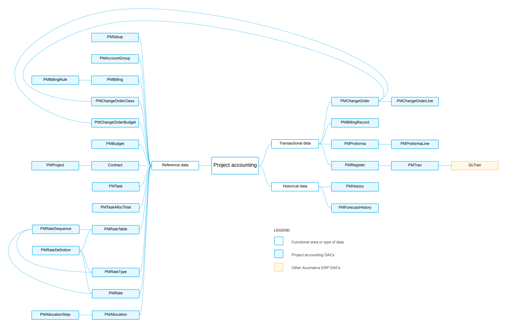

# PM DACs: General Information {#_6d9d16c8-b34a-4aa2-8bc8-37e7a4109d39 .concept}

The system uses the project accounting data access classes \(DACs\), which have the *PM* prefix, to store information about projects and their settings. The settings of a project include the tasks that have been defined for a project and the employees, resources, and equipment assigned to it. For details about the project accounting processes, see [Project Accounting in Acumatica ERP](../UserGuide/PM__PM_Features.md).

## Learning Objectives { .section}

In this chapter, you will learn about the DACs that are related to the following data:

-   Reference data that is used in most of the DACs of project accounting
-   Transactional data
-   Historical data

## Applicable Scenarios { .section}

You review the project accounting DACs in the following cases:

-   You need to create a generic inquiry that uses project accounting data.
-   You need to design a report that uses project accounting data.
-   You need to customize the project accounting functionality by adjusting it in the [Customization Project Editor](../UserGuide/SM_20_45_10.md).
-   You need to customize the project accounting functionality by writing customization code.

## Basic Relationships of Project Accounting DACs { .section}

The following diagram illustrates the main relationships between project accounting DACs. For detailed descriptions of the DACs and DAC fields, look for the needed DAC in the [DAC Schema Browser](https://help.acumatica.com/dacBrowser). \(For details about the DAC Schema Browser, see [Data from Multiple Data Sources: DAC Schema Browser](../UserGuide/GI_Discovering_DACs_DAC_Schema_Browser_Concept.md).\)

**Parent topic:**[Reviewing Project Accounting DACs](../DeveloperGuide/DACOverview_PM_Mapref.md)

