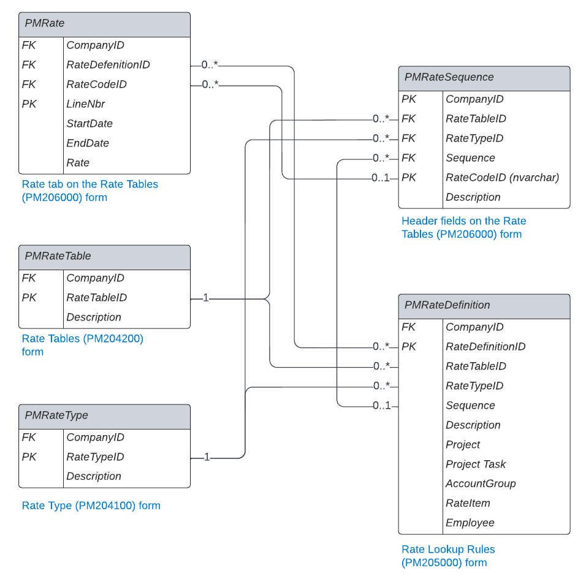

# PM DACs: Reference Data {#_91108132-81d1-41f0-a481-3ee5fada55f6 .concept}

In this topic, you can find information about the data access classes \(DACs\) that contain reference data that is used in most other DACs in project accounting.

## Project Accounting Preferences {#section_vv2_1y4_y4b .section}

The [PMSetup](https://help.acumatica.com/dacBrowser/PX.Objects.PM/PMSetup) DAC contains the general project accounting preferences, which are specified on the [Projects Preferences](../UserGuide/PM_10_10_00.md) \(PM101000\) form.

You can use the following example to obtain the project preferences of a particular tenant.

```
SELECT 
    * 
FROM 
    PMSetup s 
WHERE 
    s.CompanyID = 2
```

## Account Groups { .section}

The [PMAccountGroup](https://help.acumatica.com/dacBrowser/PX.Objects.PM/PMAccountGroup) DAC contains account groups for projects. The account groups are defined on the [Account Groups](../UserGuide/PM_20_10_00.md) \(PM201000\) form.

You can use the following example to select the list of active account groups with the *Expense* type.

```
SELECT 
    * 
FROM 
    PMAccountGroup a 
WHERE 
    a.IsActive=1 
    AND a.type='E'
```

## Rules for Project Billing { .section}

The [PMBillingRule](https://help.acumatica.com/dacBrowser/PX.Objects.PM/PMBillingRule) DAC contains the list of rules for project billing, which are defined on the [Billing Rules](../UserGuide/PM_20_70_00.md) \(PM207000\) form.

The following example shows how to select all rules with the *Time and Material* type.

```
SELECT 
    * 
FROM 
    PMBillingRule b 
WHERE 
    b.type='T'
```

## Change Order Classes { .section}

The [PMChangeOrderClass](https://help.acumatica.com/dacBrowser/PX.Objects.PM/PMChangeOrderClass) DAC contains the change order class data, which is defined on the [Change Order Classes](../UserGuide/PM_20_30_00.md) \(PM203000\) form.

The following example shows how to select the change order class with the specified ID.

```
SELECT 
    * 
FROM 
    PMChangeOrderClass c 
WHERE 
    c.ClassID = 'DEFAULT'
```

## Project Rate Tables { .section}

If a project is billed with the *Time and Material* step of the billing rule and the *@Rate* parameter is used in the billing rule formula, the relevant rate from the configured rate table is used in the pro forma invoices.

A user configures each rate by performing the following steps:

1.  Adding a rate table code on the [Rate Table Codes](../UserGuide/PM_20_42_00.md) \(PM204200\) form. The rate table data is stored in the [PMRateTable](https://help.acumatica.com/dacBrowser/PX.Objects.PM/PMRateTable) DAC.
2.  Adding a rate type on the [Rate Types](../UserGuide/PM_20_41_00.md) \(PM204100\) form. The rate type data is stored in the [PMRateType](https://help.acumatica.com/dacBrowser/PX.Objects.PM/PMRateType) DAC.
3.  Defining a rule on the [Rate Table Sequences](../UserGuide/PM_20_50_00.md) \(PM205000\) form. The rule data is stored in the [PMRateDefinition](https://help.acumatica.com/dacBrowser/PX.Objects.PM/PMRateDefinition) DAC. A definition of a rule includes the addition of sequences and the defining of conditions for each combination of a rate table and rate type. Conditions can be defined for the following entities:
    -   A project, whose ID is stored in the [PMProjectRate](https://help.acumatica.com/dacBrowser/PX.Objects.PM/PMProjectRate) DAC
    -   A project task, whose ID is stored in the [PMTaskRate](https://help.acumatica.com/dacBrowser/PX.Objects.PM/PMTaskRate) DAC
    -   An account group, whose ID is stored in the [PMAccountGroupRate](https://help.acumatica.com/dacBrowser/PX.Objects.PM/PMAccountGroupRate) DAC

    -   An inventory item, whose ID is stored in the [PMItemRate](https://help.acumatica.com/dacBrowser/PX.Objects.PM/PMItemRate) DAC
    -   An employee, whose ID is stored in the [PMEmployeeRate](https://help.acumatica.com/dacBrowser/PX.Objects.PM/PMEmployeeRate) DAC

4.  Adding a rate sequence for each combination of rate table, rate type, and rate code on the [Rate Tables](../UserGuide/PM_20_60_00.md) \(PM206000\) form. The rate sequence data is stored in the [PMRateSequence](https://help.acumatica.com/dacBrowser/PX.Objects.PM/PMRateSequence) DAC.
5.  Adding a rate on the [Rate Tables](../UserGuide/PM_20_60_00.md) \(PM206000\) form. The rate data is stored in the [PMRate](https://help.acumatica.com/dacBrowser/PX.Objects.PM/PMRate) DAC.

For details on the configuration of billing rates, see [Billing Rates: General Information](../UserGuide/Billing_Rates_GeneralInfo.md).

The following diagram shows the relationships between the project rate tables.



## Projects, Project Templates, Customer Contracts, and Contract Templates { .section}

The [Contract](https://help.acumatica.com/dacBrowser/PX.Objects.CT/Contract) DAC contains the master data of the entities that are created and edited on the following data entry forms:

-   [Projects](../UserGuide/PM_30_10_00.md) \(PM301000\)
-   [Project Templates](../UserGuide/PM_20_80_00.md) \(PM208000\)
-   [Customer Contracts](../UserGuide/CT_30_10_00.md) \(CT301000\)
-   [Contract Templates](../UserGuide/CT_20_20_00.md) \(CT202000\)

The following examples show how to obtain entities that satisfy particular conditions:

-   The selection of all projects with the *In Planning* status

    ```
    SELECT 
        * 
    FROM 
        Contract p 
    WHERE 
        p.Status='D' 
        AND p.BaseType='P' 
        AND p.NonProject=0 
        AND IsTemplate=0
    ```

-   The selection of *Non-Project* items

    ```
    SELECT 
        * 
    FROM 
        Contract 
    WHERE 
        NonProject=1
    ```


## Project Tasks { .section}

The [PMTask](https://help.acumatica.com/dacBrowser/PX.Objects.PM/PMTask) DAC contains the tasks that are defined in the table on the **Tasks** tab of the [Projects](../UserGuide/PM_30_10_00.md) \(PM301000\) form—that is, the tasks of a particular project.

The following examples illustrate the selection of project tasks that meet specific conditions:

-   The selection of the tasks for the specified project

    ```
    SELECT 
        * 
    FROM 
        PMTask t 
    WHERE 
        t.ProjectID = 3312
    ```

-   The selection of all common tasks

    ```
    SELECT 
        * 
    FROM 
        PMTask 
        INNER JOIN Contract 
            ON PMTask.ProjectID = Contract.ContractID 
    WHERE 
        Contract.NonProject = 1
    ```


The [PMTaskAllocTotal](https://help.acumatica.com/dacBrowser/PX.Objects.PM/PMTaskAllocTotal) DAC contains the quantity and the previously allocated amount for the project tasks with the *Allocate Budget* allocation method specified on the **Calculation Rules** tab of the [Allocation Rules](../UserGuide/PM_20_75_00.md) \(PM207500\) form. \(The previously allocated amount, which is expressed in the project currency, is stored in the PMTaskAllocTotal.Amount field.\) The class contains data that is not available in the UI but that can be useful for troubleshooting and data migration.

## Project Budget Lines { .section}

The [PMBudget](https://help.acumatica.com/dacBrowser/PX.Objects.PM/PMBudget) DAC contains the project budget lines that are defined on the following forms:

-   [Projects](../UserGuide/PM_30_10_00.md) \(PM301000\), on the **Revenue Budget** and **Cost Budget** tabs
-   [Project Budget](../UserGuide/PM_30_90_00.md) \(PM309000\)

Project budget lines aggregate the project balance amounts and quantities by project ID, project task ID, cost code, account group, and inventory ID.

The selection of project budget lines that meet particular conditions is illustrated in the following examples:

-   The selection of project budget lines for the specified project with the specified account group

    ```
    SELECT 
        * 
    FROM 
        PMBudget b 
    WHERE 
        b.ProjectID = 3293 
        AND b.AccountGroupID=23
    ```

-   The selection of the cost project budget of the specified project

    ```
    SELECT 
        * 
    FROM 
        PMBudget 
    WHERE 
        Type = 'E' 
        AND ProjectID = 3293
    ```

-   The selection of the budget lines entered for the out-of-balance account group

    ```
    SELECT 
        * 
    FROM 
        PMBudget 
        INNER JOIN PMAccountGroup 
            ON PMBudget.AccountGroupID = PMAccountGroup.GroupID 
    WHERE 
        PMAccountGroup.Type = 'O'
    ```


## Change Order Budgets { .section}

The [PMChangeOrderBudget](https://help.acumatica.com/dacBrowser/PX.Objects.PM/PMChangeOrderBudget) DAC contains the lines that are defined on the **Revenue Budget** and **Cost Budget** tabs of the [Change Orders](../UserGuide/PM_30_80_00.md) \(PM308000\) form.

The following example shows the retrieval of the list of change order budgets with the specified project and account group.

```
SELECT 
    * 
FROM 
    PMChangeOrderBudget c 
WHERE 
    c.ProjectID = 29 
    AND c.AccountGroupID = 2
```

**Parent topic:**[Reviewing Project Accounting DACs](../DeveloperGuide/DACOverview_PM_Mapref.md)

