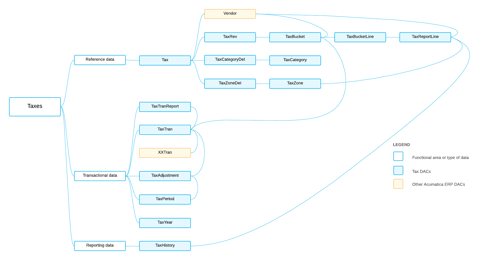

# TX DACs: General Information {#_76df525f-cad2-4a4f-b85f-dedecfc1a7a0 .concept}

The system uses the tax DACs, which are available in the *PX.Objects.TX* namespace, for the following main purposes:

-   Tax calculation for documents and their lines
-   Generation and release of the tax report

The system also uses tax DACs for the configuration of tax calculation and reporting.

## Learning Objectives { .section}

In this chapter, you will learn about the DACs that are related to the following information:

-   Reference data that is used in most of the tax DACs
-   Transactional data
-   Reporting data

## Applicable Scenarios { .section}

You review tax DACs in the following cases:

-   You need to create a generic inquiry that uses tax data.
-   You need to design a report that uses tax data.
-   You need to customize the tax functionality by adjusting it in the [Customization Project Editor](../UserGuide/SM_20_45_10.md).
-   You need to customize the tax functionality by writing customization code.

## Basic Relationships Between TX DACs { .section}

The following diagram shows basic relationships between tax DACs. For detailed descriptions of DACs and DAC fields, look for the needed DAC in the [DAC Schema Browser](https://help.acumatica.com/dacBrowser). \(For details about the DAC Schema Browser, see [Data from Multiple Data Sources: DAC Schema Browser](../UserGuide/GI_Discovering_DACs_DAC_Schema_Browser_Concept.md).\)

**Parent topic:**[Reviewing Tax DACs](../DeveloperGuide/DACOverview_TX_Mapref.md)

