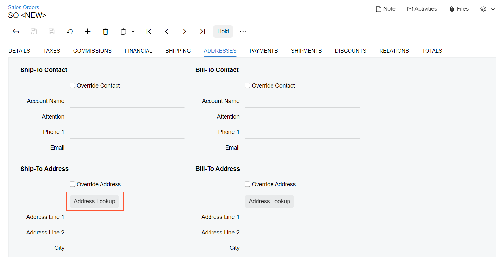

# Address Lookup: General Information {#_8afa54b9-62c5-4072-b68d-03bc359bc90f .concept}

An **Address Lookup** button is a control that a user can click to search for addresses that are available in the entered records. When a user clicks this control, the system opens the corresponding dialog box, where the user can perform a search operation. In this dialog box, the user can also add a new address, update an existing address, and fill in the missing address information in a record.

An example of this control is available on the **Addresses** tab of the [Sales Orders](../UserGuide/SO_30_10_00.md) \(SO301000\) form, as shown in the following screenshot.



In the Classic UI, **Address Lookup** button is defined by PXButton, with the corresponding value specified for the button's CommandName property. You also need to separately define the code for the corresponding dialog box that opens when this button is clicked. In the Modern UI, an **Address Lookup** button is defined by the [qp-address-lookup](https://help.acumatica.com/(W(1))/Help?ScreenId=ShowWiki&pageid=1dbff7a3-a969-f6ec-9534-bb360fabbe52) HTML tag. This tag already includes the code for both the button and the corresponding dialog box.

## Learning Objectives { .section}

In this chapter, you will learn the following about an **Address Lookup** button:

-   The design guidelines for an **Address Lookup** button
-   The proper configuration of a button for specific cases, such as when a button is to be placed below another element

## Applicable Scenarios { .section}

You configure an **Address Lookup** button on a form when a user needs to look up addresses that are available in the entered records.

## Address Lookup ID { .section}

An ID of a address lookup in HTML consists of three parts: the `addressLookup` prefix, the location of the **Address Lookup** button, and the semantic name separated with a dash. The semantic name describes the purpose of the element. For example, the **Address Lookup** button on the **Billing** tab that specifies an address may have the ``addressLookupBilling-Addresses`` ID, as the following code shows.

```language-xml
<qp-address-lookup id="addressLookupBilling-Addresses" 
  view.bind="Billing_Address" class="col-12"></qp-address-lookup>
```

**Parent topic:**[Address Lookup](../DeveloperGuide/UIDevRef_AddressLookup_Mapref.md)

