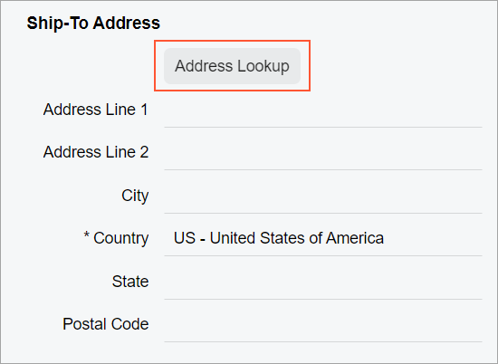

# Address Lookup: Layout Examples {#_a926870d-3255-428a-9285-8c5a2d3e490c .concept}

In this topic, you can find examples of ways to configure various layouts with **Address Lookup** buttons.

## Address Lookup Button at the Top of a Fieldset { .section}

You can add an **Address Lookup** button at the top of a fieldset, as shown in the following screenshot.



To add an **Address Lookup** button, you add a `field` tag with the unbound attribute and nest the qp-address-lookup tag within it, as shown in the following code example.

```
<field name="FakeField" unbound>
  <qp-address-lookup class="col-12" view.bind="Shipping_Address">
  </qp-address-lookup>
</field>
```

## Address Lookup Button Below a UI Element { .section}

You can add a button after another control so that it is displayed on the next line below the control. To do that, you need to add the button control inside the field tag and specify `class="col-12"` for the button control.

For example, suppose that you need to place the **Address Lookup** button on the next line after a check box, as shown in the following screenshot.


The **Address Lookup** button is implemented by using the qp-address-lookup tag. The following code shows an example of moving the **Address Lookup** button to the next line.

```
<field name="OverrideAddress">
  <qp-address-lookup class="col-12" view.bind="Shipping_Address">
  </qp-address-lookup>
</field>
```

**Parent topic:**[Address Lookup](../DeveloperGuide/UIDevRef_AddressLookup_Mapref.md)

