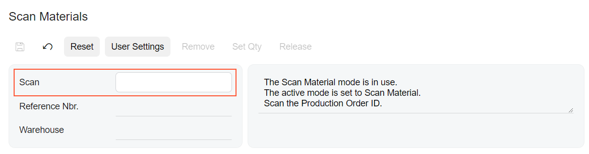

# Barcode Editor: General Information {#_2257a170-be9a-4132-af2c-b2112e11a032 .concept}

A barcode editor is a control in which a user can input a barcode and view its representation in the UI. The barcode editor uses the functionality of the barcode-driven engine provided by Acumatica ERP.

A barcode editor is defined by PXTextEdit in the Classic UI. In the Modern UI, you define a barcode editor in one of the following ways:

-   By using the field or qp-field tag with the `qp-barcode-input` control type specified
-   Explicitly by using the [`qp-barcode-input`](https://help.acumatica.com/(W(1))/Help?ScreenId=ShowWiki&pageid=5c63d353-31da-9c38-960f-b4a27bb9a71c) control

## Learning Objectives { .section}

In this chapter, you will learn the following about the barcode editor:

-   The design guidelines for the barcode editor, including the naming conventions and layout recommendations
-   The proper configuration of the barcode editor for specific cases, such as enabling the sound signal

## Applicable Scenarios { .section}

You configure the barcode editor when you want to give a user the capability to scan a barcode.

## Overview of the Barcode Editor { .section}

The barcode editor looks like a text box with a text value that corresponds to the barcode values. The system submits the text value to the server when a user presses Enter by using the action specified in the submitCommand property. Note that the default action Scan has already been implemented and specified in the control, so normally, you do not need to specify it. For details, see [Barcode-Driven Engine Guide](WMSEngine_Guide.md).

To facilitate back-to-back barcode scanning, the control prevents defocusing when a user presses Enter.

You can also configure the sound signal that the computer plays when a user scans the barcode. For details, see [Barcode Editor: Configuration of Sound Effects](UIDevRef_BarcodeInput_Sound.md).

**Important:** The declaration of the field for the barcode editor in TypeScript must not include &lt;PXFieldOptions.CommitChanges&gt; because that setting incurs extra requests to the server. A fatal error will be thrown if the CommitChanges setting is specified.

## UI Naming Convention { .section}

The following table shows the UI naming convention for a barcode editor.

|Naming Convention|Example|
|-----------------|-------|
|Use a noun or a noun phrase to describe the contents of a barcode editor. Preferably, the name of a barcode editor should consist of one or two words.|The **Scan** barcode editor on the [Scan Materials](../UserGuide/AM_30_00_30.md) \(AM300030\) form, which is shown in the following screenshot

|

## Use of the BarcodeProcessingScreen Component { .section}

The source code of Acumatica ERP provides a reusable component, named `BarcodeProcessingScreen`, that you can use to insert the barcode editor with all necessary logic. The component is defined in the `Screen/src/screens/barcodeProcessing` folder of the instance, and it uses the functionality defined in the barcode-driven engine.

The reusable component includes the following:

-   The Summary area with the scanned barcode and the message indicating the result of the scanning
-   The **Scan Log** tab, which lists all attempts to scan the barcode
-   The logic to produce the sound signal when the barcode is scanned

For details on including the reusable component in the UI, see [Reusing a UI Definition](UIDev_UIDefinitionReuse_Mapref.md).

For details on configuring the backend part of the form that uses the barcode-driven engine, see [Barcode-Driven Engine Guide](WMSEngine_Guide.md).

**Parent topic:**[Barcode Editor](../DeveloperGuide/UIDevRef_BarcodeInput_Mapref.md)

