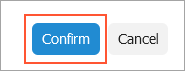
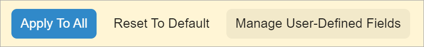
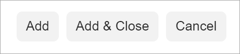

# Button: Configuration {#_74eaaf33-4d94-4b75-bea2-0033a52c6960 .concept}

In this topic, you can learn how to adjust a button for specific cases.

## Action Definition in TypeScript {#_48f6ba21-06dc-442b-bdbf-4af7bea5e024 .section}

The actions that are defined in the graph or in the workflow have corresponding commands displayed on the More menu of the form toolbar by default. You do not need to define them in the TypeScript code of the Acumatica ERP form.

However, if you need to place a button for an action on an area of the form other than the toolbar or the More menu, you need to do the following:

-   To place a button on a table toolbar, you specify the property with the name of the corresponding action in the view class of the table, as shown below.

    ```language-javascript
    import { 
        gridConfig,
        PXView,
        PXActionState
    } from "client-controls";
      
    @gridConfig({
        preset: GridPreset.Details
    })
    export class SOLine extends PXView {
        AddInvBySite: PXActionState;
    }
    ```

-   To place a button in a dialog box or somewhere on the form \(outside of the form toolbar or table toolbar\), you specify the property with the name of the corresponding action in the screen class, as the following code shows. You then add the qp-button tag for the action in HTML. For details, see [Dialog Box: Configuration](UIDevRef_DialogBox_Configuration.md).

    ```language-javascript
    import { 
        graphInfo,
        PXScreen,
        PXActionState
    } from "client-controls";
    
    @graphInfo({
        graphType: "PX.Objects.GL.AccountHistoryEnq",
        primaryView: "Filter"
    })
    export class GL401000 extends PXScreen {
        AddInvoiceOK: PXActionState;
    }
    ```

-   To execute an action when a user clicks the link in a column of a grid, you specify the property with the name of the corresponding action in the screen class and use the [linkCommand](https://help.acumatica.com/Help?ScreenId=ShowWiki&pageid=bcc7789a-04b4-7fc6-0e03-a9a9bc2d8e88) decorator for the column that displays the link. An example of such action is shown in the following code.

    ```language-javascript
    @graphInfo({ 
        graphType: "PX.Objects.FA.CalcDeprProcess", 
        primaryView: "Filter" 
    })
    export class FA502000 extends PXScreen {
        ViewAsset: PXActionState;
        Balances = createCollection(FABookBalance);
    }
    
    @gridConfig({ 
        preset: GridPreset.Processing 
    })
    export class FABookBalance extends PXView { 
        **@linkCommand\("ViewAsset"\)**
        @columnConfig({ allowUpdate: false })
        AssetID: PXFieldState;
        ...
    }
    ```


-   To execute an action when a user clicks the link in a field in a fieldset, you specify the property with the name of the corresponding action in the screen class and use the [editCommand](https://help.acumatica.com/(W(11))/Help?ScreenId=ShowWiki&pageid=f09209ae-c510-12ea-b69e-c24f1db45d18) property in the [controlConfig](https://help.acumatica.com/(W(11))/Help?ScreenId=ShowWiki&pageid=ece136fa-9f2c-a8b2-3b3c-aff23a4d1156) decorator for the field that displays the link. An example of such action is shown in the following code.

    ```language-javascript
    @graphInfo({
        graphType: "PX.Objects.EP.EPAssignmentMaint", 
        primaryView: "AssigmentMap" 
    })
    export class EP205000 extends PXScreen {
        OpenForm: PXActionState;
        AssigmentMap = createSingle(EPAssignmentMap);
    }
    
    export class EPAssignmentMap extends PXView {
      @controlConfig({editCommand: "OpenForm"})
      GraphType: PXFieldState<PXFieldOptions.CommitChanges>;
    }
    ```


**Important:** When you include the property of the PXActionState type for the action in the TypeScript code of a form, this action is automatically bound by name to an action in the graph. The action is not displayed on the form toolbar by default. To specify explicitly whether the button for the action is displayed on the form toolbar, you can use the [PXButton.DisplayOnMainToolbar](https://help.acumatica.com/(W(1))/Help?ScreenId=ShowWiki&pageid=1a7069c4-95d5-456b-41ec-5b19371358db) property in the graph’s action declaration.

## Button for a Graph Action in HTML { .section}

If you need to use an action defined in a graph in your HTML code, you must specify the state attribute for the button that corresponds to this action, as shown in the following code.

```language-xml
<qp-button id="buttonAddBlanketLine" state.bind="AddBlanketLineOK">
</qp-button>
```

In the code above, you have used the state attribute and specified the *AddBlanketLineOK* value for its bind property, which is the name of the action that is defined in the graph.

## Configuration of Button Properties { .section}

You use the actionConfig decorator to specify the properties of an action explicitly defined in a view class, such as an action that corresponds to a button on the table toolbar or a button in a dialog box. The full list of properties is defined in the [IActionConfig](https://help.acumatica.com/(W(1))/Help?ScreenId=ShowWiki&pageid=372fd44c-c8e2-5144-865e-22710fb5352e) interface. The following code uses this decorator.

```language-javascript
@localizable
export class LocalizableStrings {
    static btn_specifyDatabaseEngine = "Specify Database Engine";
}
  
export class AU209000 extends PXScreen {
    localizableStrings = LocalizableStrings;
 
    @actionConfig({text: LocalizableStrings.btn_specifyDatabaseEngine})
    actionAddSqlAttribute: PXActionState;
}
```

You can also specify the properties of any button by using the config attribute of the [qp-button](https://help.acumatica.com/(W(1))/Help?ScreenId=ShowWiki&pageid=b625313a-58f8-3614-13b1-54b95fa4faf3) tag in HTML, as the following code shows.

```language-xml
<qp-button id="pdfPrevPageBtn" 
  config.bind="{images: { normal: 'svg:main@arrowLeft' } }">
</qp-button>
```

You can also handle the state and appearance of any action that corresponds to a button or command on the table toolbar by using the actionsConfig property of the gridConfig decorator, as shown in the following examples.

```language-javascript
// Hides the Refresh button from the table toolbar.
@gridConfig({
  actionsConfig: { refresh: { hidden: true } }
})
export class SOLine extends PXView

// Adds the Custom Refresh button.
@gridConfig({
  actionsConfig: {
    refresh: {
      renderAs: MenuItem.RENDER_TEXT,
      images: {},
      text: "Custom Refresh" }  
  }
})
export class POLine extends PXView
```

## Standard Buttons of a Dialog Box { .section}

For the standard buttons of a dialog box—such as **OK** or **Cancel**—you must have the dialog-result attribute specified. Also, if you do not specify the caption attribute, the button's caption will be set to the value of the dialog-result attribute, and the caption will be localizable by general rules. You can override the default caption by specifying the caption attribute. You can omit the caption attribute if its value is the same as the value of the dialog-result attribute.

The following code example shows an approach to declaring the **OK** button of a dialog box that has a caption.

```
<qp-button id="buttonOK" caption="Confirm" dialog-result="OK"> </qp-button>
```

The following code example shows an approach to declaring the **Cancel** button of a dialog box that does not have a caption.

```
<qp-button id="buttonCancel" dialog-result="Cancel"></qp-button>
```

For more details on buttons of a dialog box, see [Dialog Box: Buttons on the Dialog Box](UIDevRef_DialogBox_AddButton.md).

## Configuration of Button Connotation { .section}

You can configure a button connotation from frontend by using the class property of the qp-button tag. The property can have the following values:

-   major-button: The button is highlighted with blue, as shown in the following screenshot.

    

    An example implementation of this button is shown in the following code.

    ```
    <qp-button
        id="btnOK" dialog-result="OK"
        config.bind="{ validateInput: true }"
        caption="Confirm"
        class="major-button">
    </qp-button>
    ```

-   minor-button: The button does not have any frame, gray or blue. When a user hovers over the button with this class, the button gets a gray frame. In the following screenshot, the **Reset to Default** and **Manage User-Defined Fields** buttons have `class="minor-button"` specified. The **Manage User-Defined Fields** button has a gray frame because a mouse hovers over it.

    


By default, a button has a gray frame as shown in the following screenshot.



**Parent topic:**[Button](../DeveloperGuide/UIDevRef_Button_Mapref.md)

