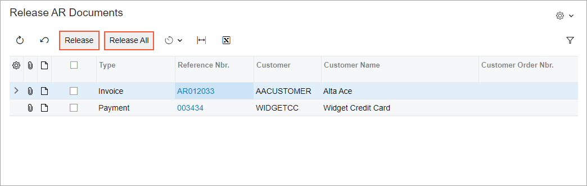

# Button: General Information {#_366e7cf6-ce7c-45a0-a0e9-d37cc1bced60 .concept}

A button is a control that users can interact with to trigger an action or execute a command.

A button is defined by PXButton in the Classic UI. In the Modern UI, a button is defined by the [qp-button](https://help.acumatica.com/(W(7))/Help?ScreenId=ShowWiki&pageid=b625313a-58f8-3614-13b1-54b95fa4faf3) HTML tag.

You do not need to manually add the standard buttons to the form toolbar of an Acumatica ERP form. The buttons representing actions that are available on the form toolbar are added automatically to the form. For details about adding button to various parts of the form, see [Button: Configuration](UIDevRef_Button_Configuration.md).

## Learning Objectives { .section}

In this chapter, you will learn the following about a button:

-   The design guidelines for a button, including the naming conventions and layout recommendations
-   The proper configuration of a button for specific cases, such as when a button is to be placed below another element
-   The key details of each property of a button

## Applicable Scenarios { .section}

You configure buttons in the following user scenarios:

-   A user needs to trigger an action or execute a command, such as initiating invoice creation.
-   A user needs to confirm or cancel an action or a command, such as canceling the release of an invoice.

## Button ID { .section}

An ID of a button in HTML consists of two parts, the `button` prefix and the semantic name. The semantic name describes the purpose of the element. For example, you may have a button that adjusts the document amount. You can set its ID to `buttonAdjustDocAmt`, as the following code shows.

```
<qp-button id="buttonAdjustDocAmt"></qp-button>
```

## UI Naming Conventions { .section}

The following table shows the UI naming conventions for a button.

|Naming Convention|Example|
|-----------------|-------|
|Use a verb or verb phrase that describes the process that is initiated when a user clicks the button. Title-style capitalization is used for button names. In the Classic UI, button names are displayed in uppercase.|The **Release** and **Release All** buttons on the [Release AR Documents](../UserGuide/AR_50_10_00.md) \(AR501000\) form, as shown in the following screenshot

|

**Parent topic:**[Button](../DeveloperGuide/UIDevRef_Button_Mapref.md)

