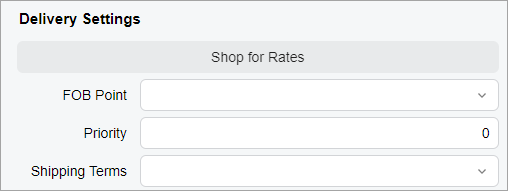
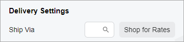
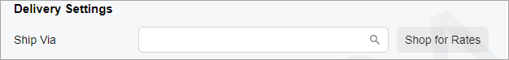

# Button: Layout Examples {#_f502c685-35ae-4169-af37-18bb445df0b8 .concept}

In this topic, you can find examples of ways to configure various layouts with buttons.

## Button Below a UI Element { .section}

You can add a button after another control so that it is displayed on the next line below the control. To do that, you need to add the button control inside the field tag and specify `class="col-12"` for the button control.

For example, suppose that you need to place the **Address Lookup** button on the next line after a check box, as shown in the following screenshot.


The **Address Lookup** button is implemented by using the qp-address-lookup tag. The following code shows an example of moving the **Address Lookup** button to the next line.

```
<field name="OverrideAddress">
  <qp-address-lookup class="col-12" view.bind="Shipping_Address">
  </qp-address-lookup>
</field>
```

## Button Above a Set of UI Elements { .section}

Suppose that you need to display the **Shop for Rates** button above a set of boxes, as shown in the following screenshot.



You need to put the qp-button tag within the field tag with the replace-content and unbound attributes, as shown in the following code example.

```
<qp-fieldset slot="A" id="currentDocument_formDeliverySettings" 
  wg-container view.bind="CurrentDocument" caption="Delivery Settings">
  <field name="fakename" replace-content unbound>
    <qp-button id="buttonShopRates" class="col-12" state.bind="ShopRates"></qp-button>
  </field>
  <field name="FOBPoint"></field>
  <field name="Priority"></field>
  <field name="ShipTermsID"></field>
</qp-fieldset>
```

## Button with a Fixed Width { .section}

Suppose that you want to set a fixed width to be used for the **Shop for Rates** button regardless of the width of the screen, as shown in the following screenshots.





You need to specify the `class="col-auto"` attribute to set a fixed width for the button, as shown in the following code example.

```
<field name="ShipVia">
  <qp-button id="btnShopRates" state.bind="ShopRates" class="col-auto">
  </qp-button>
</field>
```

## Button with an Image { .section}

An image for a button is an SVG icon that is stored in the `\Content\svg_icons` folder of your instance. You can add a button with an image by using one of the following approaches:

-   Specify the ImageSet and ImageKey properties in the PXButton attribute of the corresponding action in the graph code.
-   Specify the config attribute and provide a value for the imageSet and imageKey properties in it.

The ImageSet \(declared in a graph\) or imageSet \(declared in HTML\) property specifies one of the icon sets available in the `\Content\svg_icons` folder. The ImageKey \(declared in a graph\) or imageKey \(declared in HTML\) property specifies a particular item from this icon set.

The following code example shows you how to define the `Refresh` image for a button whose action is defined in the graph code.

```
[PXButton(ImageKey = Web.UI.Sprite.Main.Refresh, ImageSet = Web.UI.Sprite.AliasMain)]
public IEnumerable Refresh(PXAdapter adapter) {}
```

The following code example shows you how to define the `Refresh` image for a button in HTML. This code adds a button to the right of an existing field.

```
<field name="CuryOrigDocAmt">
  <qp-button id="buttonAdjustDocAmt" state.bind="model.viewModel.AdjustDocAmt" class="col-4"
    config.bind="{imageSet: 'main', imageKey: 'Refresh'}"></qp-button>
</field>
```

**Parent topic:**[Button](../DeveloperGuide/UIDevRef_Button_Mapref.md)

