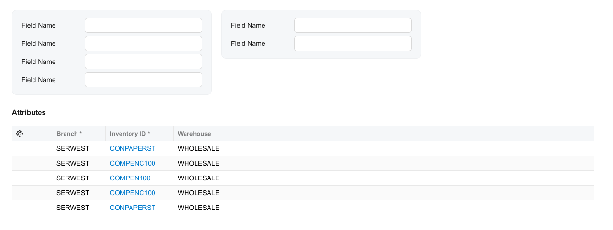

# Caption: Caption of a Fieldset, Table, or a Tab {#_3cc7a353-0808-4909-96d3-53967e0181c1 .concept}

To specify a caption for a fieldset, table, or tab, you use the `caption` attribute of the respective tag. The `caption` attribute is localizable. For details, see [Fieldset](UIDevRef_Fieldset_Mapref.md), [Table \(Grid\)](UIDevRef_Grid_Mapref.md), and [Tab](UIDevRef_Tab_Mapref.md).

The following screenshot shows the **Attributes** caption specified for a table.



The following code example adds a caption to a grid.

```language-xml
<qp-grid id="ordersGrid" 
  view.bind="BlanketOrderChildrenDisplayList" 
  caption="Child Orders">
</qp-grid>
```

**Parent topic:**[Caption](../DeveloperGuide/UIDevRef_Caption_Mapref.md)

