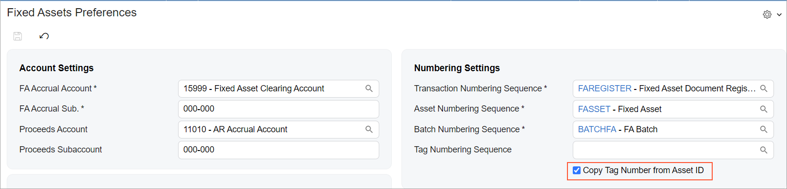
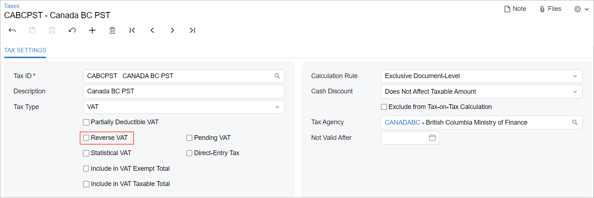
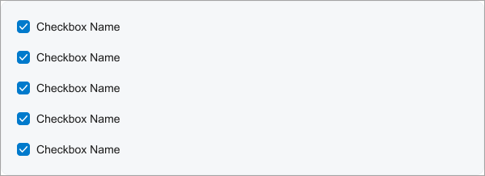
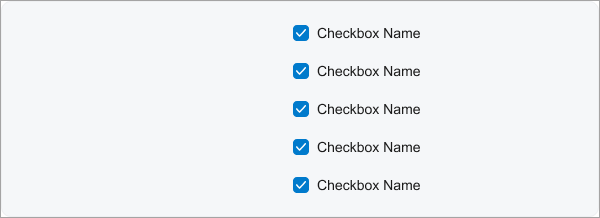
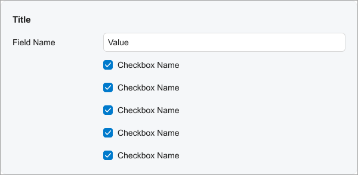
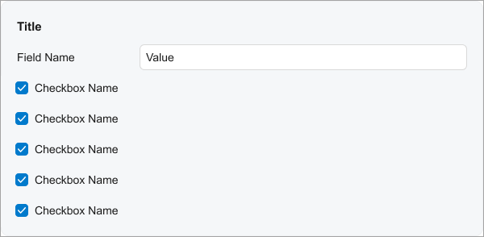

# Check Box: General Information {#_59387045-923e-4156-97c1-b22d87be9415 .concept}

A check box is a control in which a user makes a choice between two mutually exclusive options.

A check box is defined by PXCheckBox in the Classic UI. In the Modern UI, a check box is defined by the field tag \(whose control type is automatically defined as a check box from the backend code\). In rare cases, a check box in the Modern UI is defined explicitly by the [qp-check-box](https://help.acumatica.com/(W(7))/Help?ScreenId=ShowWiki&pageid=f2676e56-7b9a-a6d9-8694-6c0178825f7d) control.

## Learning Objectives { .section}

In this chapter, you will learn the following information about a check box:

-   The design guidelines for a check box, including the naming conventions and layout recommendations
-   The proper configuration of a check box for specific cases, such as when a check box is located next to another element in the same row.
-   A detailed description of each property of a check box

## Applicable Scenarios { .section}

You configure check boxes in the following user scenarios:

-   A user can select multiple items in a list of items, such as selecting items from a list of preferences.
-   A user chooses one option from two possible options, such as enabling or disabling a feature.
-   A user selects a specific criterion to apply to the displayed information to filter or sort data.

## UI Naming Conventions { .section}

The following table shows the UI naming conventions for a check box.

|Naming Convention|Example|
|-----------------|-------|
|For a check box that \(if selected\) enables an action, use a verb or verb phrase that describes this action.|The **Copy Tag Number from Asset ID** check box on the [Fixed Assets Preferences](../UserGuide/FA_10_10_00.md) \(FA101000\) form, which is shown in the following screenshot

|
|For a check box that \(if selected\) gives an entity some property, use a noun or noun phrase.|The **Reverse VAT** check box on the [Taxes](../UserGuide/TX_20_50_00.md) \(TX205000\) form, which is shown in the following screenshot

|

## Recommendations for Organizing the Layout {#section_vv2_1y4_y4b .section}

The following table shows the recommendations for organizing the layout for check boxes.

|Correct|Incorrect|
|-------|---------|
|When a fieldset contains only check boxes, align the check boxes without left padding.To remove the left padding, specify `class="no-label"` in qp-fieldset, as shown below.

```language-xml
<qp-fieldset slot="C" class="no-label" ...>...</qp-fieldset>
```

|
|||
|Keep the default left padding for check boxes in a section if the section contains other controls and has a title.|
|||

**Parent topic:**[Check Box](../DeveloperGuide/UIDevRef_CheckBox_Mapref.md)

