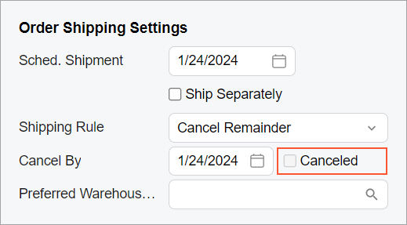
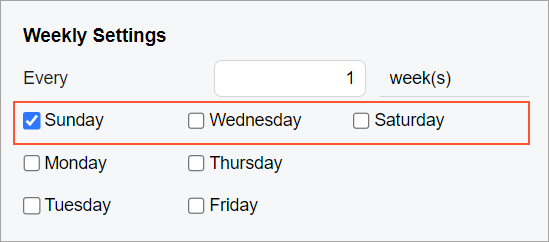

# Check Box: Layout Examples {#_818730a5-318f-4e93-b5bc-f32a325f6935 .concept}

In this topic, you can find examples of configurations of layouts with check boxes.

## Check Box Next to a UI Element { .section}

Suppose that you want to place the **Canceled** check box next to the **Cancel By** box in the same row, as shown in the following screenshot.



You use the following code.

```
<field name="CancelDate">
  <qp-field control-state.bind="CurrentDocument.Cancelled" 
    config-enabled.bind="false"></qp-field>
</field>
```

**Tip:** You do not need to specify `class="no-label"` for the second control to omit the empty label of the check box because `class="no-label"` is used by default for a qp-field tag inside a field tag.

## Multiple Check Boxes in a Row { .section}

Suppose that you need to display three check boxes in a row, as shown in the following screenshot.



The following code implements this layout.

```
<field name="fake01" unbound replace-content>
    <qp-field control-state.bind="StaffScheduleSelected.WeeklyOnSun" 
      config-enabled.bind="false" class="col-4"></qp-field>
    <qp-field control-state.bind="StaffScheduleSelected.WeeklyOnWed" 
      config-enabled.bind="false" class="col-4"></qp-field>
    <qp-field control-state.bind="StaffScheduleSelected.WeeklyOnSat" 
      config-enabled.bind="false" class="col-4"></qp-field>
</field>
```

You do not need to set `class="no-label"` to remove the label before each check box because this class is used by default in this case.

You have distributed the check boxes equally with `class="col-4"`, which means that each check box occupies four \(12 / 3 = 4\) columns out of 12 columns that the replaced field occupies. \(If you need to have four columns and need to distribute them equally, you should use `class="col-3"`.\)

**Parent topic:**[Check Box](../DeveloperGuide/UIDevRef_CheckBox_Mapref.md)

