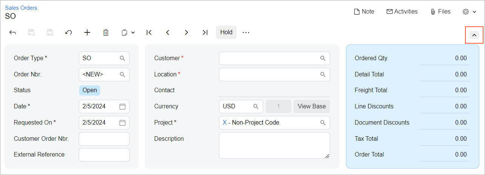
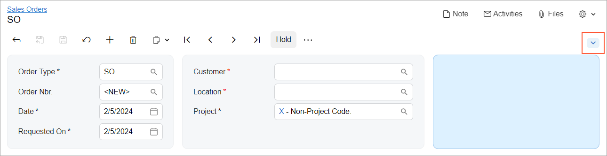
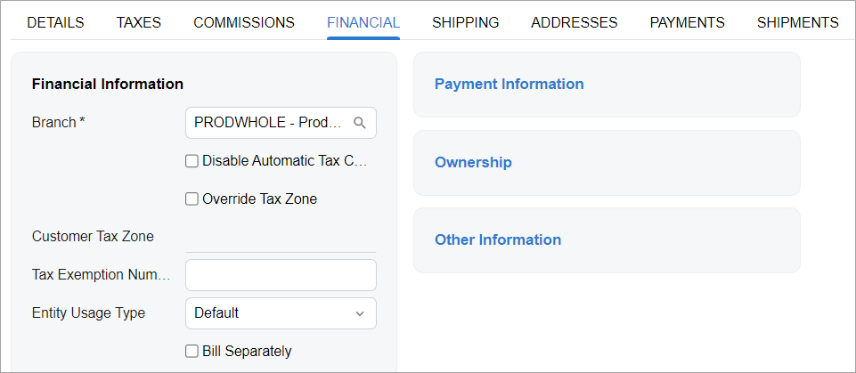
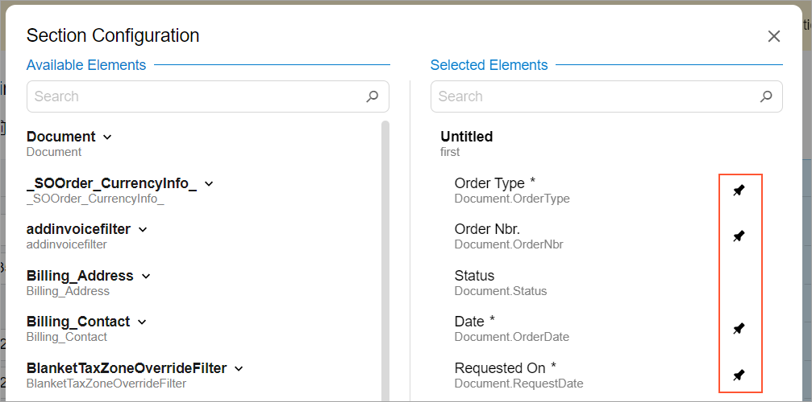

# Collapsible Area: Configuration {#_169f8b6e-c75c-4afa-8ba6-27cc24acaeeb .concept}

You can configure an area on an Acumatica ERP form to be collapsible. You can define either of the following as a collapsible area:

-   A section that corresponds to a container
-   A part of the form that corresponds to a template

When a part of the form is collapsed, only the pinned elements are displayed.

## Configuring a Collapsible Area { .section}

To make an area of an Acumatica ERP form collapsible, you add the qp-collapsible attribute to the tag that defines the area, as shown in the following code example.

```language-xml
<qp-template name="7-10-7" id="document_form" 
  qp-collapsible class="equal-height">
</qp-template>
```

If the form has any collapsible areas, the arrow button is displayed at the top right corner of the form, as shown in the following screenshot.



When a user clicks the button, all containers with the qp-collapsible attribute are collapsed; only the pinned elements are displayed.

Sections with no pinned elements in the Summary or Selection area are displayed but empty \(that is, they contain no elements\), and their height is adjusted to the height of the other sections, as shown in the following screenshot. If the section has a title, the title is displayed.



If the section is displayed on a tab and it has no pinned elements, only the title of the section is displayed without the space normally used by its elements, as shown with the sections on the right side of the form in the following screenshot.



## Defining Pinned Elements { .section}

By default, all required elements—that is, the elements that correspond to the fields with the `[PXUIFields(Required = true)]` attribute in the DAC—are pinned. A user can specify which elements are pinned in the **Section Configuration** dialog box, as shown in the following screenshot.



You can configure other elements to be pinned by default. To pin an element that corresponds to a field from code, you use the pinned attribute of the field tag, as shown in the following example.

```language-xml
<field name="OrderQty" pinned></field>
<field name="CuryDetailExtPriceTotal" pinned="true"></field>
```

To unpin an element that corresponds to a field, you specify pinned="false", as shown in the following code.

```language-xml
<field name="OrderDate" pinned="false"></field>
```

**Parent topic:**[Collapsible Area](../DeveloperGuide/UIDevRef_CollapsibleArea_Mapref.md)

