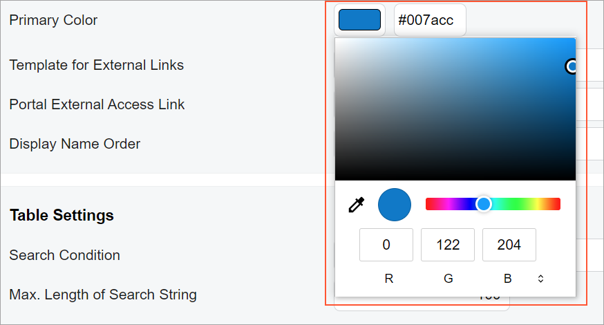

# Color Picker: General Information {#_d5b49b9a-9156-41fb-885a-a05cffe3c92d .concept}

A color picker is a group of controls and the Color Picker dialog box, which give a user the ability to select a color.

The following screenshot shows an example of this control.



In the Classic UI, the color picker control is defined by the PXTextEdit tag with the `TextMode="Color"` attribute. In the Modern UI, the color picker control is defined by the [qp-color-picker](https://help.acumatica.com/(W(7))/Help?ScreenId=ShowWiki&pageid=55169129-3026-82e4-72f0-836822366439) tag.

## Learning Objectives { .section}

In this chapter, you will learn the following about the color picker:

-   The design guidelines for the color picker control
-   The proper configuration of the color picker control

## Applicable Scenarios { .section}

You configure the color picker control when you want a user select an arbitrary color from a dialog box.

## Design Guidelines { .section}

A color picker is implemented as a `field` tag with a `control-type="qp-color-picker"` attribute, as shown in the following code.

```
<field name="PrimaryColor" control-type="qp-color-picker"></field>
```

The default value of the color picker is specified in the backend code.

**Note:** You do not need to specify `control-type="qp-color-picker"` for fields that have the `PXColorState` state, such as the fields that have `PXColorListAttribute` specified on the DAC field.

**Parent topic:**[Color Picker](../DeveloperGuide/UIDevRef_ColorPicker_Mapref.md)

