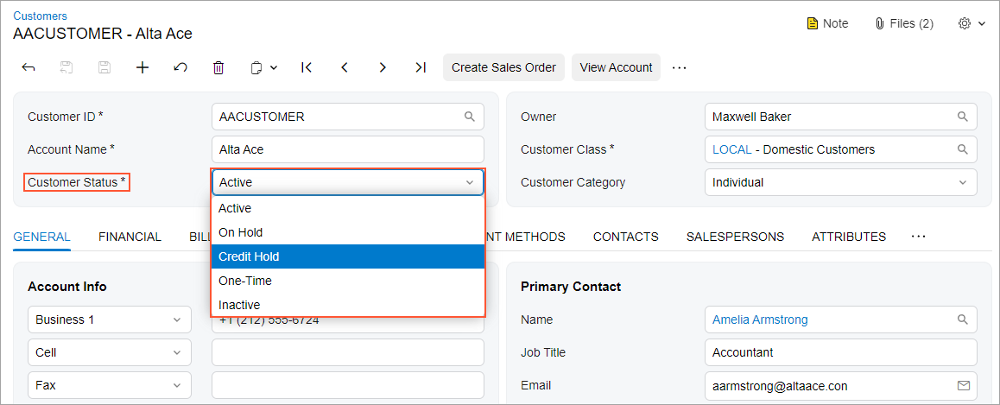
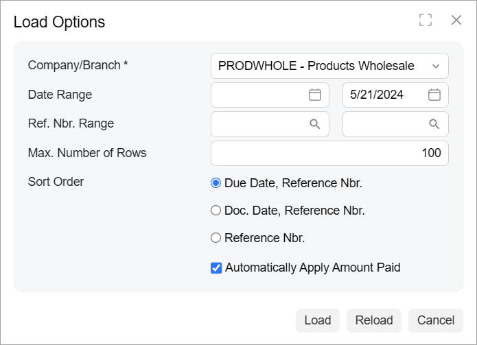
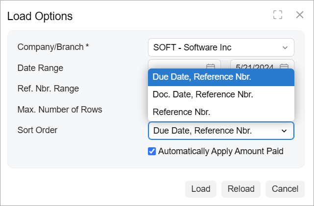

# Combo Box: General Information {#_329fc5a5-333f-491d-be66-a89cf95b1046 .concept}

A combo box is a drop-down control that combines a text box with a list of options. It can consist of any number of values that a user can select. You can configure a combo box so that the user can select more than one value.

A combo box is defined by PXDropDown in the Classic UI. In the Modern UI, a combo box is defined by the field tag, whose control type is automatically defined as a combo box from the backend code. In rare cases, a combo box in the Modern UI is defined explicitly by the [qp-drop-down](https://help.acumatica.com/(W(7))/Help?ScreenId=ShowWiki&pageid=bc0d2a73-9cf0-0913-7740-927613f91b48) control.

## Learning Objectives { .section}

In this chapter, you will learn the following about a combo box:

-   The design guidelines for a combo box, including the naming conventions
-   The details of each property of a combo box

## Applicable Scenarios { .section}

You configure combo boxes in the following user scenarios:

-   A user needs to select a single item or multiple items from a finite list of items, such as selecting items from a list of preferences.
-   A user needs to selects a specific criterion from a predefined list of options to apply a filter or sort data.

## UI Naming Convention { .section}

The following table shows the UI naming convention for a combo box.

|Naming Convention|Example|
|-----------------|-------|
|Use a noun or a noun phrase to describe the contents of a combo box. Preferably, combo box names should consist of one or two words.|The **Customer Status** combo box on the [Customers](../UserGuide/AR_30_30_00.md) \(AR303000\) form, which is shown in the following screenshot.

|

## Recommendations for Organizing the Layout {#section_vv2_1y4_y4b .section}

The following table shows the recommendations for organizing the layout for combo boxes.

|Correct|Incorrect|
|-------|---------|
|If the area where you are going to place the control has enough space, the control is used often \(such as in a wizard or a dialog box\), and the list of options contains no more than five options, we recommend that you use radio buttons instead of a combo box to avoid a user spending extra time on opening the options list in the combo box, scanning the list, and selecting an option.|
|||

**Parent topic:**[Combo Box](../DeveloperGuide/UIDevRef_ComboBox_Mapref.md)

