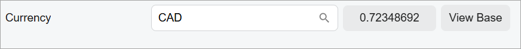
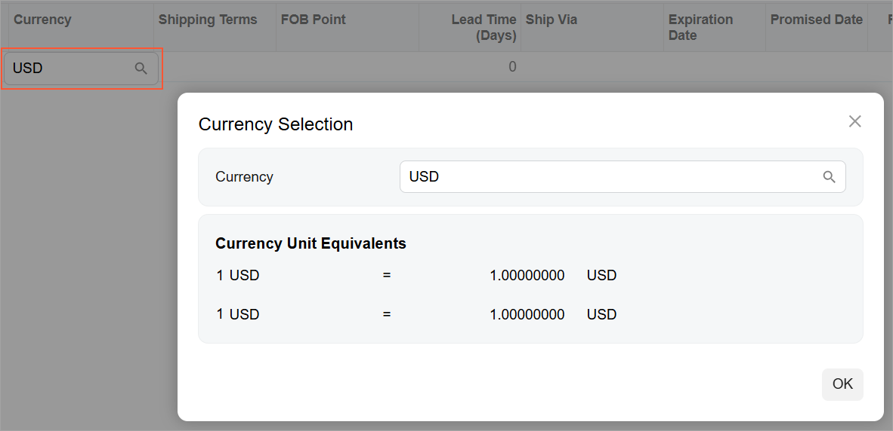

# Currency: Configuration of the Currency Control {#_24695e78-0148-4d80-b2aa-67871aea21b5 .concept}

To configure a currency control, you need to do the following:

-   Map a view for the control in TypeScipt.
-   Add a field for the control in HTML or TypeScript.

    The way you add the control depends on whether it is located in a form view, or a table. See [Defining a Currency Control in the Form View](#_58d43c40-0eed-4f44-b091-4613c17ca714) and [Defining the Currency Control in a Table](#_0dc3d742-bd8e-4911-b2fc-d9a1e97c5d0b).

-   Configure the type of the control and specify the view for it.

## Defining the View { .section}

Suppose that the view for a currency control is defined in the graph as follows.

```
public PXSelect<CurrencyInfo, Where<CurrencyInfo.curyInfoID, 
  Equal<Current<SOOrder.curyInfoID>>>> currencyinfo;
```

To define the view for the currency control in TypeScript, do the following:

1.  Define a view class that implements the ICurrencyInfo interface, as shown in the following code.

    ```
    export class CurrencyInfo extends PXView implements ICurrencyInfo {
    	CuryInfoID: PXFieldState;
    	BaseCuryID: PXFieldState;
    	BaseCalc: PXFieldState;
    	CuryID: PXFieldState<PXFieldOptions.CommitChanges>;
    	DisplayCuryID: PXFieldState;
    	CuryRateTypeID: PXFieldState<PXFieldOptions.CommitChanges>;
    	BasePrecision: PXFieldState;
    	CuryRate: PXFieldState<PXFieldOptions.CommitChanges>;
    	CuryEffDate: PXFieldState<PXFieldOptions.CommitChanges>;
    	RecipRate: PXFieldState<PXFieldOptions.CommitChanges>;
    	SampleCuryRate: PXFieldState<PXFieldOptions.CommitChanges>;
    	SampleRecipRate: PXFieldState<PXFieldOptions.CommitChanges>;
    }
    
    ```

2.  Create the instance of the view in the screen class, as shown in the following code.

    ```
    export class SO301000 extends PXScreen {
      @viewInfo({ containerName: "Process Order" })
      _SOOrder_CurrencyInfo_ = createSingle(CurrencyInfo);
    }
    ```


## Defining a Currency Control in the Form View {#_58d43c40-0eed-4f44-b091-4613c17ca714 .section}

Suppose that you need to define a currency control in the form view, and it should look as shown in the following screenshot.



To add a currency control to a form, you use the `field` tag inside a fieldset in the HTML template. In the field tag, you need to specify the following parameters:

-   The type of the control: qp-currency
-   The view that defines the currency data, which you defined in TypeScript

The following code shows implementation of the currency control in the screenshot above.

```
<field name="CuryID" 
  control-type="qp-currency" 
  view.bind="_SOOrder_CurrencyInfo_">
</field>
```

## Defining the Currency Control in a Table {#_0dc3d742-bd8e-4911-b2fc-d9a1e97c5d0b .section}

Suppose that you need to define a currency control in a table—that is, a **Currency** column with a currency selector, as shown in the following screenshot.



To add a currency control in a table column, you use the columnConfig decorator in TypeScript, where you need to specify the following parameters:

-   The type of the control: qp-currency-selector.

    For this purpose, you need to use the editorType property: editorType: "qp-currency-selector".

-   The view that defines the currency data, which you defined in TypeScript.

    For this purpose, you need to use the viewName property of the editorConfig property.


The following code shows the implementation of the currency control in the screenshot above.

```
@columnConfig({
  editorType: "qp-currency-selector",
  hideViewLink: true,
  editorConfig: {
    viewName "_RQRequisition_CurrencyInfo_"
  },
})
CuryID: PXFieldState<PXFieldOptions.CommitChanges>;
```

**Parent topic:**[Currency](../DeveloperGuide/UIDevRef_Currency_Mapref.md)

