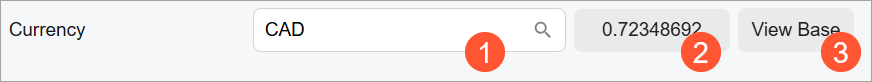
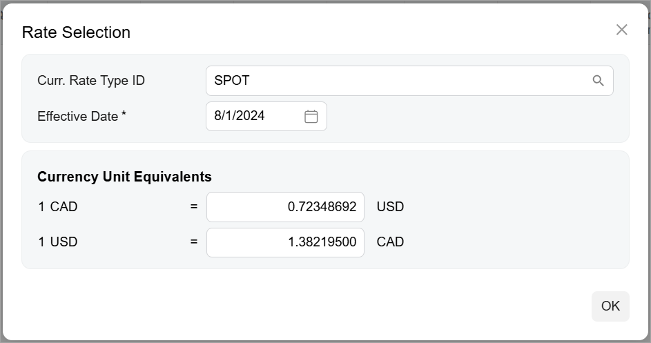
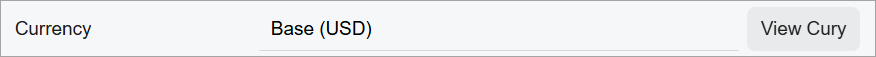

# Currency: General Information {#_743c13b8-23b5-4241-9cf2-552e9869fb7d .concept}

You use a currency control to display a currency on an Acumatica ERP form. This control provides advanced capabilities: Users can select a currency, view and select an exchange rate, and toggle between the foreign and base currencies.

In Classic UI a curremcy control is defined by PXCurrencyRate. In the Modern UI, a currency control appears and is used slightly differently on where it is defined on an Acumatica ERP form: as an advanced lookup box in a qp-template control or in a column of a table. You define a currency control by using the following controls in the Modern UI:

-   qp-currency for the lookup box
-   qp-currency-selector for the table column

## Learning Objectives { .section}

In this chapter, you will learn the following:

-   The design guidelines for the currency control, including the naming conventions and layout recommendations
-   The proper configuration of the currency control

## Applicable Scenarios { .section}

You configure the currency control in the following cases:

-   Users need to specify a currency and a currency rate in a qp-templatecontrol.
-   Users need to specify a currency in a table column.

## Currency Control for the Lookup Box { .section}

As a looup box, a currency control has two modes:

-   The foreign currency mode, which displays the foreign currency:

    The foreign currency mode is shown by default.

-   The base currency mode

These views are described and shown below.

**Foreign Currency Mode**

The foreign currency mode displays the following:

-   A currency selector \(see Item 1 in the example in the following screenshot\).

    When a user clicks the magnifier button of the currency selector, they can select a currency that has been defined on the Currencies \(CM202000\) form.

-   An exchange rate between the selected foreign currency and the base currency \(Item 2\).
-   The **View Base** button \(Item 3\), which a user can click to switch between the base currency and the current currency.



When a user clicks the exchange rate box \(Item 2\), the system opens the **Rate Selection** dialog box \(see the following screenshot\), where a user can configure the currency rate. The user selects the ID of the currency rate type and the date when the rate becomes effective. In the **Currency Unit Equivalents** section, the user can see the exchange rates between the selected foreign currency and the base currency.



**Base Currency Mode**

The base currency mode is displayed when a user clicks **View Base** in the currency control. The base currency mode displays the following:

-   The base currency.
-   The **View Cury** button.

    By clicking the **View Cury** button, the user can switch to the default mode of the control \(with **View Base** displayed\).




## Currency Control for the Table Column { .section}

A currency control in a table column is represented by a currency selector. When a user clicks the magnifier button, the **Currency Selection** dialog box is opened, as shown in the following screenshot. The user selects a currency and then the system displays the currency unit equivalencies. That is, it shows the exchange rates between the selected foreign currency and the base currency.


## Currency ID { .section}

An ID of a currency control in HTML consists of two parts: the `cury` prefix and the semantic name. The semantic name describes the purpose of the element. For example, a control that specifies the vendor currency may have the `curyVendorCurrency` ID, as the following code shows.

```
<qp-currency id="curyVendorCurrency"></qp-currency>
```

## UI Naming Convention { .section}

The following table shows the UI naming conventions for the currency.

|Naming Convention|Example|
|-----------------|-------|
|Use a noun or a noun phrase to describe the UI name of the currency box. Preferably, currency box names should consist of one or two words.|The **Currency** box on the [Sales Orders](../UserGuide/SO_30_10_00.md) \(SO301000\) form, which is shown in the following screenshot.

|

**Parent topic:**[Currency](../DeveloperGuide/UIDevRef_Currency_Mapref.md)

