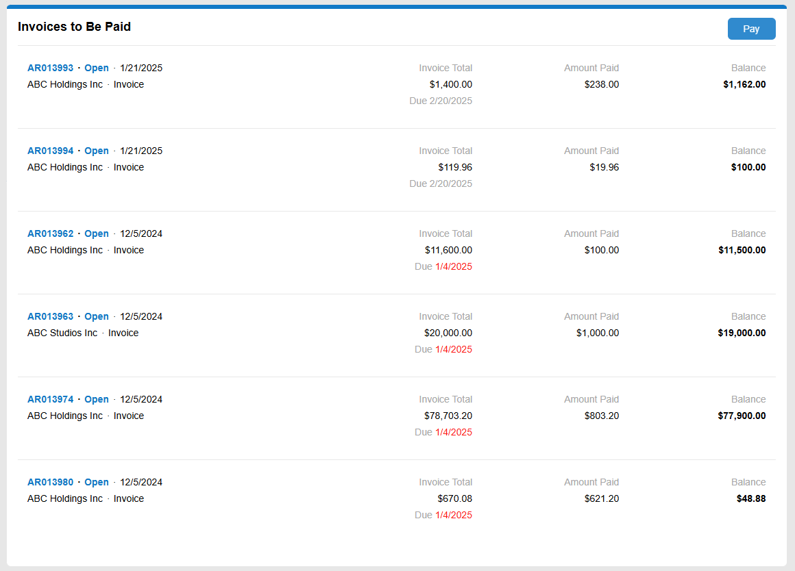

# Data Feed: Configuration of Bottom Toolbar {#_0c23cf00-3687-4a75-b5bf-d0d65feebc95 .concept}

You can configure the layout of a data feed's bottom toolbar in the footer tag inside the qp-data-feed tag.

The following example shows the definition of a bottom toolbar that shows either the **More Records** button or a text message. Each variant of the toolbar is defined in a div tag and is displayed based on the condition specified in the if.bind property.

```
<qp-data-feed ... >
  ...
  <footer>
    <div **if.bind="controller.hasNextPage"** class="ou-item ou-item--footer">
      <div
        id.bind="id & attr"
        class="ou-item__show-more"
        click.delegate="controller.appendPage()"
      >More Records</div>
    </div>
    <div **if.bind="controller.isEmpty"** class="ou-item ou-item--footer">
      <div class="ou-item__content">
        <div class="ou-item__no_records ou-item--disabled">No records found</div>
      </div>
    </div>
  </footer>
</qp-data-feed>
```

## Configuring a Fixed Number of Tiles {#section_qgb_kkc_xgc .section}

You can configure a data feed to display a fixed number of tiles, even if the view may contain more records, as shown below.

The footer of the data feed control is not displayed in this case, and scrolling within the control isn’t available.



To configure a data feed control that displays no more than a predefined number of records:

1.  Specify the number of records in the page-size property of the qp-data-feed control.
2.  Add an empty footer at the end of the `qp-data-feed` tag.

``` {#codeblock_kb3_skc_xgc}
<qp-data-feed id="dfOpenInvoices" class="..." view.bind="OpenInvoices" 
  **page-size.bind="7"**>
    <template width="100%">
		...
    </template>
    **&lt;footer&gt;&lt;/footer&gt;**
</qp-data-feed>
```

**Parent topic:**[Data Feed](../DeveloperGuide/UIDevRef_DataFeed_Mapref.md)

