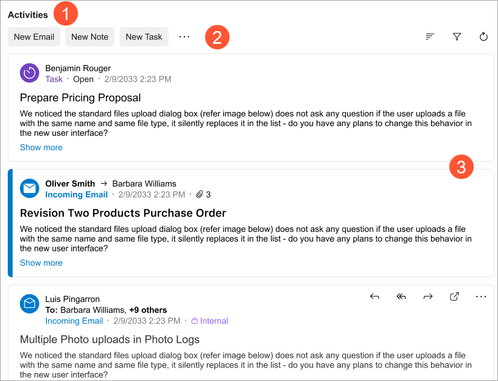
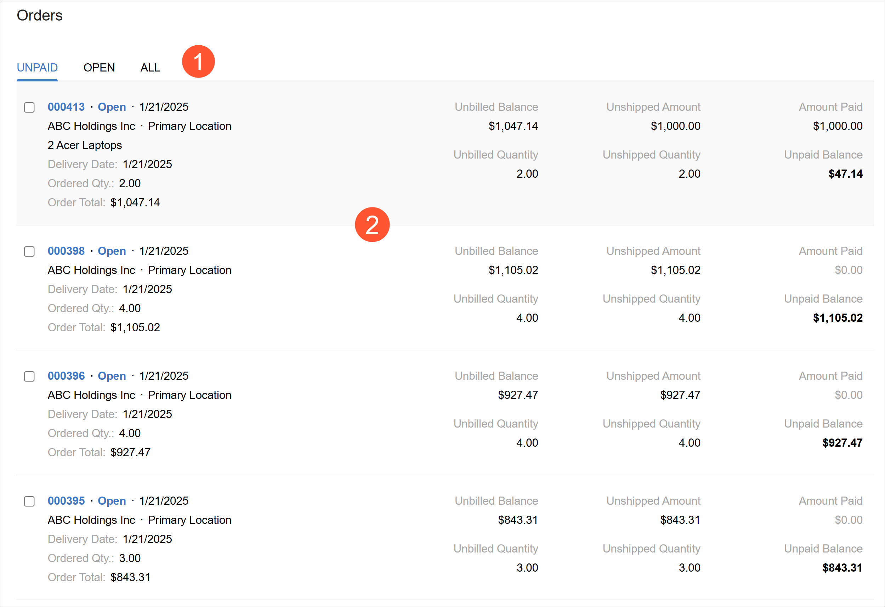

# Data Feed: General Information {#_2fcaa224-1ac2-47d3-a676-11254437fe3f .concept}

In this topic, you’ll learn what a data feed control is and what its basic components are.

## Learning Objectives { .section}

In this chapter, you’ll learn the following about the data feed control:

-   Its design guidelines, including naming conventions and layout recommendations
-   The proper configuration of the control for specific cases, such as defining templates of the control

## Applicable Scenarios { .section}

You configure the data feed control when you want to display a list of entities, such as activities or tasks, where each item in the list contains a short summary of the entity.

## Overview of the Data Feed Control { .section}

A data feed control lets users view multiple entities of different types and apply actions to these entities. The control offers flexibility in displaying, filtering, and organizing entities through configuration in both HTML and TypeScript. For example, you can configure a data feed control to show each entity on a separate tile and group entities by one of their properties.

The following example shows a data feed control configured to display activities of different types.



The data feed control includes the following components:

-   A title \(Item 1 above\).
-   The top toolbar, also called a header \(Item 2\).

    For information about configuring toolbar buttons, see [Data Feed: Configuration of Toolbar Buttons](UIDevRef_DataFeed_Actions.md).

-   Tiles \(Item 3\).

    A *tile* is a container that displays any valid HTML. This HTML can contain information about a record, custom text, or values from multiple records that describe an entity. You can use predefined templates to organize content on a tile. For details, see [Data Feed: Configuration of Tiles](UIDevRef_DataFeed_Templates.md).

-   The bottom toolbar \(footer\).

    Typically, the data feed control is configured to use infinite scroll, so the bottom toolbar isn’t displayed.

    For information about configuring the bottom toolbar, see [Data Feed: Configuration of Bottom Toolbar](UIDevRef_DataFeed_Footer.md).


You can group entities in the data feed control based on a condition—for example, the entity’s status. For each group, you can configure an HTML template that specifies which properties of the entity and which commands are displayed on the tile. The following example shows such a data feed where tiles are grouped by the status of an entity.



Each container includes of the following components:

-   A group title \(Item 1 above\)
-   An optional menu with the available commands for the entities
-   The list of entities of the container type \(Item 2\)
-   An optional bottom toolbar of the tile

For information on configuring tiles, see [Data Feed: Configuration of Tiles](UIDevRef_DataFeed_Templates.md).

The data feed control is implemented with the [qp-data-feed](https://help.acumatica.com/Help?ScreenId=ShowWiki&pageid=6bf8e4aa-120b-dd25-f692-b1133f232b07) control in the Modern UI. The control does not have an analogue in the Classic UI.

## Defining the Data Feed Control { .section}

The implementation of the data feed control is based on a table \(grid\). So to define a data feed control in TypeScript, you use the same approach as you use to define a table: Define a view class with the table’s columns and actions, and specify the table properties in the gridConfig decorator. In HTML, you add the data feed control by using the qp-data-feed tag. For information on configuring the table in TypeScript, see [Table \(Grid\): Configuration of the Table and Its Columns](UIDevRef_Grid_Configuration.md).

**Important:** The data feed is bound to a particular view—a collection of records in the context of a screen—initialized by the createCollection method. But in the context of a tile \(the template tag inside the data feed control\), the view is treated as a single record, as if the createSingle method was used to initialize it.

To define the data feed control:

1.  In TypeScript, define the view whose records should be displayed in the data feed.
2.  If necessary, map the actions for the data feed control.
3.  Initialize the view by using the createCollection method.
4.  In HTML, add the qp-data-feed tag.
5.  In the qp-data-feed tag, specify the needed properties of the control, including the following:
    -   The view whose records should be displayed in the control
    -   The view model
6.  Optional: To add buttons to the toolbar of the data feed control, add the toolbar tag in the qp-data-feed tag and specify the corresponding actions in the action tag. For details, see [Data Feed: Configuration of Toolbar Buttons](UIDevRef_DataFeed_Actions.md).
7.  For each entity type, define the template for the tile. For details, see [Data Feed: Configuration of Tiles](UIDevRef_DataFeed_Templates.md).
8.  Optional: To define a bottom toolbar, add the footer tag in the qp-data-feed tag and specify the toolbar layout in it. For details, see [Data Feed: Configuration of Bottom Toolbar](UIDevRef_DataFeed_Footer.md).
9.  Configure the message displayed in an empty data feed: In the qp-data-feed tag, specify the message in the placeholderTemplate property.

## Data Feed ID { .section}

The data feed control is based on a table control and was represented by a table in the Classic UI. That’s why the data feed control’s ID should have the same structure and consist of:

-   The `grid` prefix.

-   The semantic name, which describes the control's purpose. For example, a table that shows transactions can have the `gridActivities` ID, as the following code shows.

    ``` {#codeblock_b3p_x2v_ghc}
    <qp-data-feed caption="Activities" id="gridActivities">
    ```


The controls inside a qp-data-feed control must have unique IDs. To ensure this, you specify IDs for all nested elements with the `$index` suffix, as shown in the following example.

``` {#codeblock_jl2_b4k_xgc}
<qp-data-feed id="MyDataFeed" ... >
    <template>
        <qp-template id="template_${$index}" name="record-1">
             <qp-fieldset id="fieldset_${$index}" slot="A1" 
                   view.bind="LinkedFilesByEntity">
                   <field name="LinkedDocumentType""></field>
             </qp-fieldset>
         </qp-template>
         ...
    </template>
</qp-data-feed>
```

You don’t need to specify IDs for fields inside a nested fieldset of `qp-template`. Their IDs are automatically appended with indexing suffixes as long as the fieldset is nested inside the `<qp-data-feed>` tag.

**Parent topic:**[Data Feed](../DeveloperGuide/UIDevRef_DataFeed_Mapref.md)

