# Data Feed: Configuration of Tiles {#_430819af-c1ab-497c-8bba-a0327e6f7620 .concept}

You can define each tile’s layout and the list of properties displayed on it. You define tiles inside the template tag of the qp-data-feed tag.

To define the type of tile, you need to specify a condition in the if.bind property. For example, to define a tile for entities of the `Email` class, specify `<template if.bind="Activities.ClassID.cellText == 'Email'">...</template>`. If no condition is specified, the template tag defines tiles for all other entity types.

The following example shows definition of a tile.

``` {#codeblock_cdw_kt2_whc}
<template width="100%">
  <div class="activity-card">
    <template if.bind="Activities.ClassID.cellText == 'Email'">
      <div style="background-color:${Activities.Color.cellText};">${Activities.OwnerID.cellText}
          </div>
      <div>${Activities.ClassInfo.cellText} &middot; ${Activities.StartDate.cellText} &middot; 
          ${Activities.Location.cellText}</div>
      <div>${Activities.Subject.cellText}</div>
      <qp-rich-text-editor state.bind="Activities.Body" 
        config.bind="{readOnly: true, expandToContent: true, expandToContentMinHeight: 1}">
      </qp-rich-text-editor>
    </template>
  </div>
</template>
```

## Overview of Tile Templates {#section_jzy_vbv_wgc .section}

Acumatica ERP provides several predefined templates that you can use to organize data on a tile. The name of a tile template always starts with record-.

**Note:** You can use templates that start with record- not only in a data feed but anywhere on Acumatica ERP forms for formatting content.

Each template has the following types of slots:

-   A prefix slot
-   A number of columns with *primary* slots. A tile can have up to four columns with slots which are indicated by letters from A to D.
-   A postfix slot

The following diagram shows the basic structure of the template.

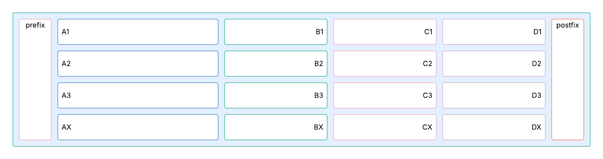

Every column can contain from one to four slots:

-   Each slot’s name consists of the combination of the letter which indicates a column and the row number—for example, *A1* for the first slot in column A is *A1*, and the second slot in column C is *C2*.
-   Slots with numbers *1* to *3* \(such as *A1, A2,* and *A3*\) can display values separated by a gray dot.
-   Each column also has the *X* slot \(for example, *AX* or *BX*\), where all values are placed one below the other.
-   You can combine slots \(*A1* and *A2*\) and the *X* slot \(for example, *A1* and *AX*\), or just one type of slots.

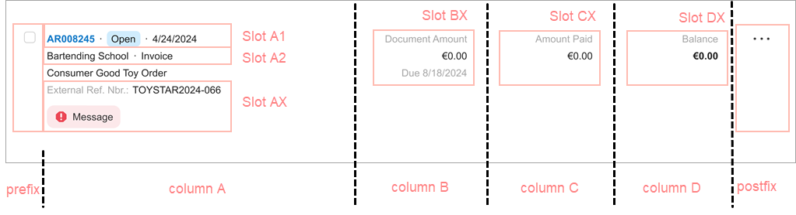

**Labels on tiles**: On numbered slots \(*A1*–*A3*\), labels are not displayed. On *X* slots, labels are displayed by default.

**Text alignment**: By default, text is left-aligned in *AX* slots and right-aligned in *BX*, *CX*, and *DX* slots. All number values without labels \(*A1*–*A3*\) are left-aligned. To right-align text in a slot, use the *fieldset--left* CSS class.

**Text formatting**: By default, text on tiles gets the same formatting as in a regular fieldset. For example, status fields are highlighted with connotation colors and links appear in blue. For formatting, you can also use such CSS classes as *fieldset--text*, *fieldset--long-text*, *fieldset--header*, *fieldset--secondary*, and *fieldset--bold*.

## Predefined Templates {#section_mlk_3jw_ghc .section}

For the predefined templates, the number of primary slots is indicated in the template name. For example, record-1-1 and record 1-2 both contain two slots \(in addition to the prefix and postfix\). The digit in the template name indicates the relative width of each slot for a full-width screen. That means that the second slot in record-1-2 is wider than the second slot in record-1-1.

**Important:** The following templates describe the default position of slots for a full-width screen. When the screen width changes, the width of primary slots automatically changes as well. The slots may even be visually merged.

The following table lists the predefined templates, along with examples and descriptions.

|Name|Example|Description|
|----|-------|-----------|
|record-1|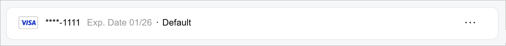

 A tile with multiple fields in the *A1* slot and a menu in the postfix slot

|The template contains one primary slot.|
|record-1-1|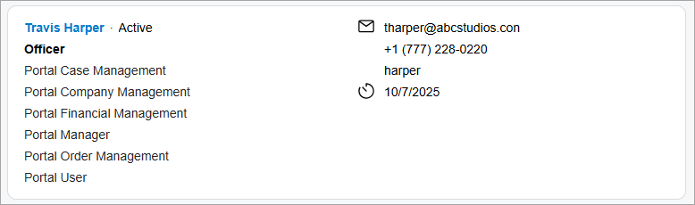

 A tile with multiple fields in the *A1*, *AX*, and *BX* slots

|The template contains two primary slots of equal width.|
|record-1-2|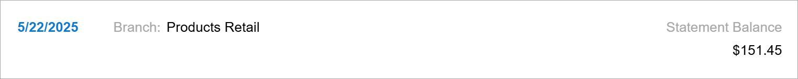

 A tile with a prefix and fields in the *AX* and *BX* slots

|The template contains two primary slots; the second primary slot is wider than the first one.|
|record-1-2-compact| |The template contains two primary slots; the second primary slot is wider than the first one. This template is intended for narrow spaces \(for example, when the data feed occupies one-third of the screen\).|
|record-1-1-1| |The template contains three primary slots of equal width.|
|record-1-1-1-compact| |The template also contains three primary slots of equal width but is intended for narrow spaces \(for example, when a data feed occupies one-third of the screen\).|
|record-3-2-2-2|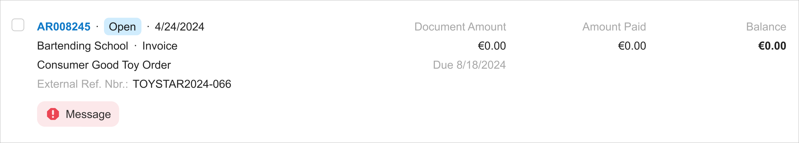|The template contains four primary slots. The first primary slot is wider than the others.|

The following code shows the use of the record-1-2 template that results in the screenshot in the table above.

``` {#codeblock_zks_rvw_wgc}
<template width="100%">
	<div class="sp-documents-document no-animation">
		<qp-template id="dfCase" wg-container name="record-1-2">
			<qp-fieldset slot="Prefix" id="fsCasePrefix" view.bind="{{$viewName}}"
				class="record-item__prefix--date">
				<field name="StatementDateText" class="field--bold"></field>
			</qp-fieldset>
			<qp-fieldset slot="AX" id="fsCaseA" view.bind="{{$viewName}}"
				class="fieldset--condensed-sm fieldset--condensed-md fieldset--condensed-lg">
				<field name="AcctName"></field>
			</qp-fieldset>
			<qp-fieldset slot="BX" id="fsCaseB" view.bind="{{$viewName}}"
				class="fieldset--label-above-sm">
				<field name="CuryEndBalance_Text"></field>
				<field name="EndBalance_Text"></field>
			</qp-fieldset>
		</qp-template>
	</div>
</template>
```

## CSS Classes for the record- Templates {#section_yqd_5zb_xgc .section}

The following table shows CSS classes that you can use to format content inside the record-templates. These classes cannot be used outside those templates.

|Class Name|Example|Description|
|----------|-------|-----------|
|*feed-vertical-divider*|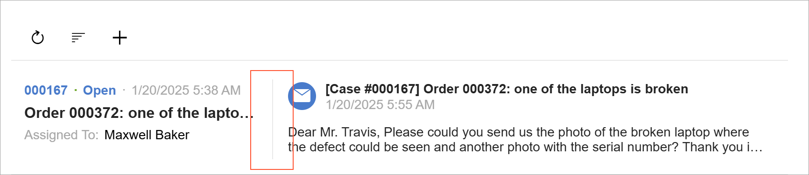|Displays a vertical line before the template.

 The class must be specified in a tag higher in the hierarchy than qp-template.

 ``` {#codeblock_tbd_wdc_xgc}
<div class="feed-vertical-divider">
  <qp-template id="dfCase" name="record-1-2"></qp-template>
</div>
```

|
|*field--header*|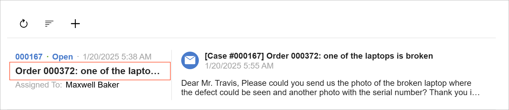|Intended for a header of the tile.

 The class should be applied to the field tag or, if replace-content is used, in nested tags.

|
|*field--text*|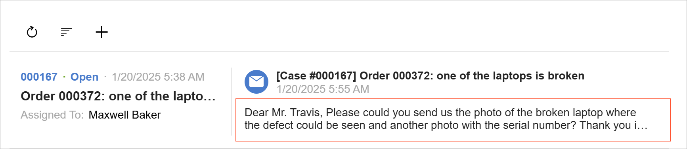|Intended for plain text inside the template. Depending on the container size, the text may be limited to two, three, or four lines.

 The class should be applied to the field tag or, if replace-content is used, in nested tags.

|
|*field--long-text*|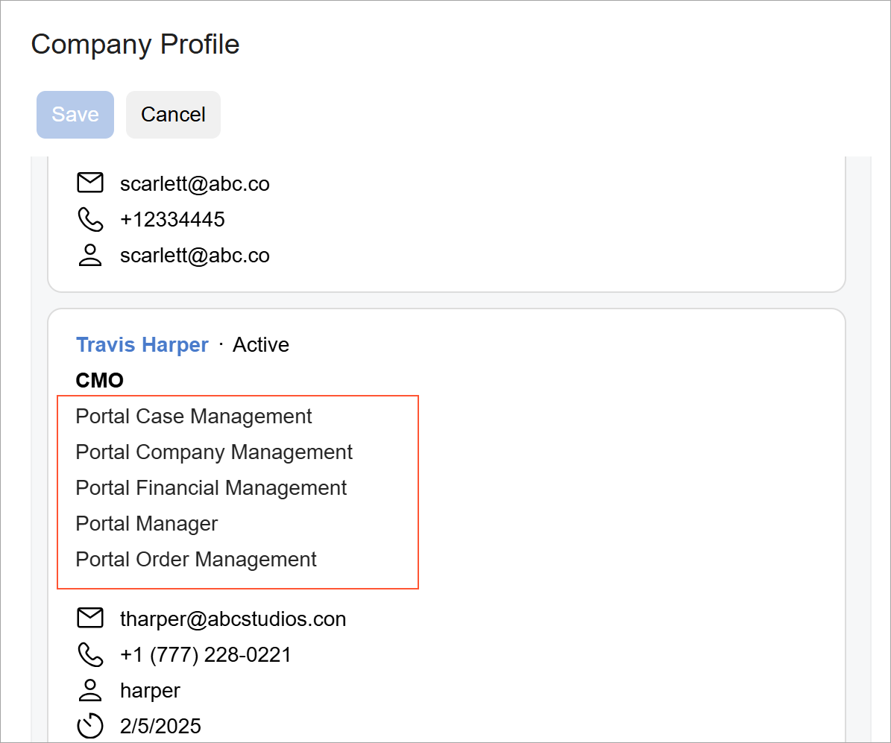|Formats plain text that should occupy multiple lines.The class should be applied to the `field` tag or, if `replace-content` is used, in nested tags.

|
|*field--left*| |Left-aligns the label text when the label is displayed above the value \(see [Displaying of Labels and Values](#section_ard_dcc_xgc)\).

 The class should be applied to the `field` tag or, in case `replace-content` is used, in nested tags.

|
|*field--bold*|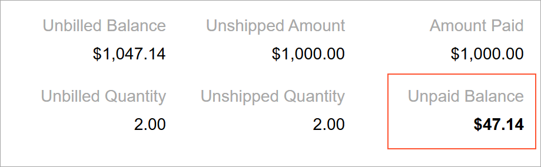|Makes text bold.The class is applied to the `field` tag or, in case `replace-content` is used, in nested tags.

|
|*fieldset--condensed-*-   *fieldset--condensed-xs*
-   *fieldset--condensed-sm*
-   *fieldset--condensed-md*
-   *fieldset--condensed-lg*

| |Displays labels and values in the condensed mode \(see [Displaying of Labels and Values](#section_ard_dcc_xgc)\).If condensed mode is needed only for particular size of screen, specify the suffix. For example, if the field should be displayed in condensed mode only for *SM* and *XS* screens, specify `class="fieldset--condensed-xs fieldset–condensed-sm"`.

The class is applied to the qp-fieldset tag.

|
|*record-item-compound*| |Allows you to use multiple templates in a single div tag. By using this CSS class, you can define templates for different entities.``` {#codeblock_bh3_qbc_xgc}
<qp-data-feed id="fileListFeedByTag"
 view.bind="LinkedFilesByTag"
 class="no-toolbar sp-invoices-feed compact-feed">
 <template width="100%">
   <div
   class="record-item-compound ..."
   >
     <div class="col-lg-4">
        <qp-template id="fileFormByTag1" name="record-1">
         ...
        </qp-template>
     </div>

     <div class="col-lg-4">
       <qp-template id="fileFormByTag2" name="record-1">
         ...
       </qp-template>
     </div>

     <div class="col-lg-4">
       <qp-template id="fileFormByTag3" name="record-1">
         ...
       </qp-template>
     </div>
   </div>
 </template>
</qp-data-feed>
```

|

## Displaying of Labels and Values {#section_ard_dcc_xgc .section}

The following table describes how field labels and values can be displayed on a tile.

|Notation and Description|Example|
|------------------------|-------|
|**Compressed**: The label and value are displayed in one line, separated with a single space.This notation is applied to fieldsets of the *SM* or *XS* size.

|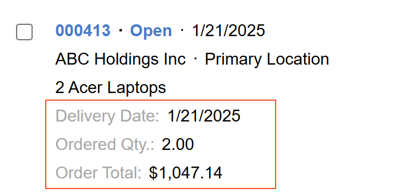|
|**Dot notation**: The label and value are displayed in one line, separated with dots. This notation is used when the tile is displayed on a smaller screen.|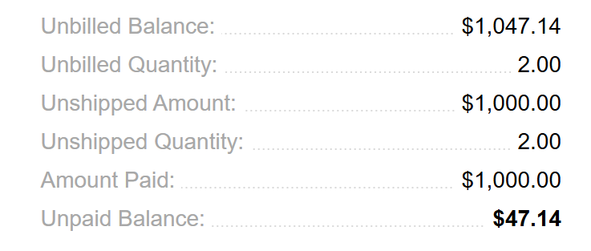|
|**With the label above the value**: The label without a colon is displayed above the value.

 This notation is applied to fieldsets of the *MD* or *LG* size.

 By default, the labels in the left column are left-aligned, and the labels in the rest of the columns are right-aligned.

 To left-align the label text, use the `field-left` class.

|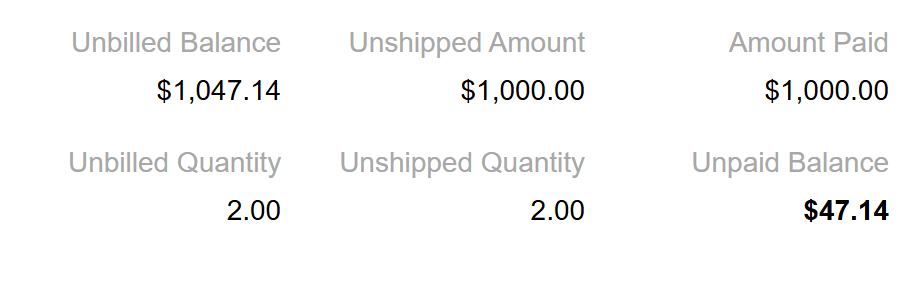|

## Recommendations for Organizing the Layout {#section_vv2_1y4_y4b .section}

The following table shows layout recommendations for a data feed.

|Correct|Incorrect|
|-------|---------|
|Use slots *B*, *C*, or *D* for fields with vertical alignment \(values under their labels\) and show them on the right side of the card.Don't show compressed fields on the right side and fields with labels above values on the left side.

|
|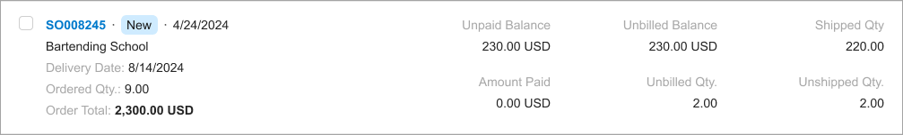|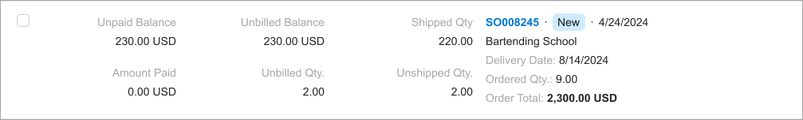|
|Use compressed fields in slots *B*, *C*, and *D*.Don't mix fields with labels above values and compressed fields.

|
||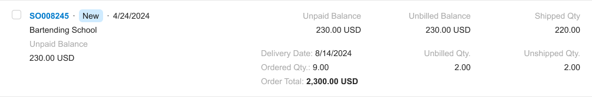|
|Don’t use tiles that contain only fields shown as labels above values.|
|||
|Left-align fields with text values. Don’t right-align fields with text values.

|
||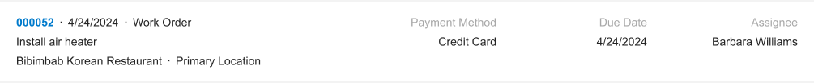|
|Show the primary link \(which opens the form with the corresponding record\) in the top left corner of the tile.Don’t show the primary link in slots below the first row of the tile.

|
||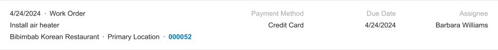|
|Distribute values on the tile evenly using multiple slots of the A, B,C, or D columns.Don’t put too many values in a single column.

|
||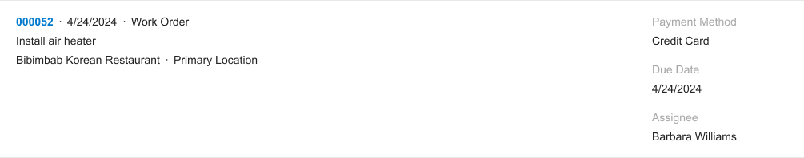

 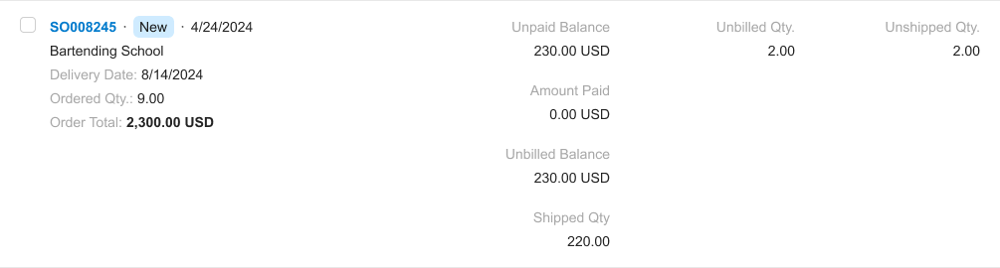

|
|Use compressed notation when you’re displaying values in multiple columns.Don’t use dot notation in a single slot when other columns have a different notation.

|
||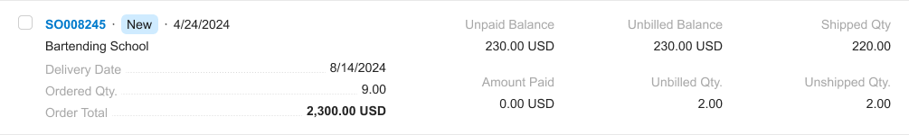|
|Use dot notation for tiles displayed in narrow areas \(such as side panels or narrow fieldsets\). Don’t display labels above values in narrow areas.

|
|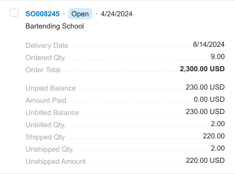|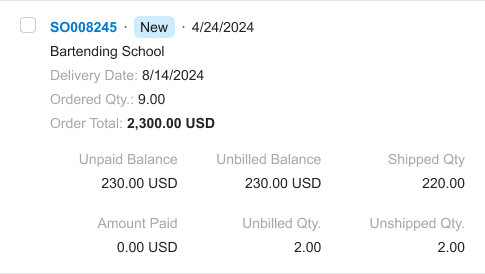|

## Adding a Menu on a Tile {#section_ipr_323_xgc .section}

A tile can have a drop-down menu.

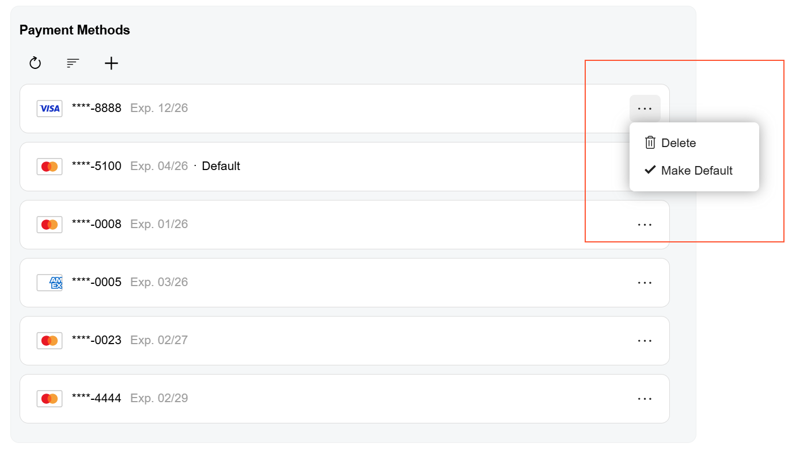

To add a menu to a tile, use the qp-menu control. The menu control should be located in the postfix slot of a tile, as shown above.

To configure the menu control, you need to define its configuration and the MenuSelected event handler. For details, see [Menu](UIDevRef_Menu_Mapref.md).

The following code implements the data feed from the screenshot above. The qp-menu tag is located in the `postfix` slot of the `record-1` template.

``` {#codeblock_j2w_s23_xgc}
<qp-data-feed id="dfPayMethods" view.bind="PaymentMethods" auto-resize="true">
  <template width="100%">
    <qp-template id="dfPayMethod" name="record-1" class="no-hover">
      <qp-fieldset slot="A1" id="fsContactA1" view.bind="{{$viewName}}">
				...
      </qp-fieldset>
      <qp-menu slot="Postfix" config.bind="paymentMethodCommands({{$viewName}})"
        menuselected.delegate="processPaymentMethodMenuCommand({{$viewName}}, $event)">
      </qp-menu>
    </qp-template>
  </template>
</qp-data-feed>>
```

**Parent topic:**[Data Feed](../DeveloperGuide/UIDevRef_DataFeed_Mapref.md)

