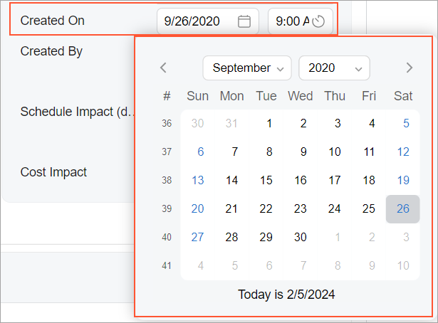
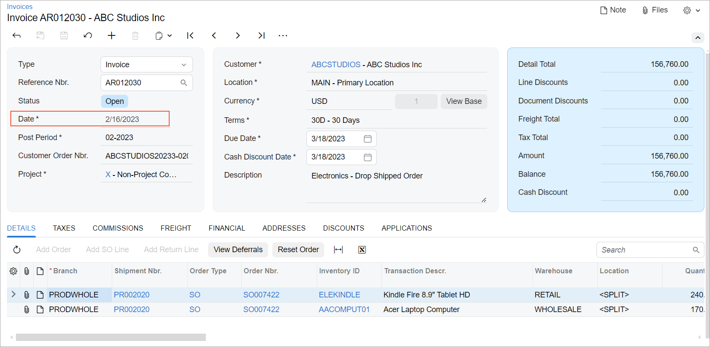

# Date and Time Control: General Information {#_2fcf43aa-d155-4149-9251-f843890357eb .concept}

A date and time control displays the date and the time, only the time, or only the date. By clicking the calendar button in the date box, a user can select the date in the calendar, as shown in the following screenshot. By clicking the clock button in the time box, a user can select the time from the drop-down list.



A date and time control is defined by PXDateTimeEdit in the Classic UI. In the Modern UI, you use the `field` tag inside a fieldset. If you need to display the date and the time separately in two boxes, you also use a nested `qp-field` control inside the `field` tag. The control type in the Modern UI is defined automatically from the backend code. In rare cases, you may need to explicitly use the [qp-datetime-edit](https://help.acumatica.com/(W(7))/Help?ScreenId=ShowWiki&pageid=7f98e5a2-cc4d-663c-e8e4-3706beb062b5) or [qp-datetime-edit-utc](https://help.acumatica.com/(W(7))/Help?ScreenId=ShowWiki&pageid=3c5e1e2a-d98f-e9df-20f0-3cd93486b460) tag.

## Learning Objectives { .section}

In this chapter, you will learn the following about a date and time control:

-   The design guidelines for a date and time control, including the naming conventions
-   The proper configuration of a date and time control for specific cases, such as a control with both the date and the time
-   A detailed description of each property of a date and time control

## Applicable Scenarios { .section}

You use date and time controls in the following scenarios:

-   On data entry forms where users need to input or modify temporal information. The use of date and time controls ensures accurate and standardized input formats, reducing errors and enhancing data consistency.
-   On forms that involve scheduling, calendar management, or event planning. Users can select specific dates and times for appointments, meetings, or other time-sensitive activities.
-   On forms that are designed for reporting or analytical purposes, to filter or aggregate data based on temporal parameters.
-   In the implementation of notifications. Users can make the system trigger automated actions at specified dates and times.
-   In automated processes, such as scheduled tasks, which frequently rely on date and time controls to initiate actions at predefined intervals.

## Date and Time Control ID { .section}

The field tag doesn’t have an ID. If the control is defined as a field with a nested qp-field, the qp-field tag has an ID that consists of two parts, the `field` prefix and the semantic name. The semantic name describes the purpose of the element. For example, a time field for the contact export date and time control can have the `fieldContactExportTime` ID, as the following code shows.

```
<field name="ContactsExportDate_Date">
  <qp-field
    id="fieldContactExportTime"
    control-state.bind=
      "EmailSyncAccountFilter.ContactsExportDate_Time"
  </qp-field>
</field>
```

## UI Naming Conventions { .section}

The following table shows the UI naming conventions for date and time controls.

|Naming Convention|Example|
|-----------------|-------|
|Use nouns or noun phrases that describe the content of a date and time control. Preferably, box names should consist of no more than two words.|The **Date** box on the [Invoices](../UserGuide/SO_30_30_00.md) \(SO303000\) form, which is shown in the following screenshot

|

## Date Format Settings { .section}

When the year of the date is displayed with two digits—for example, *25*—the actual year is calculated as follows:

-   A number between 50 and 99 is treated as the year in the XXth century. For example, *50* specifies the year 1950.
-   A number between 0 and 49 is treated as the year in the XXIth century. For example, *49* specifies the year 2049.

This setting corresponds to the current setting in .NET.

**Parent topic:**[Date and Time](../DeveloperGuide/UIDevRef_DateTime_Mapref.md)

