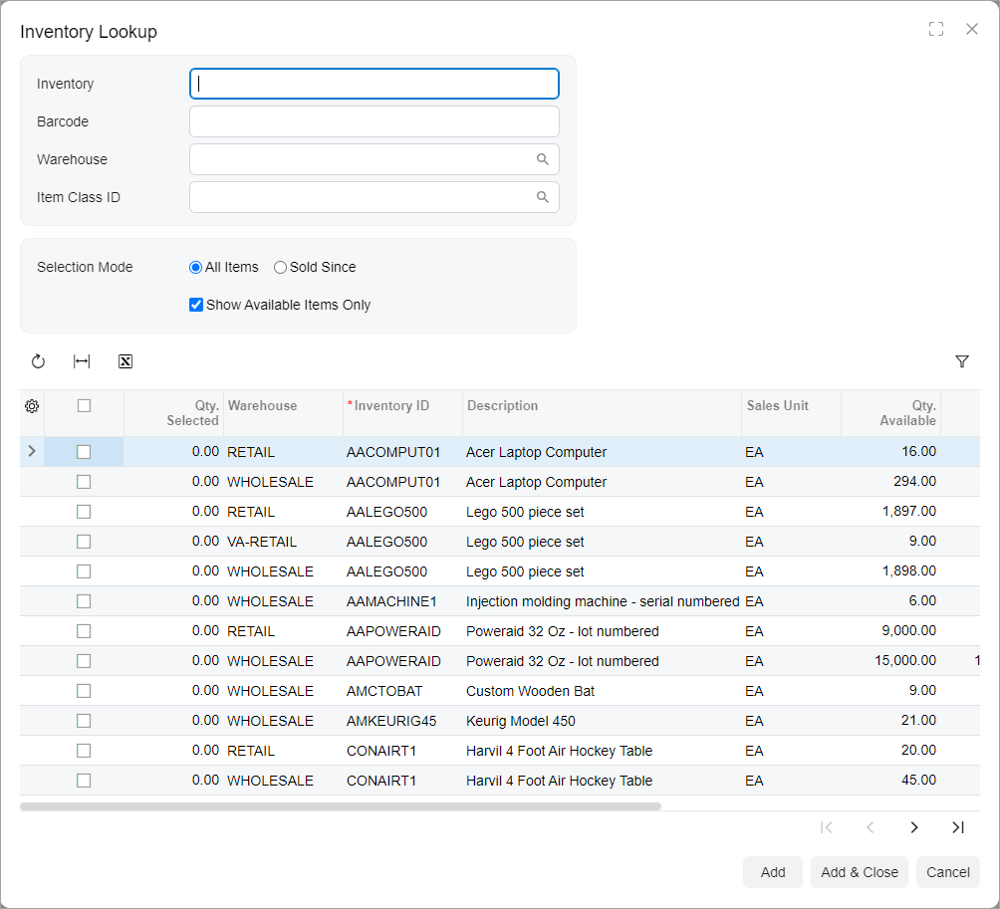

# Dialog Box: Configuration {#_2a6496fa-4d66-4403-9335-dacde369bc3b .concept}

A dialog box can contain a Summary area, a grid, and a footer with buttons, as shown in the following screenshot.



## View Definition of a Dialog Box { .section}

The following code shown an example of a view declaration and initialization for a dialog box.

```
@graphInfo({graphType: 'PX.Objects.SO.SOOrderEntry', primaryView: 'Document', 
  bpEventsIndicator: true, udfTypeField: 'OrderType', showActivitiesIndicator: true})
export class SO301000 extends PXScreen {
  ...
  AddSelectedItems: PXActionState;
  
  @viewInfo({containerName: "Inventory Lookup"})
  ItemFilter = createSingle(SOSiteStatusFilter);
 
  @viewInfo({containerName: "Inventory Lookup"})
  ItemInfo = createCollection(SOSiteStatusSelected);
}
  
export class SOSiteStatusFilter extends PXView {
    Inventory: PXFieldState<PXFieldOptions.CommitChanges>;
    BarCode: PXFieldState<PXFieldOptions.CommitChanges>;
    SiteID: PXFieldState<PXFieldOptions.CommitChanges>;
    ItemClass: PXFieldState<PXFieldOptions.CommitChanges>;
    SubItem: PXFieldState<PXFieldOptions.CommitChanges>;
 
    Mode: PXFieldState<PXFieldOptions.CommitChanges>;
    HistoryDate: PXFieldState<PXFieldOptions.CommitChanges>;
    OnlyAvailable: PXFieldState<PXFieldOptions.CommitChanges>;
    DropShipSales: PXFieldState<PXFieldOptions.CommitChanges>;
 
    CustomerLocationID: PXFieldState<PXFieldOptions.CommitChanges>;
}
 
@gridConfig({
    preset: GridPreset.ReadOnly,
    syncPosition: true,
    adjustPageSize: true
})
export class SOSiteStatusSelected extends PXView {
    @columnConfig({allowCheckAll: true}) Selected: PXFieldState;
    QtySelected: PXFieldState;
    @columnConfig({hideViewLink: true}) SiteID: PXFieldState;
    @columnConfig({hideViewLink: true}) ItemClassID: PXFieldState;
    ItemClassDescription: PXFieldState;
    @columnConfig({hideViewLink: true}) PriceClassID: PXFieldState;
    PriceClassDescription: PXFieldState;
    @columnConfig({hideViewLink: true}) PreferredVendorID: PXFieldState;
    PreferredVendorDescription: PXFieldState;
    @columnConfig({hideViewLink: true}) InventoryCD: PXFieldState;
    @columnConfig({hideViewLink: true}) SubItemID: PXFieldState;
    Descr: PXFieldState;
    @columnConfig({hideViewLink: true}) SalesUnit: PXFieldState;
    QtyAvailSale: PXFieldState;
    QtyOnHandSale: PXFieldState;
    CuryID: PXFieldState;
    QtyLastSale: PXFieldState;
    CuryUnitPrice: PXFieldState;
    LastSalesDate: PXFieldState;
    DropShipLastQty: PXFieldState;
    DropShipCuryUnitPrice: PXFieldState;
    DropShipLastDate: PXFieldState;
    AlternateID: PXFieldState;
    AlternateType: PXFieldState;
    AlternateDescr: PXFieldState;
}
```

## Layout of a Dialog Box { .section}

To define the layout of the Summary area of a dialog box, you use one of the predefined templates. For details, see [Form Layout: Predefined Templates](UIDev_DesigningLayout_Templates.md). The following code shown an example of the HTML for the dialog box in the preceding screenshot.

```
<qp-panel id="ItemInfo" 
  caption="Inventory Lookup" auto-repaint="true" width="lg" height="85vh">
    <qp-template id="ItemFilter_formSitesStatus" name="17-17-14" 
      class="equal-height" wg-container>
        <qp-fieldset id="fs-sitestatusfilter-first" slot="A"  view.bind="ItemFilter">
            <field name="Inventory"></field>
            <field name="BarCode"></field>
            <field name="SiteID"></field>
            <field name="ItemClass"></field>
            <field name="SubItem"></field>
        </qp-fieldset>
        <qp-fieldset id="fs-sitestatusfilter-second" slot="B"  view.bind="ItemFilter">
            <field name="Mode" control-type="qp-radio"></field>
            <field name="HistoryDate"></field>
            <field name="OnlyAvailable"></field>
            <field name="DropShipSales"></field>
        </qp-fieldset>
        <qp-fieldset id="fs-sitestatusfilter-third" slot="C"  view.bind="ItemFilter">
            <field name="CustomerLocationID"></field>
        </qp-fieldset>
    </qp-template>
    <qp-grid id="ItemInfo_gridSiteStatus" view.bind="ItemInfo">
    </qp-grid>
    <footer>
        <qp-button id="btnAdd" state.bind="AddSelectedItems">
        </qp-button>
        <qp-button id="btnAddClose" caption="Add & Close" dialog-result="OK">
        </qp-button>
        <qp-button id="btnCancel" caption="Cancel" dialog-result="Cancel">
        </qp-button>
    </footer>
</qp-panel>
```

## Width and Height of a Dialog Box { .section}

Generally, you do not need to specify the width and height of a dialog box. If you need to change the width and height of the dialog box that are detected by default, you can use the `width` and `height` attributes of the qp-panel tag.

To specify the width of the dialog box, you use the preferred values for the property, which are *sm*, *md*, and *lg*. Only if the predefined sizes do not suit your needs can you can use other standard CSS units to specify the value for this property, such as pixels \(px\), percentage \(%\), or viewport width \(vw\). For a complete list of standard CSS values and units, see [CSS values and units](https://developer.mozilla.org/en-US/docs/Learn/CSS/Building_blocks/Values_and_units).

You may need to specify the height of a dialog box if the dialog box contains a grid, tab, or rich text editor. You set the height by using pixels \(px\) or the viewport height \(vh\).

The following code shows some examples of the usage of different values and units for the `width` and `height` attributes.

```
<qp-panel
  id="ItemInfo" width="md" height="85vh">
...
</qp-panel> 

<qp-panel
  id="ItemInfo" width="120px" height="85vh">
...
</qp-panel> 

<qp-panel
  id="ItemInfo" width="100%" height="85vh">
...
</qp-panel>
```

If a dialog box contains a text message in the qp-text-box control, its parent, or the field tag that corresponds to the qp-text-box control, you can make the height of the dialog box adaptive to the size of the message. For this purpose, do the following:

1.  Specify the adaptive-height CSS class for the qp-text-box control or its parent. For details, see [adaptive-height](UIDev_DesigningLayout_CSSClasses.md#_1c25532f-2b2d-477e-a621-885afa87acdb).
2.  Specify the multiline mode for the qp-text-box control. For details, see [Text Box: Multiline Text Box](UIDevRef_TextBox_MultilineTextBox.md).

The following code shows an example of configuring adaptive height in a dialog box.

```
<qp-panel
  id="LogFileFilterRecord" caption="Log" auto-repaint="true" width="50vw">
  <qp-fieldset id="frmLockout" view.bind="LogFileFilterRecord">
    <field
      name="Text"
      class="label-size-xxs adaptive-height"
      config-type.bind="1"></field>
  </qp-fieldset>
  <footer>
    <qp-button id="btnCancel" dialog-result="Cancel" caption="Close"></qp-button>
  </footer>
</qp-panel>
```

## Buttons of a Dialog Box {#_8a131a0d-6156-43fa-adab-03ed35c80ad4 .section}

To add a button to the dialog box, you do the following:

1.  In the qp-panel tag, you specify the qp-button tag.

    For the button to be at the bottom of the dialog box, add the qp-button tag inside the footer tag.

2.  You bind the button to an action by specifying action in the state attribute or specify the dialog-result attribute.

For more details on adding buttons to a dialog box, see [Dialog Box: Buttons on the Dialog Box](UIDevRef_DialogBox_AddButton.md).

**Parent topic:**[Dialog Box](../DeveloperGuide/UIDevRef_DialogBox_Mapref.md)

