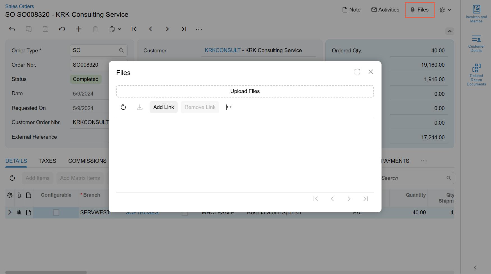

# Dialog Box: Files {#_121a6238-8dda-4650-b142-dcd02a3b3baa .concept}

The **Files** dialog box gives a user the ability to attach files to the primary record displayed on a form. To open this dialog box, the user clicks the **Files** button on the right side of the form title bar. Below you can see an example of the **Files** button and the corresponding dialog box.



The Files dialog box is implemented using the qp-upload-dialog control.

## Hiding the Files Button { .section}

The **Files** button is displayed by default. To hide this button from the form title bar, specify hideFilesIndicator : true in the graphInfo decorator.

## Default Closing Behavior { .section}

By default, a user can close the **Files** dialog box only by clicking the X button in the dialog box. A user cannot close the dialog box by clicking outside the dialog box.

## Opening the Files Dialog Box from a Custom Button { .section}

You can implement a button anywhere on a form, and specify that this button should open the **Files** dialog box. For this purpose, do the following:

1.  In TypeScript code, define the following method, which opens the **Files** dialog box.

    ```
    filesShow() {
      (this.activeScreenVM?.screenService
        .getDataComponent(NoteMenuDataComponent.dataComponentName) as NoteMenuDataComponent).filesShow();
    }
    ```

2.  In HTML, define a button by using the qp-button tag.

    ```
    <qp-button id="btnFiles" caption="Attach Files"></qp-button>
    ```

3.  In the qp-button tag, specify the method that opens the **Files** dialog box in the click.delegate attribute, as the following code shows.

    ```
    <qp-button id="btnFiles" caption="Open Files" **click.delegate="filesShow\(\)"**>
    </qp-button>
    ```


**Parent topic:**[Dialog Box](../DeveloperGuide/UIDevRef_DialogBox_Mapref.md)

