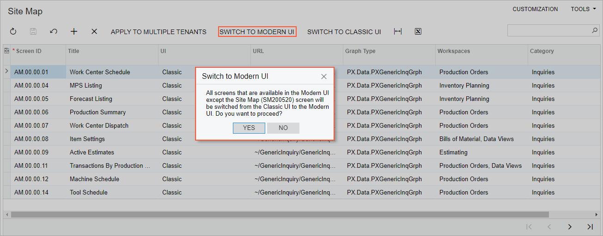
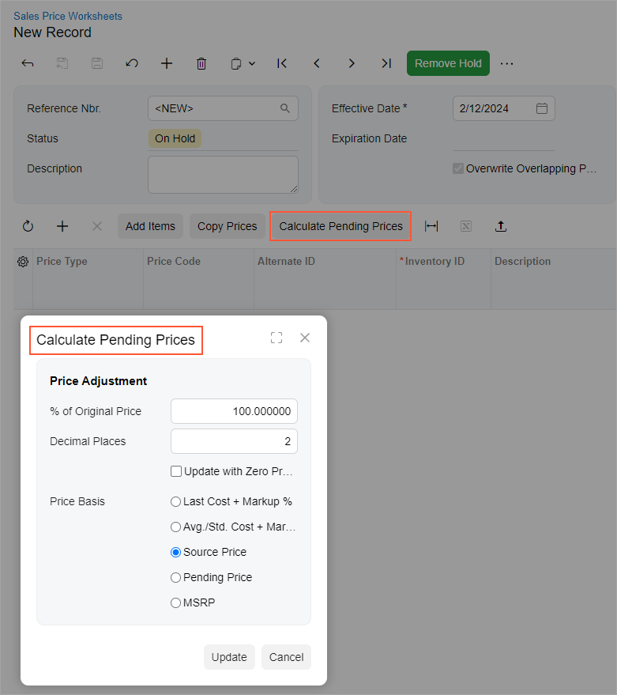
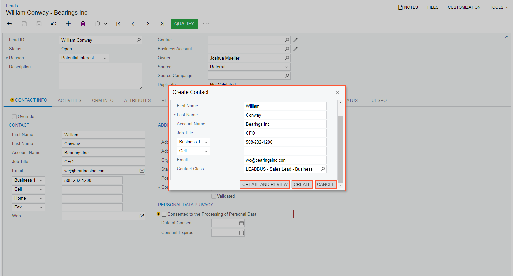
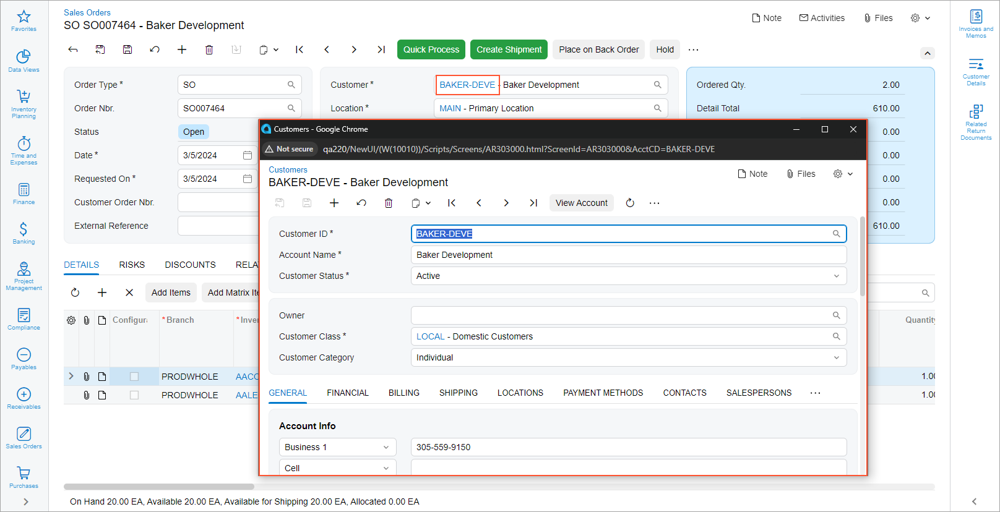

# Dialog Box: General Information {#_f11cb073-1f6c-4b5e-968b-728088241afc .concept}

A dialog box is a pop-up panel or window that opens when a user clicks a button or link. In Acumatica ERP, it can be either of the following:

-   A modal pop-up panel that gives the user information and prompts them to enter settings or click a button \(or both\) before continuing. This type of dialog box may be opened when the user clicks a button or a command.
-   A pop-up window that contains an Acumatica ERP form. This type of dialog box is not modal and is usually opened when the user clicks a link on a form. You define the form that opens in the pop-up window as you define any other form.

A dialog box is defined by PXSmartPanel in the Classic UI. In the Modern UI, a dialog box can be defined by the [qp-panel](https://help.acumatica.com/(W(7))/Help?ScreenId=ShowWiki&pageid=263bbb26-0eb6-c6fd-f37f-6d10269965f2) control, or in rare cases, by the qp-dialog control.

**Tip:** The qp-panel control is not specifically a control for creating a dialog box; it is a generic placeholder for an HTML template that can be used in various other contexts, such as creating a tab or wizard.

## Learning Objectives { .section}

In this chapter, you will learn the following:

-   The design guidelines for a dialog box, including the naming conventions and layout recommendations
-   The details of each property of a dialog box that is created by using the qp-panel control

## Applicable Scenarios { .section}

You configure a dialog box in the following user scenarios:

-   A user needs to enter data on a form that is related to another entity without having to navigate to that entity's form.
-   A user has clicked a button or command, and you want the user to provide additional information before the system invokes the associated action.
-   A user has clicked a button, and you want the user to verify or cancel the intention to continue before the action is invoked.
-   A user has clicked a link with a record's identifier, and the system should open a pop-up window to show the selected record on the corresponding form.

## Types of Dialog Boxes { .section}

The following table lists different types of dialog boxes and the corresponding controls.

|Control|Purpose|Documentation|
|-------|-------|-------------|
|qp-panel|Smart panel, simple dialog box|[Dialog Box](UIDevRef_DialogBox_Mapref.md)|
|No control is needed.|Workflow dialog box|[Implementing Workflow Dialog Boxes](WorkflowAPI_DialogBox_Mapref.md)|
|qp-upload-dialog|Dialog box for uploading files|[Upload Dialog Box](UIDevRef_UploadDialog_Mapref.md)|
|qp-multi-upload|A button and a dialog box for uploading multiple files at a time|[Upload Files Button](UIDevRef_MultiUploadFiles_Mapref.md)|

## UI Naming Conventions { .section}

The following table shows the UI naming conventions for a dialog box.

|Naming Convention|Example|
|-----------------|-------|
|Dialog box used to confirm an action that the user has invoked by clicking a button or command: Use the button or command name \(or a part of it\) as the name of the dialog box caption.|When a user clicks the **Switch to Modern UI** button on the [Site Map](../UserGuide/SM_20_05_20.md) \(SM200520\) form, the dialog box shown below opens. Thus, the dialog box is also named **Switch to Modern UI**.

|
|For a dialog box used to provide additional information before the system can execute the action that the user has invoked by clicking a button or command: Use the button or command name \(or a part of it\) as the name of the dialog box caption.|When a user clicks the **Calculate Pending Prices** button on the [Sales Price Worksheets](../UserGuide/AR_20_20_10.md) \(AR202010\) form, the following dialog box opens. It should be named **Calculate Pending Prices** \(as shown below\) or **Calculate Prices**.

|
|For a dialog box used to confirm a change, such as a change in the value of a box that causes changes in other boxes: Use a clear summary as the name of the dialog box caption. The name should describe the change that the user needs to confirm.|Suppose that a user has made a change on a form that will cause an address on the form to be replaced. The name of the dialog box that confirms this change should be **Replace Address**.|
|For a dialog box that asks the user a question or offers multiple choices: Use a short summary of the choices or the question that you want to present to the user.|When a user clicks the **Create Contact** command on the More menu of the [Leads](../UserGuide/CR_30_10_00.md) \(CR301000\) form, the dialog box should be named **Create Contact**, as shown below.

|
|For a dialog box that opens a form in a pop-up window: You do not need to make any changes to the form's name.|Suppose that a user has clicked the link in the **Customer** box for the selected record on the [Sales Orders](../UserGuide/SO_30_10_00.md) \(SO301000\) form. The system launches a pop-up window and displays the selected record on the [Customers](../UserGuide/AR_30_30_00.md) \(AR303000\) form. Notice that the original name of this form is maintained in the pop-up window.

|

**Parent topic:**[Dialog Box](../DeveloperGuide/UIDevRef_DialogBox_Mapref.md)

