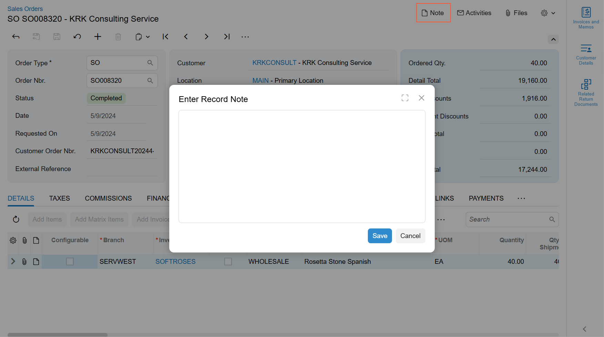

# Dialog Box: Notes {#_ca3f2142-231f-4b02-8a39-a6c04bf8c3b0 .concept}

The Notes dialog box provides a user with the ability to specify notes for a particular record displayed on a form. To open the Notes dialog box, the user clicks the **Note** button on the right side of the form title bar. Below you can see an example of the Note button and the corresponding dialog box.



The Notes dialog box is implemented using the qp-dialog control.

## Hiding the Note Button { .section}

The **Note** button is displayed by default. To hide this button from the form title bar, specify hideNotesIndicator : true in the graphInfo decorator.

## Default Closing Behavior { .section}

By default, a user can close the Note dialog box in one of the following ways:

-   If no changes have been made in the notes attached to the record, the dialog box is closed when a user clicks anywhere outside the dialog box.
-   If any modification has been made to the notes attached to the record, a user can close the dialog box only by clicking the **Save** button in the dialog box.

## Opening Notes from a Custom Button { .section}

You can implement a button anywhere on a form, and specify that this button should open the Notes dialog box. For this purpose, do the following:

1.  In TypeScript code, define the following method, which opens the Notes dialog box.

    ```
    noteShow() {
      (this.screenService.getDataComponent(NoteMenuDataComponent.dataComponentName) 
        as NoteMenuDataComponent).noteShow();
    }
    ```

2.  In HTML, define a button by using the qp-button tag.

    ```
    <qp-button id="notes" caption="Open Notes"></qp-button>
    ```

3.  In the qp-button tag, specify the method that opens the Notes dialog box in the click.delegate attribute, as the following code shows.

    ```
    <qp-button id="notes" caption="Open Notes" **click.delegate="noteShow\(\)"**>
    </qp-button>
    ```


**Parent topic:**[Dialog Box](../DeveloperGuide/UIDevRef_DialogBox_Mapref.md)

