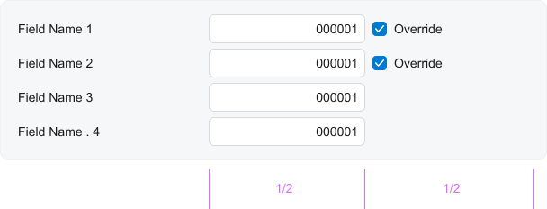
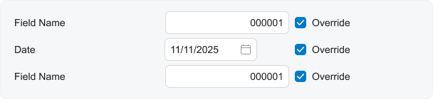
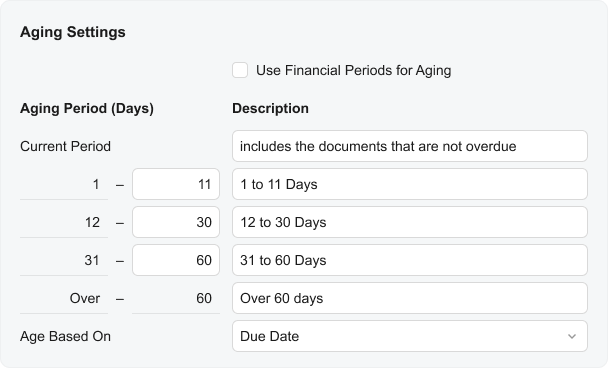
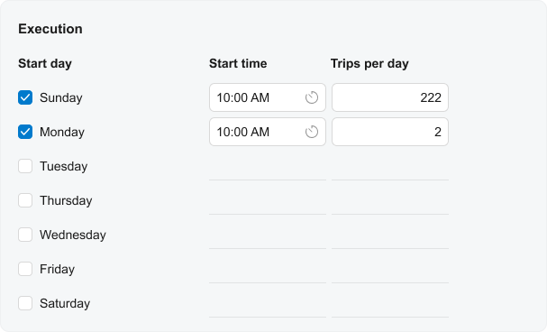

# Fieldset: Layout Examples {#_ea732ea9-69ea-4e08-9a2e-a000514fe612 .concept}

In this topic, you will find cases of complicated layouts inside a fieldset and instructions on how to implement them.

## Check Boxes Next to Particular Controls { .section}

If you need to put check boxes next to particular controls and define them to occupy half of the control space, as shown in the following screenshot, add the qp-field tag inside the `field` tag, and specify `class="col-6"` for the nested control.



The following code implements this approach.

```language-xml
<qp-fieldset id="groupFields" view.bind="View1">
  <field name="Field1">
    <qp-field control-state.bind="View1.Override1" class="col-6" >
    </qp-field>
  </field>
  <field name="Field2">
    <qp-field control-state.bind="View1.Override2" class="col-6" >
    </qp-field>
  </field>
  <field name="Field3">
    <span class="col-6"></span>
  </field>
  <field name="Field4">
    <span class="col-6"></span>
  </field>
</qp-fieldset>
```

## Check Boxes Next to All Controls { .section}

If you need to put check boxes next to all controls \(as the following screenshot shows\), add the `qp-field` tag inside the `field` tag. There is no need to specify the class.



The following code illustrates this approach.

```language-xml
<qp-fieldset id="groupFields" view.bind="View1">
  <field name="Field1">
    <qp-field control-state.bind="View1.Override1"></qp-field>
  </field>
  <field name="Date">
    <qp-field control-state.bind="View1.Override2"></qp-field>
  </field>
  <field name="Field3">
    <qp-field control-state.bind="View1.Override3"></qp-field>
  </field>
</qp-fieldset>
```

## Complicated Layout with Multiple Controls in a Row { .section}

Suppose that you need to organize a complicated layout with multiple controls in a row, as shown in the following screenshot.



The following code implements the layout above.

```language-xml
<qp-fieldset id="groupAgingSettings-ARStatementCycleRecord"
  view.bind="ARStatementCycleRecord" Caption="Aging Settings">
    <field name="UseFinPeriodForAging">
    </field>
    <field name="AgingPeriodsCaption" unbound>
        <qp-label slot="label" caption="Aging Period (Days)">
        </qp-label>
        <qp-label caption="Description">
        </qp-label>
    </field>
    <field name="AgeMsgCurrent">
        <qp-label slot="label" caption="Current Period">
        </qp-label>
    </field>
    <field name="AgeMsg00">
        <div slot="label" class="no-label h-stack">
            <qp-field
              control-state.bind=
                "ARStatementCycleRecord.Bucket01LowerInclusiveBound"
              class="col-4">
            </qp-field>
            -
            <qp-field
              control-state.bind="ARStatementCycleRecord.AgeDays00"
              class="col-4">
            </qp-field>
        </div>
    </field>
    <field name="AgeMsg01">
        <div slot="label" class="no-label h-stack">
            <qp-field
              control-state.bind=
                "ARStatementCycleRecord.Bucket02LowerInclusiveBound"
              class="col-4">
            </qp-field>
            -
            <qp-field
              control-state.bind="ARStatementCycleRecord.AgeDays01"
              class="col-4">
            </qp-field>
        </div>
    </field>
    <field name="AgeMsg02">
        <div slot="label" class="no-label h-stack">
            <qp-field
              control-state.bind=
                "ARStatementCycleRecord.Bucket03LowerInclusiveBound"
              class="col-4">
            </qp-field>
            -
            <qp-field
              control-state.bind="ARStatementCycleRecord.AgeDays02"
              class="col-4">
            </qp-field>
        </div>
    </field>
    <field name="AgeMsg03">
        <div slot="label" class="no-label h-stack">
            Over
            <qp-field
              control-state.bind=
                "ARStatementCycleRecord.Bucket04LowerInclusiveBound"
              class="col-4">
            </qp-field>
        </div>
    </field>
    <field name="AgeBasedOn">
    </field>
</qp-fieldset>
```

## Multiple Columns in a Fieldset { .section}

Suppose that you need to implement the layout that is shown in the following screenshot.



The following code implements the layout above.

```language-xml
<qp-fieldset id="RouteSelected_10"
  view.bind="RouteSelected">
    <field name="fake01" unbound replace-content>
        <qp-label caption="Start day" class="col-4">
        </qp-label>
        <qp-label caption="Start time" class="col-4">
        </qp-label>
        <qp-label caption="Trips per day" class="col-4">
        </qp-label>
    </field>
    <field name="fake02" unbound replace-content>
        <qp-field control-state.bind="RouteSelected.ActiveOnSunday"
          no-label="true" class="col-4">
        </qp-field>
        <qp-field
          control-state.bind="RouteSelected.BeginTimeOnSunday_Time"
          no-label="true"
          config-time-mode.bind="true" class="col-4">
        </qp-field>
        <qp-field control-state.bind="RouteSelected.NbrTripOnSunday"
          no-label="true" class="col-4">
        </qp-field>
    </field>
    <field name="fake03" unbound replace-content>
        <qp-field control-state.bind="RouteSelected.ActiveOnMonday"
          no-label="true" class="col-4">
        </qp-field>
        <qp-field
          control-state.bind="RouteSelected.BeginTimeOnMonday_Time"
          no-label="true"
          config-time-mode.bind="true" class="col-4">
        </qp-field>
        <qp-field control-state.bind="RouteSelected.NbrTripOnMonday"
          no-label="true" class="col-4">
        </qp-field>
    </field>
    <field name="fake04" unbound replace-content>
        <qp-field control-state.bind="RouteSelected.ActiveOnTuesday"
          no-label="true" class="col-4">
        </qp-field>
        <qp-field
          control-state.bind="RouteSelected.BeginTimeOnTuesday_Time"
          no-label="true"
          config-time-mode.bind="true" class="col-4">
        </qp-field>
        <qp-field control-state.bind="RouteSelected.NbrTripOnTuesday"
          no-label="true" class="col-4">
        </qp-field>
    </field>
    <field name="fake05" unbound replace-content>
        <qp-field control-state.bind="RouteSelected.ActiveOnWednesday"
          no-label="true" class="col-4">
        </qp-field>
        <qp-field
          control-state.bind="RouteSelected.BeginTimeOnWednesday_Time"
          no-label="true"
          config-time-mode.bind="true" class="col-4">
        </qp-field>
        <qp-field
          control-state.bind="RouteSelected.NbrTripOnWednesday"
          no-label="true" class="col-4">
        </qp-field>
    </field>
    <field name="fake06" unbound replace-content>
        <qp-field control-state.bind="RouteSelected.ActiveOnThursday"
          no-label="true" class="col-4">
        </qp-field>
        <qp-field
          control-state.bind="RouteSelected.BeginTimeOnThursday_Time"
          no-label="true"
          config-time-mode.bind="true" class="col-4">
        </qp-field>
        <qp-field control-state.bind="RouteSelected.NbrTripOnThursday"
          no-label="true" class="col-4">
        </qp-field>
    </field>
    <field name="fake07" unbound replace-content>
        <qp-field control-state.bind="RouteSelected.ActiveOnFriday"
          no-label="true" class="col-4">
        </qp-field>
        <qp-field
          control-state.bind="RouteSelected.BeginTimeOnFriday_Time"
          no-label="true"
          config-time-mode.bind="true" class="col-4">
        </qp-field>
        <qp-field control-state.bind="RouteSelected.NbrTripOnFriday"
          no-label="true" class="col-4">
        </qp-field>
    </field>
    <field name="fake08" unbound replace-content>
        <qp-field control-state.bind="RouteSelected.ActiveOnSaturday"
          no-label="true" class="col-4">
        </qp-field>
        <qp-field
          control-state.bind="RouteSelected.BeginTimeOnSaturday_Time"
          no-label="true"
          config-time-mode.bind="true" class="col-4">
        </qp-field>
        <qp-field
          control-state.bind="RouteSelected.NbrTripOnSaturday"
          no-label="true" class="col-4">
        </qp-field>
    </field>
</qp-fieldset>
```

**Parent topic:**[Fieldset](../DeveloperGuide/UIDevRef_Fieldset_Mapref.md)

